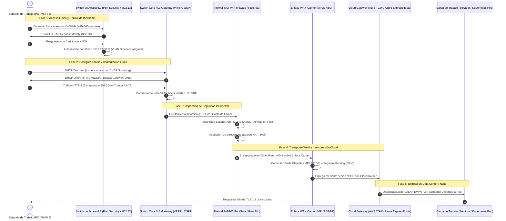

# 🏛️ Arquitectura Global y Mapa Ontológico del Conocimiento EDC
## Network Engineering & Cybersecurity Master Compendium

> **DOCUMENTO MAESTRO DE MAPEO CONCEPTUAL, ONTOLOGÍA Y FLUJO DE DATOS**  
> **Ubicación:** `Base de Conocimientos_EDC/01_ARQUITECTURA_Y_MAPA_GLOBAL_EDC.md`  
> **Referencia:** Estándar EDC (Enterprise Data & Connectivity)

---

## 1. Visión Holística de la Infraestructura de Telecomunicaciones y Ciberseguridad

El diseño, despliegue y protección de infraestructuras digitales modernas requiere una visión sistémica que integre desde la física cuántica de la luz en fibras monomodo hasta la lógica de aplicaciones distribuidas en nubes públicas, bajo un marco perimetral y microsegmentado de **Zero Trust**.

El ecosistema de conocimiento se estructura en **6 Pilares Interconectados**, cada uno gobernado por estándares internacionales de la **IETF (RFCs), IEEE, TIA/EIA, ISO/IEC, NIST y 3GPP**:

```mermaid
graph TB
    classDef foundation fill:#0f172a,stroke:#38bdf8,stroke-width:2px,color:#fff;
    classDef switching fill:#1e1b4b,stroke:#818cf8,stroke-width:2px,color:#fff;
    classDef routing fill:#064e3b,stroke:#34d399,stroke-width:2px,color:#fff;
    classDef security fill:#450a0a,stroke:#f87171,stroke-width:2px,color:#fff;
    classDef datacenter fill:#3b0764,stroke:#c084fc,stroke-width:2px,color:#fff;
    classDef ops fill:#713f12,stroke:#facc15,stroke-width:2px,color:#fff;

    subgraph PILAR1["PILAR 1: INFRAESTRUCTURA FÍSICA Y FUNDAMENTOS"]
        OSI["🌐 Modelo OSI y Stack TCP/IP (ISO 7498 / RFC 1122)"]:::foundation
        CAB["🔌 Medios de Cobre TIA-568-D y Fibra Óptica SMF/MMF"]:::foundation
        OPT["💡 Transceptores SFP28/QSFP-DD y Presupuesto Óptico"]:::foundation
    end

    subgraph PILAR2["PILAR 2: ACCESO, MOVILIDAD Y CONMUTACIÓN MULTI-VENDOR"]
        SW["🖧 Switching L2/L3 (Cisco, Huawei, Aruba, HP, 3Com, TP-Link)"]:::switching
        VLAN["🏷️ Segmentación VLAN 802.1Q, QinQ y Private VLANs"]:::switching
        STP["🔄 Prevención de Bucles: STP / RSTP (802.1w) / MSTP (802.1s)"]:::switching
        WIFI["📡 Wireless Enterprise: Wi-Fi 6/6E/7 (802.11ax/be) + WLC"]:::switching
    end

    subgraph PILAR3["PILAR 3: ENRUTAMIENTO, WAN, CARRIER Y QoS"]
        IGP["🛣️ Enrutamiento Interior: OSPFv2/v3, EIGRP, BFD Sub-segundo"]:::routing
        EGP["🌍 Enrutamiento Global: BGP-4 Internet, RPKI, FlowSpec"]:::routing
        WAN["🚄 Transporte Carrier: MPLS L3VPN, Segment Routing (SRv6)"]:::routing
        QOS["⚖️ Calidad de Servicio: DiffServ RFC 4594, LLQ, CBWFQ, WRED"]:::routing
    end

    subgraph PILAR4["PILAR 4: SEGURIDAD PERIMETRAL, IDENTIDAD Y ZERO TRUST"]
        DEF["🛡️ Defensa en Profundidad OSI L1 a L7 (MITRE ATT&CK)"]:::security
        AAA["🔑 Control de Acceso: IEEE 802.1X, RADIUS, TACACS+, ISE"]:::security
        FW["🧱 NGFW Líderes: Fortinet, Palo Alto (App-ID), Cisco FTD"]:::security
        VPN["🔒 Túneles Criptográficos: IPsec IKEv2, WireGuard, DMVPN"]:::security
        OT["🏭 Ciberseguridad Industrial: Modelo Purdue & ISA/IEC 62443"]:::security
    end

    subgraph PILAR5["PILAR 5: DATA CENTER FABRIC, CLOUD Y WHITEBOX"]
        DC["🏢 Arquitectura Spine-Leaf Clos y Redes Overlay VXLAN EVPN"]:::datacenter
        HYB["☁️ Cloud Networking Híbrido: AWS DirectConnect, Azure ExpressRoute"]:::datacenter
        NOS["🐧 Sistemas Operativos Abiertos: SONiC, FRRouting, VyOS"]:::datacenter
    end

    subgraph PILAR6["PILAR 6: GOBERNANZA, DDI, TELEMETRÍA Y FORENSE"]
        DDI["🗂️ Servicios Centrales: Anycast DNS, DHCP Failover, NetBox SSoT"]:::ops
        OPS["📐 Metodología de Ingeniería: Diseños HLD, LLD, MOP y RFC 2544"]:::ops
        WSH["🦈 Análisis Forense de Paquetes: Wireshark y Diagnóstico TCP/VoIP"]:::ops
        LAB["🧪 Banco de 200 Laboratorios Prácticos y Simulación EVE-NG"]:::ops
    end

    PILAR1 ==> PILAR2
    PILAR2 ==> PILAR3
    PILAR3 ==> PILAR4
    PILAR4 ==> PILAR5
    PILAR5 ==> PILAR6
```



---

## 2. Mapa de Correspondencia: Modelo OSI vs. TCP/IP vs. Protocolos y Seguridad

Esta matriz proporciona el mapeo exhaustivo de protocolos, unidades de datos (PDU), hardware involucrado y vectores de ataque a lo largo de cada estrato de la red:

| Capa OSI | Capa TCP/IP | PDU Oficial | Protocolos Representativos | Hardware y Dispositivos | Amenazas Principales | Controles y Mitigación EDC |
| :--- | :--- | :--- | :--- | :--- | :--- | :--- |
| **7. Aplicación** | Aplicación | Datos | HTTP/3 (QUIC), DNS, DHCP, SIP, BGP, SNMPv3, SSH | Servidores, Proxies L7, WAF, Teléfonos IP | Inyección SQL, XSS, DNS Poisoning, Toll Fraud VoIP | WAF (ModSecurity), DNSSEC, DoH/DoT, SBC Session Border |
| **6. Presentación** | Aplicación | Datos | TLS 1.3, SSL, SSH, JPEG, MPEG, JSON, ASN.1 | Servidores Web, Motores de Cifrado Hardware | SSL Stripping, Cifrados Obsoletos (RC4/3DES), RCE Deserialización | HSTS Preload, Deshabilitar TLS < 1.2, PFS (ECDHE), Validación Schema |
| **5. Sesión** | Aplicación | Datos | NetBIOS, RPC, SOCKS5, SIP (Llamada), ISAKMP Phase 1 | Controladores de Dominio, Conmutadores PBX | Secuestro de Sesión (Session Hijacking), EternalBlue (SMBv1) | Desactivación SMBv1, Tokens Criptográficos Aleatorios, SIPS TLS 5061 |
| **4. Transporte** | Transporte | Segmento (TCP) / Datagrama (UDP) | TCP (RFC 9293), UDP (RFC 768), SCTP (RFC 9260) | Firewalls de Estado (Stateful), Balanceadores L4 | SYN Flood, UDP Amplification, TCP RST Injection, Port Scans | TCP SYN Cookies, Rate Limiting UDP, Inspección Stateful, Conntrack |
| **3. Red** | Internet | Paquete | IPv4 (RFC 791), IPv6 (RFC 8200), ICMP, OSPF, BGP, IPsec ESP | Routers Core/Edge, Switches L3, Gateways Nube | IP Spoofing, Smurf Attack, BGP Route Hijacking, Man-in-the-Middle | Unicast RPF (uRPF Strict), RPKI ROA Validation, IPsec ESP AES-GCM |
| **2. Enlace de Datos** | Acceso a Red | Trama (Frame) | Ethernet (802.3), Wi-Fi (802.11), 802.1Q, LACP, ARP, STP | Switches L2/L3, WLCs, Access Points, Tarjetas NIC | MAC Flooding, ARP Spoofing, DHCP Rogue, STP Root Hijack | Port Security, Dynamic ARP Inspection (DAI), DHCP Snooping, BPDU Guard |
| **1. Física** | Acceso a Red | Bit | 1000BASE-T, 10GBASE-SR, 100GBASE-LR4, DWDM, RJ45 | Cables Cat6A/8, Fibras SMF/MMF, SFP28, Patch Panels | Cable Tapping, Hardware Implants, Corte de Fibra, Pérdida de Señal | Blindaje STP/FTP, Fibra con Monitoreo OTDR, Cifrado Óptico MACsec L2 |

---

## 3. Flujo de Datos Transversal de Extremo a Extremo (End-to-End Enterprise Flow)

El siguiente diagrama detalla la ruta crítica que recorre una solicitud de un usuario empresarial desde su estación de trabajo hasta una aplicación en la nube híbrida, ilustrando qué tecnología interviene en cada salto:



---

## 4. Ontología de Relaciones y Dependencias del Repositorio EDC

Para navegar y estudiar eficientemente la base de conocimientos, se establece el siguiente grafo de dependencias de aprendizaje y diseño técnico:

```text
[01. Modelo OSI y Cableado Físico]
    │
    ├──> [02. Switching Multi-Vendor & L2 Security]
    │        │
    │        ├──> [03. Routing Dinámico (OSPF/EIGRP/BGP) & WAN]
    │        │        │
    │        │        ├──> [04. Carrier MPLS, SRv6, 5G & DWDM]
    │        │        │
    │        │        └──> [05. Calidad de Servicio (QoS DiffServ)]
    │        │
    │        └──> [06. Wireless Enterprise (Wi-Fi 6/7) & Movilidad]
    │
    ├──> [07. Identidad, AAA 802.1X & Zero Trust]
    │        │
    │        └──> [08. Firewalls NGFW & VPNs Criptográficas]
    │                 │
    │                 └──> [09. Ciberseguridad OT Industrial (ISA/IEC 62443)]
    │
    └──> [10. Data Center Spine-Leaf (VXLAN EVPN) & Cloud Híbrido]
             │
             ├──> [11. Whitebox NOS (SONiC / FRR)]
             │
             └──> [12. Servicios DDI, NetDevOps, Forense & Metrología]
                      │
                      └──> [13. Banco de 200 Laboratorios y Pruebas RFC 2544]
```

### Reglas de Dominio Técnico EDC:
1. **Regla de la Capa Inferior:** Un problema no resuelto en una capa inferior (ej. colisiones por dúplex incorrecto en Capa 1/2) no puede ser diagnosticado con éxito mediante protocolos de capas superiores (ej. análisis de sesión BGP en Capa 3/4).
2. **Principio de Aislamiento de Fallas:** Todo diagnóstico debe comenzar validando los estados de hardware (`show interfaces status`, potencias ópticas en dBm) antes de sospechar de políticas de enrutamiento o listas de control de acceso (ACLs).
3. **Cero Confianza por Defecto (Zero Trust):** Ningún paquete, sin importar si proviene de un enlace interno LAN, de una VPN corporativa o de un puerto de acceso de invitados, se procesa sin autenticación de origen, validación de integridad e inspección profunda de carga útil.
