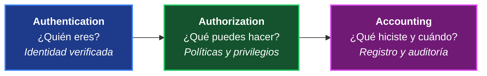
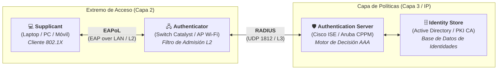
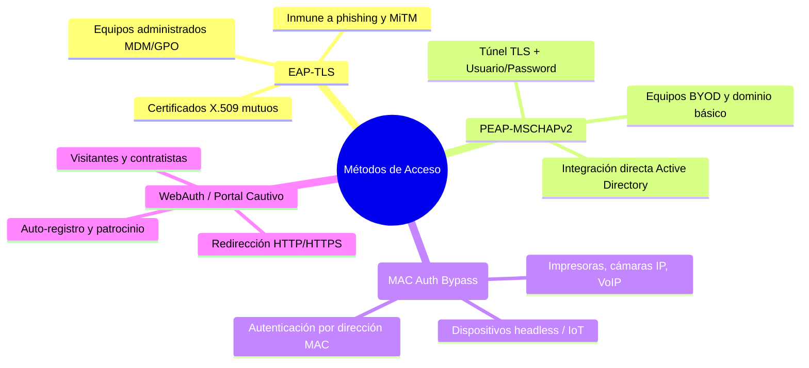

# 00. Índice General, Arquitectura NAC y Modelo Zero Trust

  
  
  

---

## 1. ¿Qué es AAA y por qué es indispensable en redes corporativas?

En una red empresarial moderna, ningún usuario ni endpoint puede tener acceso irrestricto sin identificarse previamente. En arquitecturas basadas en el principio de **Privilegio Mínimo** y **Zero Trust**, el modelo **AAA** proporciona la base sobre la que descansan la seguridad perimetral, la segmentación y la auditoría forense.

### Componentes Fundamentales de AAA:

1. **Authentication (Autenticación):**
   - **Pregunta clave:** *"¿Quién eres?"*
   - El endpoint o usuario presenta credenciales verificables:
     - Nombre de usuario y contraseña de dominio (Active Directory / LDAP).
     - Tokens de un solo uso (OTP / MFA).
     - Certificados digitales **X.509** emitidos por una PKI empresarial.
     - Dirección física MAC (en dispositivos heredados mediante MAB).

2. **Authorization (Autorización):**
   - **Pregunta clave:** *"¿Qué tienes permitido hacer?"*
   - Una vez comprobada la identidad, el servidor determina los privilegios exactos:
     - Asignación dinámica de **VLAN** en el switch de acceso.
     - Descarga de Listas de Control de Acceso (**dACLs**) aplicadas directamente al puerto físico.
     - Asignación de etiquetas de grupo de seguridad (**Security Group Tags - SGT**) en Cisco TrustSec.
     - Nivel de comandos ejecutables en consolas administrativas (privilegios 0 a 15 en TACACS+).

3. **Accounting (Auditoría / Contabilidad):**
   - **Pregunta clave:** *"¿Qué hiciste, cuándo inició y cuándo terminó tu sesión?"*
   - Registra fecha y hora de inicio/fin (`start-stop`), dirección IP asignada, volumen de bytes transferidos, puerto físico de conexión y cada comando CLI tecleado por administradores.
   - **Obligatorio para cumplimiento regulatorio:** Normativas internacionales como **PCI-DSS** (requisito 8 y 10), **ISO/IEC 27001**, **HIPAA** y **SOX** exigen bitácoras inmutables de acceso.

---

## 2. Arquitectura NAC (Network Access Control) y Modelo IEEE 802.1X

El estándar **IEEE 802.1X** define el control de admisión en capas de acceso (puertos Ethernet cableados y SSIDs inalámbricos). El modelo desacopla el punto de conexión físico del motor de políticas mediante una relación triangular:

### Roles en la Arquitectura:

| Rol | Componente Típico | Responsabilidad Técnica |
| :--- | :--- | :--- |
| **Supplicant** (Suplicante) | Agente de software nativo en Windows, macOS, Linux, iOS o Android. | Solicita acceso a la red y responde a los desafíos criptográficos presentando credenciales o certificados. |
| **Authenticator** (Autenticador) | Switch de acceso Ethernet (Cisco Catalyst, Huawei, Aruba) o Access Point. | Mantiene el puerto en estado **Unauthorized** (bloqueado), descartando todo tráfico de usuario salvo tramas **EAPoL**. Actúa como puente intermedio encapsulando EAP en paquetes RADIUS. |
| **Authentication Server** | Cisco ISE, Aruba ClearPass Policy Manager o FreeRADIUS. | Valida la identidad contra el directorio corporativo, evalúa las políticas de acceso y devuelve atributos de autorización al switch. |

---

## 3. Catálogo de Métodos de Acceso en NAC Moderno

### 1. 802.1X con EAP-TLS (Extensible Authentication Protocol - Transport Layer Security)
- **Máximo estándar de seguridad empresarial.**
- Realiza **autenticación mutua**: el servidor valida el certificado digital del cliente y el cliente valida el certificado del servidor.
- Inmune a ataques de fuerza bruta, intercepción de contraseñas (*credential stuffing*) y ataques Man-in-the-Middle.
- Requiere una Infraestructura de Clave Pública (**PKI**) y distribución de certificados (Active Directory Certificate Services, Microsoft Intune o SCEP).

### 2. 802.1X con PEAP-MSCHAPv2 (Protected EAP)
- El servidor RADIUS presenta un certificado digital para crear un túnel TLS seguro.
- Dentro del túnel cifrado, el usuario envía su usuario y contraseña de Windows Domain.
- Ampliamente utilizado en redes corporativas por su facilidad de despliegue sin requerir certificados en cada máquina cliente.

### 3. MAB (MAC Authentication Bypass)
- Diseñado para dispositivos **"Headless"** que carecen de soporte de software suplicante 802.1X (impresoras de red, cámaras de videovigilancia CCTV, teléfonos VoIP, lectores biométricos).
- El switch captura la dirección MAC de origen y la envía al servidor RADIUS como nombre de usuario y contraseña.
- Se debe complementar con **Profiling** dinámico para evitar ataques de suplantación de MAC (*MAC Spoofing*).

### 4. WebAuth / Portal Cautivo
- Utilizado principalmente para redes de invitados (*Guest Access*) y contratistas temporales.
- El switch o controlador inalámbrico intercepta el tráfico HTTP inicial y redirige el navegador a una página web segura para auto-registro o autenticación patrocinada.

---

## 4. Estructura y Navegación del Módulo

| Módulo | Nombre del Archivo | Descripción y Objetivos |
| :---: | :--- | :--- |
| **01** | [**01_PROTOCOLOS_TACACS_PLUS_VS_RADIUS_Y_AUTENTICACION.md**](01_PROTOCOLOS_TACACS_PLUS_VS_RADIUS_Y_AUTENTICACION.md) | Comparativa técnica profunda entre TACACS+ y RADIUS. Configuraciones listas para producción en Cisco IOS-XE y Huawei VRP. Auditoría granular y fallback local. |
| **02** | [**02_DOT1X_EAP_TLS_PEAP_Y_MAB_EN_SWITCHES.md**](02_DOT1X_EAP_TLS_PEAP_Y_MAB_EN_SWITCHES.md) | Configuración de puertos de acceso con 802.1X, modos Multi-Domain (PC + Teléfono IP), MAB, temporizadores, contingencia (VLAN Crítica) y Change of Authorization (CoA RFC 5176). |
| **03** | [**03_CISCO_ISE_CONFIGURACION_POLITICAS_Y_PROFILING.md**](03_CISCO_ISE_CONFIGURACION_POLITICAS_Y_PROFILING.md) | Cisco ISE 3.x: Nodos PAN, PSN, MnT, pxGrid. Jerarquía de Policy Sets, Downloadable ACLs (dACL), motor de Profiling por DHCP/HTTP y segmentación con Cisco TrustSec (SGT). |
| **04** | [**04_ARUBA_CLEARPASS_Y_FREERADIUS_ENTERPRISE.md**](04_ARUBA_CLEARPASS_Y_FREERADIUS_ENTERPRISE.md) | Aruba ClearPass Policy Manager: Servicios, Role Mapping y Enforcement. Implementación empresarial de FreeRADIUS en Linux con `clients.conf`, `users` y depuración en vivo con `-X`. |
