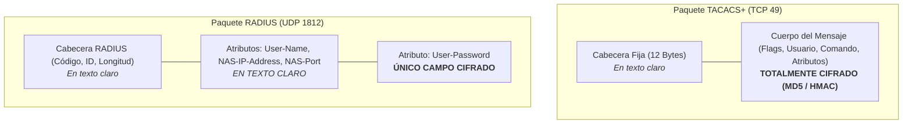

# 01. Protocolos TACACS+ vs. RADIUS y Autenticación de Administradores

<p align="center">
  
  
  
</p>

---

## 1. Comparativa Técnica Profunda: TACACS+ vs. RADIUS

Comprender la diferencia arquitectónica entre **TACACS+** y **RADIUS** es uno de los requisitos más críticos para el diseño de seguridad en infraestructuras de red:

| Característica | TACACS+ (*Terminal Access Controller Access-Control System Plus*) | RADIUS (*Remote Authentication Dial-In User Service*) |
| :--- | :--- | :--- |
| **Estándar Oficial** | Originalmente propietario de Cisco, estandarizado como **RFC 8907**. | Estándar abierto IETF (**RFC 2865** para Autenticación, **RFC 2866** para Contabilidad). |
| **Capa de Transporte** | **TCP Puerto 49** (Garantiza entrega ordenada, acuse de recibo y retransmisión rápida ante congestión). | **UDP Puertos 1812** (Autenticación/Autorización) y **1813** (Contabilidad). *Puertos heredados: 1645/1646*. |
| **Seguridad Criptográfica** | **Cifra el CUERPO COMPLETO** del paquete (solo la cabecera fija de 12 bytes viaja en claro). | **Solo cifra el campo de contraseña** (`User-Password`); nombres de usuario, direcciones IP y atributos viajan en texto claro. |
| **Arquitectura AAA** | **Modular y desacoplada**: Autenticación, Autorización y Auditoría se ejecutan como transacciones separadas. | **Acoplada / Monolítica**: La autenticación y la autorización se devuelven juntas en el paquete `Access-Accept`. |
| **Granularidad en CLI** | **Inspección comando por comando**: Permite autorizar o denegar instrucciones específicas (ej. permitir `show` pero denegar `reload`). | **Basada en roles gruesos**: Solo permite asignar un nivel de privilegio global (0 a 15) mediante atributos de proveedor (VSA). |
| **Propósito de Diseño** | **Device Administration (Gestión de equipos):** Control de acceso administrativo a switches, routers y firewalls vía SSH/Consola. | **Network Access Control (Acceso a la red):** Control de admisión para endpoints vía 802.1X, Wi-Fi Enterprise y VPNs. |



> [!IMPORTANT]
> ### 🎯 Regla de Oro de Ingeniería de Redes:
> - **Para administrar quién ingresa al switch y qué comandos puede teclear en la consola $\rightarrow$ Usar TACACS+.**
> - **Para validar qué laptop, teléfono o usuario se conecta al puerto del switch o al Wi-Fi $\rightarrow$ Usar RADIUS.**

---

## 2. Configuración en Cisco Catalyst (IOS-XE) para Administración TACACS+

A continuación se presenta la plantilla estándar de producción para asegurar switches Cisco mediante TACACS+ con respaldo local de emergencia:

```cisco
! =====================================================================
! 1. ACTIVACIÓN DEL SUBSISTEMA AAA
! =====================================================================
aaa new-model

! =====================================================================
! 2. USUARIO LOCAL DE CONTINGENCIA (Respaldo si el servidor no responde)
! =====================================================================
! Uso de algoritmo moderno Scrypt para protección contra ataques de fuerza bruta
username admin-local privilege 15 algorithm-type scrypt secret PasswordUltraSegura2026#

! =====================================================================
! 3. DEFINICIÓN DE SERVIDORES TACACS+ PRIMARIO Y SECUNDARIO
! =====================================================================
tacacs server ISE-TACACS-01
 address ipv4 10.10.1.50
 key 6 C1sc0T@c@csK3yPr0d2026!
 timeout 3

tacacs server ISE-TACACS-02
 address ipv4 10.20.1.50
 key 6 C1sc0T@c@csK3yPr0d2026!
 timeout 3

! =====================================================================
! 4. GRUPO DE SERVIDORES TACACS+
! =====================================================================
aaa group server tacacs+ GRP-TACACS-PROD
 server name ISE-TACACS-01
 server name ISE-TACACS-02

! =====================================================================
! 5. POLÍTICAS DE AUTENTICACIÓN (LOGIN Y ENABLE)
! =====================================================================
! Intenta TACACS+; si los servidores están inalcanzables (DEAD), cae a la base de datos local
aaa authentication login default group GRP-TACACS-PROD local
aaa authentication enable default group GRP-TACACS-PROD enable

! =====================================================================
! 6. POLÍTICAS DE AUTORIZACIÓN (EXEC Y COMANDOS PRIVILEGIO 15)
! =====================================================================
! Autoriza la apertura de sesión EXEC
aaa authorization exec default group GRP-TACACS-PROD local 

! Consulta al servidor TACACS+ por cada comando tecleado en nivel 15
aaa authorization commands 15 default group GRP-TACACS-PROD if-authenticated

! =====================================================================
! 7. POLÍTICAS DE CONTABILIDAD / AUDITORÍA (ACCOUNTING)
! =====================================================================
! Registra hora de inicio y fin de cada sesión y cada comando ejecutado
aaa accounting exec default start-stop group GRP-TACACS-PROD
aaa accounting commands 15 default start-stop group GRP-TACACS-PROD

! =====================================================================
! 8. APLICACIÓN DE LAS POLÍTICAS A LÍNEAS CONSOLE Y VTY (SSH)
! =====================================================================
line con 0
 login authentication default
 authorization exec default
 logging synchronous
 stopbits 1

line vty 0 4
 transport input ssh
 login authentication default
 authorization exec default
 logging synchronous
```

---

## 3. Configuración en Huawei VRP (HWTACACS Enterprise)

En sistemas operativos **Huawei VRP (Versatile Routing Platform)**, el protocolo se implementa bajo el estándar **HWTACACS**:

```shell
<Huawei-Core> system-view
sysname Huawei-Core-01

# 1. Definir la plantilla de servidores HWTACACS con redundancia
hwtacacs-server template TPL-TACACS-PROD
 hwtacacs-server authentication 10.10.1.50
 hwtacacs-server authentication 10.20.1.50 secondary
 hwtacacs-server authorization 10.10.1.50
 hwtacacs-server authorization 10.20.1.50 secondary
 hwtacacs-server accounting 10.10.1.50
 hwtacacs-server accounting 10.20.1.50 secondary
 hwtacacs-server shared-key cipher HuaweiT@c@csK3y2026!
 quit

# 2. Configuración de esquemas dentro del subsistema AAA
aaa
 # Esquema de Autenticación con fallback local
 authentication-scheme SCH_AUTH_TACACS
  authentication-mode hwtacacs local
  quit

 # Esquema de Autorización con validación de comandos nivel 15
 authorization-scheme SCH_AUTHZ_TACACS
  authorization-mode hwtacacs local
  authorization-cmd 15 hwtacacs local
  quit

 # Esquema de Contabilidad (Accounting)
 accounting-scheme SCH_ACCT_TACACS
  accounting-mode hwtacacs
  accounting start-fail online
  quit

 # Vincular esquemas al dominio administrativo predeterminado
 domain default_admin
  authentication-scheme SCH_AUTH_TACACS
  authorization-scheme SCH_AUTHZ_TACACS
  accounting-scheme SCH_ACCT_TACACS
  hwtacacs-server TPL-TACACS-PROD
  quit
 quit

# 3. Crear usuario local de rescate (exclusivo para emergencias de corte de red)
local-user admin-local password irreversible-cipher ClaveHuaweiRescate2026#
local-user admin-local service-type ssh terminal
local-user admin-local level 15
```

---

## 4. Pruebas Operativas y Troubleshooting

### A. Probar credenciales en Cisco IOS-XE sin cerrar la sesión:
Permite verificar la comunicación con el servidor TACACS+ y las credenciales del Directorio Activo antes de desloguearse:

```bash
test aaa group GRP-TACACS-PROD jperez PasswordCorporativo2026 legacy
```
*Salida esperada:*
```text
Attempting authentication test to server-group GRP-TACACS-PROD using tacacs+
User was successfully authenticated.
```

### B. Verificar salud y disponibilidad de los servidores AAA:
```bash
show aaa servers
```
*Métricas clave para inspeccionar:*
- **State:** Debe reportar `UP`. Si reporta `DEAD`, el switch no recibe respuesta a los probes.
- **Connection timeouts / Retransmissions:** Un valor alto indica problemas de firewall L4 o saturación de enlaces WAN.

### C. Depuración de sesiones en tiempo real (Live Debugging):
> [!CAUTION]
> En entornos de alta producción, use filtros de debug o ventanas de mantenimiento para evitar sobrecargar la CPU del switch.

```bash
terminal monitor
debug tacacs
debug aaa authentication
debug aaa authorization

# Detener todas las depuraciones inmediatamente después de la prueba:
undebug all
```
