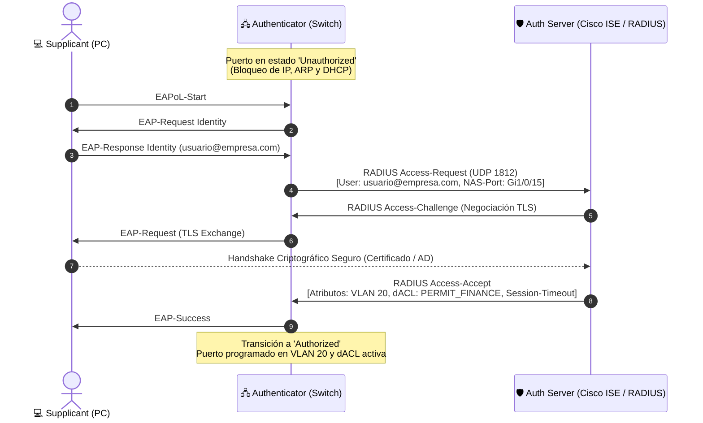
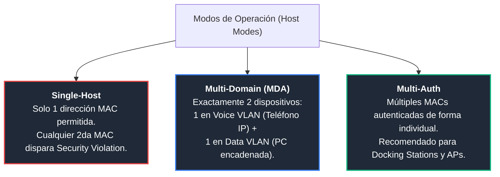

# 02. IEEE 802.1X, EAP-TLS, PEAP, MAB y Control de Puertos en Switches

<p align="center">
  
  
  
  
</p>

---

## 1. Arquitectura de Control de Admisión en Puertos (IEEE 802.1X)

Cuando un usuario conecta su equipo a una toma de red Ethernet, el switch coloca inicialmente el puerto en estado **Unauthorized (No Autorizado)**. 

En este estado, el hardware ASIC del switch descarta **TODO** el tráfico IP, peticiones ARP y solicitudes DHCP. La única excepción son las tramas de Capa 2 con EtherType **`0x888E`**, correspondientes a **EAPoL (EAP over LAN)**.



---

## 2. Comparativa de Métodos de Autenticación

| Método | Mecanismo de Seguridad | Vector Criptográfico | Caso de Uso Empresarial |
| :--- | :--- | :--- | :--- |
| **EAP-TLS** | **Certificados digitales X.509 mutuos** (Cliente y Servidor). | Criptografía asimétrica (RSA 2048/4096 o ECC). Cero contraseñas. | Laptops corporativas gestionadas por MDM (Microsoft Intune, Jamf, GPO). **Estándar de máxima seguridad corporativa.** |
| **PEAP-MSCHAPv2** | **Túnel TLS servidor** + autenticación de credenciales de usuario. | Túnel TLS con certificado público/interno del servidor; usuario y contraseña de Active Directory adentro. | Equipos personales (BYOD), contratistas o dominios sin PKI completa en los endpoints. |
| **MAB** *(MAC Authentication Bypass)* | **Autenticación por dirección física MAC**. | Ninguno (la dirección MAC se envía como identidad y contraseña al servidor RADIUS). | Dispositivos "Headless" que carecen de suplicante 802.1X: Impresoras de red, cámaras IP CCTV, telefonía IP básica, lectores biométricos. |

---

## 3. Modos de Operación de Puerto (Host Modes)

El comando `authentication host-mode` define el comportamiento del puerto ante múltiples direcciones MAC:



1. **Single-Host:**
   - Permite una única dirección MAC. Si otra MAC envía tráfico, el puerto entra en estado de violación de seguridad (`err-disable`).
2. **Multi-Domain Authentication (MDA):**
   - Diseñado para el escenario clásico de escritorio corporativo: Teléfono IP conectado a la roseta y PC conectada al switch embebido del teléfono.
   - Soporta exactamente un dispositivo en el dominio de datos y uno en el dominio de voz. Ambos se autentican independientemente.
3. **Multi-Auth (Recomendado para oficinas modernas):**
   - Autentica de forma independiente cada MAC detectada en el puerto. Esencial cuando los usuarios utilizan bases de conexión USB-C (*Docking Stations*), donde pueden coexistir interfaces virtuales o switches no administrados.

---

## 4. Configuración en Switches Cisco Catalyst (IOS-XE)

Plantilla completa de configuración para puertos de acceso con **802.1X**, fallback automático a **MAB**, manejo de contingencias y soporte de **Change of Authorization (CoA)**:

```cisco
! =====================================================================
! 1. ACTIVACIÓN GLOBAL DE AAA Y 802.1X
! =====================================================================
aaa new-model
dot1x system-auth-control

! =====================================================================
! 2. DEFINICIÓN DE SERVIDORES RADIUS (Cisco ISE / ClearPass)
! =====================================================================
radius server ISE-RADIUS-01
 address ipv4 10.10.1.50 auth-port 1812 acct-port 1813
 key 6 ClaveRadiusEmpresarial2026!
 pac-key 6 ClaveRadiusEmpresarial2026!

radius server ISE-RADIUS-02
 address ipv4 10.20.1.50 auth-port 1812 acct-port 1813
 key 6 ClaveRadiusEmpresarial2026!

aaa group server radius GRP-RADIUS-ISE
 server name ISE-RADIUS-01
 server name ISE-RADIUS-02

! =====================================================================
! 3. HABILITACIÓN DE MÉTODOS AAA PARA 802.1X Y RED
! =====================================================================
aaa authentication dot1x default group GRP-RADIUS-ISE
aaa authorization network default group GRP-RADIUS-ISE
aaa accounting dot1x default start-stop group GRP-RADIUS-ISE

! =====================================================================
! 4. CONFIGURACIÓN DE CoA (CHANGE OF AUTHORIZATION - RFC 5176)
! =====================================================================
! Permite al servidor ISE forzar reautenticación o cambiar dinámicamente
! la VLAN/dACL del usuario (ej. si el antivirus entra en estado No-Compliant)
aaa server radius dynamic-author
 client 10.10.1.50 server-key ClaveRadiusEmpresarial2026!
 client 10.20.1.50 server-key ClaveRadiusEmpresarial2026!
 port 1700

! =====================================================================
! 5. CONFIGURACIÓN DEL PUERTO DE ACCESO (802.1X + MAB)
! =====================================================================
interface GigabitEthernet1/0/15
 description PUERTO_ACCESO_CORP_DOT1X_MAB
 switchport mode access
 switchport access vlan 999       ! VLAN de aislamiento inicial
 switchport voice vlan 150        ! VLAN para telefonía IP Cisco

 ! Modo de host multi-dominio (PC + Teléfono IP)
 authentication host-mode multi-domain

 ! Prioridad y orden: intentar primero 802.1X; si no responde, probar MAB
 authentication priority dot1x mab
 authentication order dot1x mab

 ! Manejo de contingencias y alta disponibilidad
 authentication event fail action next-method
 authentication event server dead action reinitialize vlan 998   ! VLAN Crítica / Fallback
 authentication event no-response action authorize vlan 999     ! VLAN Invitados

 ! Control de temporizadores y reintentos EAP
 dot1x pae authenticator
 dot1x timeout tx-period 5
 dot1x max-reauth-req 3
 authentication periodic
 authentication timer reauthenticate 28800

 ! Endurecimiento de capa 2
 spanning-tree portfast
 spanning-tree bpduguard enable
```

---

## 5. Verificación Operativa y Troubleshooting

### A. Inspección exhaustiva de la sesión activa:
```bash
show authentication sessions interface GigabitEthernet1/0/15 details
```

*Ejemplo de salida en entorno de producción exitoso:*
```text
            Interface:  GigabitEthernet1/0/15
          MAC Address:  0050.56a1.22c4
         IPv4 Address:  10.20.15.105
            User Name:  jperez@corporativo.com
               Status:  Authorized
               Domain:  DATA
       Oper host mode:  multi-domain
     Oper control dir:  both
        Session info:   Auth Server: 10.10.1.50
       Session timeout: 28800s (local), Remaining: 27410s
        Timeout action: Reauthenticate
               Method:  dot1x (EAP-TLS)
        Assigned VLAN:  20 (VLAN_FINANZAS)
         Applied dACL:  ACSACL-x-PERMIT_FINANCE_ACCESS-654a9b
```

### B. Forzar la expulsión y reautenticación inmediata de una sesión:
```bash
clear authentication sessions interface GigabitEthernet1/0/15
```

### C. Depuración de intercambios de trama en vivo:
```bash
terminal monitor
debug dot1x all
debug radius
```
*Puntos clave a revisar en el log:*
- Recepción de `EAPoL-Start`.
- Envío de `RADIUS Access-Request` con atributos NAS correctos.
- Recepción de `Access-Accept` y programación de la hardware CAM table en la VLAN autorizada.
