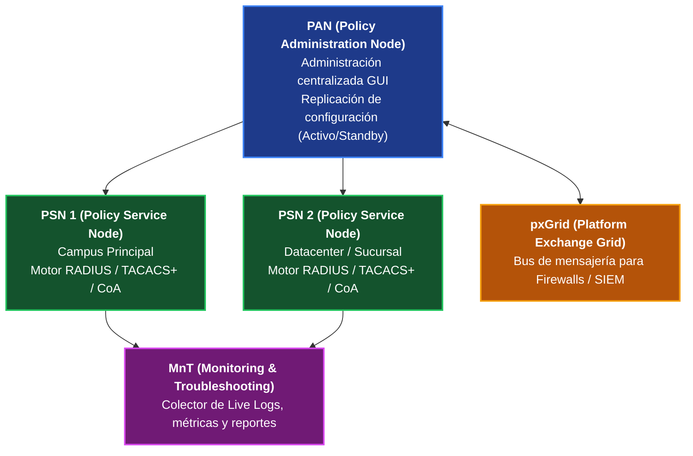
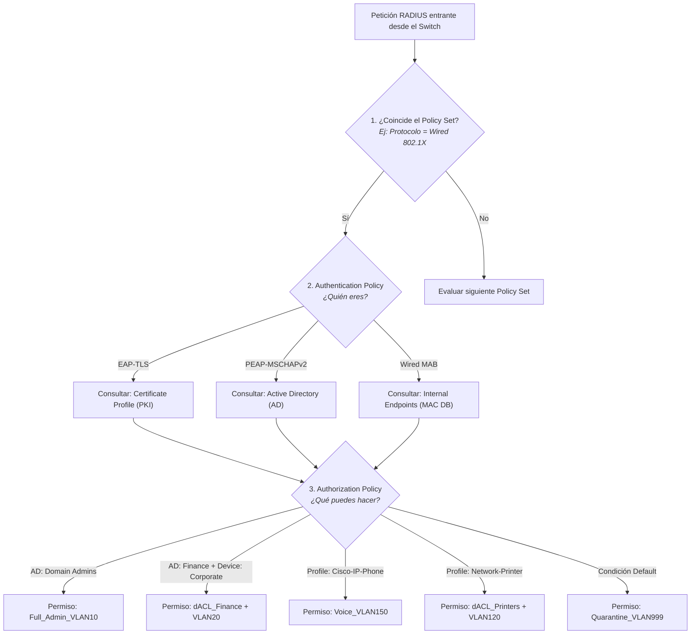
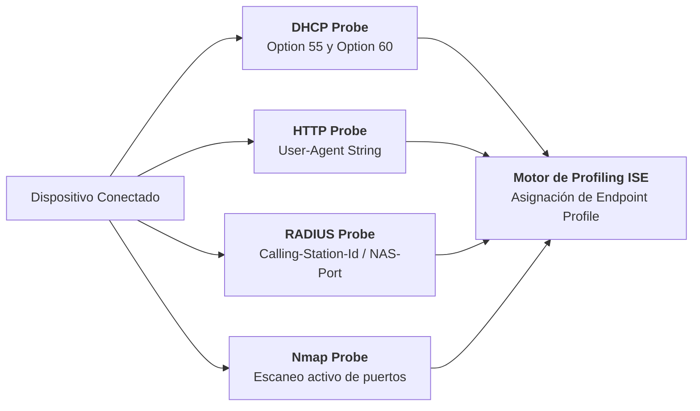
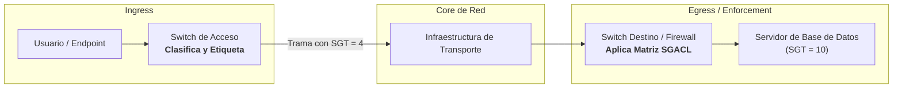

# 03. Cisco ISE (Identity Services Engine): Políticas, Profiling y TrustSec

<p align="center">
  
  
  
  
</p>

---

## 1. Arquitectura de Cisco ISE (Versiones 3.x)

Cisco ISE opera como el cerebro centralizado de control de acceso e identidad para redes cableadas, inalámbricas y VPNs. En despliegues empresariales distribuidos, sus funciones se dividen en 4 roles o **"Personas"**:



### Roles y Responsabilidades de las Personas:

1. **PAN (Policy Administration Node):**
   - Proporciona la interfaz gráfica web centralizada (GUI).
   - Administra y sincroniza las políticas hacia todos los nodos del clúster.
   - Despliegue típico: Par redundante **Primary / Secondary (Activo / Standby)**.

2. **PSN (Policy Service Node):**
   - El motor de procesamiento en tiempo real de transacciones **RADIUS**, **TACACS+**, **CoA** y **Profiling**.
   - Se distribuye físicamente cerca de los switches y APs para minimizar la latencia en las autenticaciones de los usuarios.

3. **MnT (Monitoring and Troubleshooting Node):**
   - Recibe la telemetría, contabilidad y registros de auditoría de los PSNs.
   - Alimenta el visor de **RADIUS Live Logs** y genera reportes de cumplimiento.

4. **pxGrid (Platform Exchange Grid):**
   - Bus de integración bidireccional basado en APIs (WebSockets / REST).
   - Comparte en tiempo real el contexto de identidad (*ejemplo: "El usuario jperez con IP 10.20.15.105 pertenece a Finanzas y usa Windows 11"*) con **Firewalls Cisco FTD, Palo Alto Networks, Fortinet, Check Point o SIEMs (Splunk / Microsoft Sentinel)**.

---

## 2. Jerarquía de Evaluación de Políticas (Policy Sets)

En Cisco ISE, las solicitudes de acceso no se evalúan mediante reglas planas, sino a través de un árbol de decisión estructurado conocido como **Policy Set**:



---

## 3. Implementación de Downloadable ACLs (dACL)

A diferencia de las ACLs estáticas tradicionales configuradas localmente en cada switch, una **dACL** se almacena y actualiza de forma centralizada en Cisco ISE. Al autenticarse el usuario, ISE inyecta dinámicamente la lista de acceso al puerto:

### Ejemplo de dACL para usuarios del departamento de Finanzas (`dACL_FINANCE`):

```cisco
! -------------------------------------------------------------
! Permitir servicios básicos de red para el endpoint
! -------------------------------------------------------------
permit udp any any eq bootps
permit udp any any eq domain

! -------------------------------------------------------------
! Permitir acceso específico a servidores ERP, SAP y contabilidad
! -------------------------------------------------------------
permit tcp any host 10.10.50.20 eq 443
permit tcp any host 10.10.50.21 eq 3389
permit tcp any 10.10.50.0 0.0.0.255 eq 8000

! -------------------------------------------------------------
! Permitir tráfico Web seguro a través del Proxy corporativo
! -------------------------------------------------------------
permit tcp any host 10.10.10.80 eq 8080

! -------------------------------------------------------------
! Denegar acceso a cualquier otra red interna corporativa (RFC 1918)
! -------------------------------------------------------------
deny ip any 10.0.0.0 0.255.255.255
deny ip any 172.16.0.0 0.15.255.255
deny ip any 192.168.0.0 0.0.255.255

! -------------------------------------------------------------
! Permitir navegación externa hacia Internet
! -------------------------------------------------------------
permit ip any any
```

---

## 4. Motor de Profiling: Descubrimiento Automatizado de Dispositivos

El motor de **Profiling** de Cisco ISE inspecciona el comportamiento en la red de los dispositivos para clasificarlos sin intervención humana:



1. **DHCP Probe:**
   - Analiza las solicitudes DHCP enviadas mediante IP Helper-Address.
   - **Option 60 (Vendor Class Identifier):** Ejemplo: `"Cisco Systems, Inc. IP Phone CP-8841"` o `"MSFT 5.0"`.
   - **Option 55 (Parameter Request List):** La lista exacta de parámetros solicitados delata el kernel o versión de SO.
2. **HTTP Probe:**
   - Extrae el encabezado `User-Agent` del tráfico web inicial para identificar con precisión modelos de Mac, iPhone, Android o navegadores.
3. **RADIUS Probe:**
   - Utiliza la información reportada por el switch en el mensaje de autenticación (OUI del fabricante en la dirección MAC).
4. **Nmap Probe:**
   - Ejecuta un escaneo dirigido de puertos si los métodos pasivos no logran una clasificación con suficiente certeza.

---

## 5. Cisco TrustSec y Security Group Tags (SGT)

La segmentación basada en VLANs y subredes IP es rígida e ineficiente en redes grandes. **Cisco TrustSec** introduce la segmentación basada en roles mediante etiquetas criptográficas de 16 bits (**SGT - Security Group Tags**):



### Matriz de Control de Acceso (SGACL):

| Origen (Source SGT) | Destino: Empleados (SGT 4) | Destino: Base de Datos (SGT 10) | Destino: Cámaras IoT (SGT 25) |
| :--- | :---: | :---: | :---: |
| **Empleados (SGT 4)** | Permit | **Permit (Solo SQL)** | Deny |
| **Contratistas (SGT 50)** | Deny | **DENY ALL** | Deny |
| **Servidores Web (SGT 8)** | Permit | **Permit** | Deny |

> [!TIP]
> **Ventaja de TrustSec:** La política de firewall se aplica en función del **rol (SGT)** y no de la dirección IP. Si el servidor de base de datos cambia de IP o VLAN, las reglas de acceso permanecen intactas.

---

## 6. Resolución de Fallas y Códigos de Diagnóstico (Live Logs)

Para diagnosticar problemas en Cisco ISE, navegue en la interfaz web a:
> **Operations** $\rightarrow$ **RADIUS** $\rightarrow$ **Live Logs**

Al hacer clic en el ícono de la lupa de un evento fallido, revise el **Session Details Report**. Los códigos de error más frecuentes son:

| Código de Evento | Nombre del Evento | Causa Raíz Probable | Solución Recomendada |
| :--- | :--- | :--- | :--- |
| **`5400`** | `Authentication failed` | Credenciales incorrectas o usuario deshabilitado en Active Directory. | Validar estado de la cuenta en el controlador de dominio AD. |
| **`5411`** | `EAP-TLS handshake failed` | Certificado de cliente expirado, revocado por CRL o cadena CA no confiable. | Comprobar validez del certificado en el almacén de certificados del equipo. |
| **`5440`** | `Endpoint not found in identity store` | Fallo de MAB: la dirección MAC no está registrada en la base de datos de endpoints. | Registrar la MAC o crear regla de profiling automática. |
| **`12900`** | `Supplicant stopped responding` | El endpoint no respondió al desafío EAPoL del switch. | Verificar que el servicio *Wired AutoConfig* de Windows esté iniciado (`dot3svc`). |
