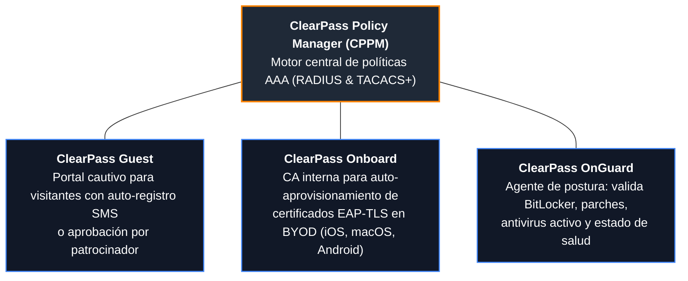
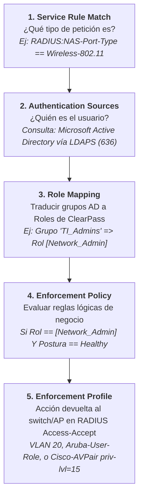

# 04. Aruba ClearPass Policy Manager y Servidor FreeRADIUS Enterprise

<p align="center">
  
  
  
  
</p>

---

## 1. Aruba ClearPass Policy Manager (CPPM): Ecosistema y Módulos

**Aruba ClearPass** (HPE Aruba Networking) es una plataforma NAC de referencia en la industria para despliegues multifabricante heterogéneos (Cisco, Aruba, Juniper, Extreme, Fortinet):



---

## 2. Flujo Lógico de Servicios en ClearPass (Pipeline de 5 Pasos)

A diferencia de Cisco ISE (organizado en Policy Sets), ClearPass procesa cada solicitud a través de un flujo secuencial estricto de **5 pasos**:



### Detalle de los Pasos:

1. **Service Rule Match:** Filtra la petición según el puerto, SSID o tipo de autenticación.
2. **Authentication Sources:** Valida contraseñas o certificados contra repositorios de identidades (Active Directory, Azure AD/Entra ID, OpenLDAP).
3. **Role Mapping:** Asigna etiquetas internas (*Roles*) independientes del fabricante del switch.
4. **Enforcement Policy:** Matriz de condiciones basada en Roles, tipo de dispositivo, horario y estado de postura de OnGuard.
5. **Enforcement Profiles (VSAs):** Retorna atributos estándar IETF o atributos de proveedor (*Vendor Specific Attributes*):
   - **Cisco:** `Cisco-AVPair = "shell:priv-lvl=15"`
   - **Aruba:** `Aruba-User-Role = "finance-sec-role"`
   - **Estándar IETF:** `Tunnel-Private-Group-Id = "20"` (Asignación de VLAN)

---

## 3. Despliegue de Servidor FreeRADIUS Enterprise en Linux

**FreeRADIUS** es el servidor AAA de código abierto más utilizado en el mundo, reconocido por su rendimiento extremo en centros de datos, proveedores de internet (ISPs) y redes académicas globales (**eduroam**).

### A. Instalación en Ubuntu / Debian Linux:
```bash
sudo apt-get update
sudo apt-get install -y freeradius freeradius-utils
```

### B. Declaración de Clientes (Switches y APs) en `/etc/freeradius/3.0/clients.conf`:
```conf
# Definición del switch Core Cisco de la red
client Switch-Core-Cisco {
    ipaddr      = 10.10.1.1
    secret      = ClaveSuperSecretaRadius2026!
    nas_type    = cisco
    require_message_authenticator = yes
}

# Subred completa de switches de acceso del campus
client Subred-Switches-Acceso {
    ipaddr      = 10.10.2.0/24
    secret      = ClaveAccesoRadius2026!
    shortname   = sw-campus
}
```

### C. Definición de Usuarios y Atributos de VLAN en `/etc/freeradius/3.0/users`:
```conf
# =====================================================================
# 1. Usuario Administrador con privilegios de consola nivel 15 (Cisco)
# =====================================================================
admin-redes  Cleartext-Password := "AdminFuerte2026#"
    Cisco-AVPair = "shell:priv-lvl=15",
    Reply-Message = "Bienvenido a la consola del Switch Core"

# =====================================================================
# 2. Usuario corporativo con asignación dinámica a VLAN 20 (Finanzas)
# =====================================================================
carlos.gomez Cleartext-Password := "ContrasenaCarlos2026!"
    Tunnel-Type = VLAN,
    Tunnel-Medium-Type = IEEE-802,
    Tunnel-Private-Group-Id = "20",
    Reply-Message = "Acceso concedido a segmento VLAN 20"

# =====================================================================
# 3. Dispositivo MAB (Impresora de red HP LaserJet por dirección MAC)
# En FreeRADIUS, la MAC se define como usuario y contraseña en minúsculas
# =====================================================================
005056a122c4  Cleartext-Password := "005056a122c4"
    Tunnel-Type = VLAN,
    Tunnel-Medium-Type = IEEE-802,
    Tunnel-Private-Group-Id = "120",
    Reply-Message = "Impresora autorizada en VLAN 120 (Impresoras)"
```

---

## 4. Pruebas Operativas y Modo Debug Avanzado

### A. Prueba de autenticación local con `radtest`:
```bash
radtest admin-redes AdminFuerte2026# localhost 0 ClaveSuperSecretaRadius2026!
```

*Salida esperada de validación exitosa:*
```text
Sent Access-Request Id 147 from 127.0.0.1:51240 to 127.0.0.1:1812
Received Access-Accept Id 147 from 127.0.0.1:1812
Cisco-AVPair = "shell:priv-lvl=15"
Reply-Message = "Bienvenido a la consola del Switch Core"
```

### B. El Secreto del Ingeniero: Depuración en Vivo con `freeradius -X`

> [!TIP]
> Si una negociación 802.1X, EAP-TLS o MAB está fallando, no intente adivinar en los registros del switch. Detenga el servicio en segundo plano e inicie FreeRADIUS en primer plano con el parámetro `-X`:

```bash
sudo systemctl stop freeradius
sudo freeradius -X
```

#### Información que revela el modo depuración interactivo:
1. **Certificados TLS:** Muestra la cadena de confianza completa, el Subject Alternative Name (SAN) y si el certificado cliente está expirado o revocado.
2. **Atributos decodificados:** Muestra exactamente qué atributos envió el switch (`NAS-IP-Address`, `Calling-Station-Id`, `NAS-Port-Type`).
3. **Causa exacta de rechazo:** Si el servidor devuelve `Access-Reject`, detalla la línea exacta del archivo de configuración o la discrepancia de hash de contraseñas.
