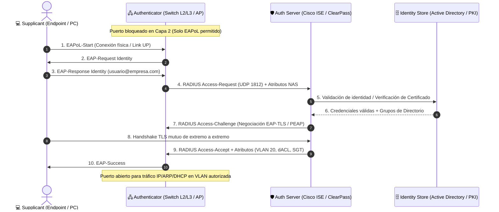

# 🛡️ Control de Acceso, Identidad y Arquitectura AAA (Cisco ISE / Aruba ClearPass / RADIUS / TACACS+)

<p align="center">
  
  
  
  
  
  
</p>

---

## 📌 Visión General del Repositorio

En las infraestructuras de red modernas bajo el paradigma **Zero Trust ("Nunca confiar, siempre verificar")**, el perímetro tradicional de seguridad ha desaparecido. El verdadero perímetro es la **identidad** del usuario y del endpoint.

Este repositorio proporciona un **manual técnico integral, modular y listo para producción** sobre la implementación de arquitecturas **AAA (Authentication, Authorization, Accounting)** y sistemas **NAC (Network Access Control)** corporativos.

Abarca desde los fundamentos de control de acceso en puertos físicos (switches) y lógicos (Wi-Fi), hasta configuraciones avanzadas de switches **Cisco Catalyst (IOS-XE)**, **Huawei VRP**, y la orquestación centralizada en **Cisco Identity Services Engine (ISE)**, **Aruba ClearPass Policy Manager (CPPM)** y **FreeRADIUS**.

---

## 🏛️ Diagrama Arquitectónico de Acceso Seguro (IEEE 802.1X / NAC)



---

## ⚖️ Matriz Comparativa: TACACS+ vs. RADIUS

| Criterio | TACACS+ (*RFC 8907*) | RADIUS (*RFC 2865 / 2866*) |
| :--- | :--- | :--- |
| **Objetivo Principal** | **Device Administration**: Gestión y control de administradores en CLI de switches, routers y firewalls. | **Network Access Control**: Control de admisión de laptops, teléfonos, impresoras y Wi-Fi corporativo. |
| **Capa de Transporte** | **TCP Puerto 49** (Orientado a conexión, confiable con retransmisión). | **UDP 1812 (Auth) / 1813 (Acct)** (Ligero, reintentos manejados en capa de aplicación). |
| **Nivel de Cifrado** | **Cifra el cuerpo completo** del paquete (solo cabecera de 12 bytes en texto claro). | **Solo cifra la contraseña**; los atributos, nombres de usuario y respuestas viajan en claro. |
| **Separación AAA** | **Totalmente modular**: Procesos independientes de Autenticación, Autorización y Auditoría. | **Monolítico**: Autenticación y Autorización acopladas en un único `Access-Accept`. |
| **Autorización de Comandos** | **Por comando individual** (granularidad milimétrica: inspecciona cada instrucción tecleada). | **Limitada** a niveles de privilegio globales (0 a 15) mediante Vendor Specific Attributes. |
| **Soporte Multi-Fabricante** | Originalmente propietario Cisco, soportado en Cisco, Huawei (HWTACACS), Juniper, Arista. | Estándar IETF universal soportado por el 100% de la industria. |

> [!TIP]
> **Regla de Oro en Producción:**
> - Si deseas controlar **quién accede a la consola del router y qué comandos ejecuta** $\rightarrow$ Configura **TACACS+**.
> - Si deseas controlar **qué laptop o teléfono se conecta a la boca de red o al SSID** $\rightarrow$ Configura **RADIUS / 802.1X**.

---

## 📂 Contenido del Repositorio y Módulos de Estudio

Haz clic en cualquiera de los módulos para acceder a la documentación detallada:

```
AAA_y_Control_de_Acceso/
│
├── 00_INDICE_Y_ARQUITECTURA_AAA_NAC.md
│   ├── Marco conceptual AAA (Authentication, Authorization, Accounting)
│   ├── La tríada IEEE 802.1X (Supplicant, Authenticator, Authentication Server)
│   ├── Catálogo de métodos: EAP-TLS, PEAP-MSCHAPv2, MAB y Portales Cautivos
│   └── Alineación con el modelo de seguridad Zero Trust
│
├── 01_PROTOCOLOS_TACACS_PLUS_VS_RADIUS_Y_AUTENTICACION.md
│   ├── Análisis técnico profundo: TACACS+ vs RADIUS
│   ├── Configuración paso a paso en Cisco Catalyst IOS-XE (aaa new-model)
│   ├── Configuración completa en Huawei VRP (HWTACACS y esquemas AAA)
│   └── Comandos de validación, pruebas con 'test aaa' y debug de sesiones
│
├── 02_DOT1X_EAP_TLS_PEAP_Y_MAB_EN_SWITCHES.md
│   ├── Ciclo de vida del puerto switch (Estados Unauthorized vs Authorized)
│   ├── Modos de host: Single-Host, Multi-Domain (MDA) y Multi-Auth
│   ├── Configuración completa en Cisco IOS-XE (802.1X + MAB + CoA RFC 5176)
│   ├── Manejo de contingencias: Critical VLAN y Guest VLAN
│   └── Verificación avanzada con 'show authentication sessions details'
│
├── 03_CISCO_ISE_CONFIGURACION_POLITICAS_Y_PROFILING.md
│   ├── Arquitectura de Personas ISE 3.x (PAN, PSN, MnT, pxGrid)
│   ├── Jerarquía y evaluación de Policy Sets (Authentication & Authorization)
│   ├── Creación e inyección de Downloadable ACLs (dACL)
│   ├── Motor de Profiling automatizado (DHCP Option 55/60, HTTP User-Agent)
│   ├── Cisco TrustSec, Security Group Tags (SGT) y matrices SGACL
│   └── Guía de diagnóstico con Live Logs y códigos de evento de falla (5400, 5411)
│
└── 04_ARUBA_CLEARPASS_Y_FREERADIUS_ENTERPRISE.md
    ├── Arquitectura modular ClearPass (CPPM, Guest, Onboard, OnGuard)
    ├── Pipeline lógico de Servicios en ClearPass (Service, Auth, Role, Enforcement)
    ├── Despliegue de FreeRADIUS Enterprise en Linux (Ubuntu/Debian)
    ├── Configuración de clients.conf, diccionarios y usuarios con atributos VSA
    └── Auditoría y depuración en tiempo real con 'freeradius -X'
```

---

## 🛠️ Comandos de Verificación Rápida (Cheat Sheet)

### Cisco IOS-XE (Switches Catalyst)
```bash
# Verificar estado y salud de los servidores AAA
show aaa servers

# Inspeccionar sesión 802.1X activa en un puerto específico
show authentication sessions interface GigabitEthernet1/0/15 details

# Forzar reautenticación inmediata de un endpoint
clear authentication sessions interface GigabitEthernet1/0/15

# Probar credenciales TACACS+ sin salir de la sesión actual
test aaa group GRP-TACACS-PROD jperez PasswordCorporativo2026 legacy
```

### Linux FreeRADIUS
```bash
# Probar autenticación localmente vía terminal
radtest admin-redes AdminFuerte2026# localhost 0 ClaveSuperSecretaRadius2026!

# Iniciar en modo depuración interactivo (Superpoder de diagnóstico)
sudo systemctl stop freeradius
sudo freeradius -X
```

---

## 📜 Licencia

Este proyecto está bajo la Licencia **MIT**. Consulta el archivo [LICENSE](../LICENSE) para más detalles.
