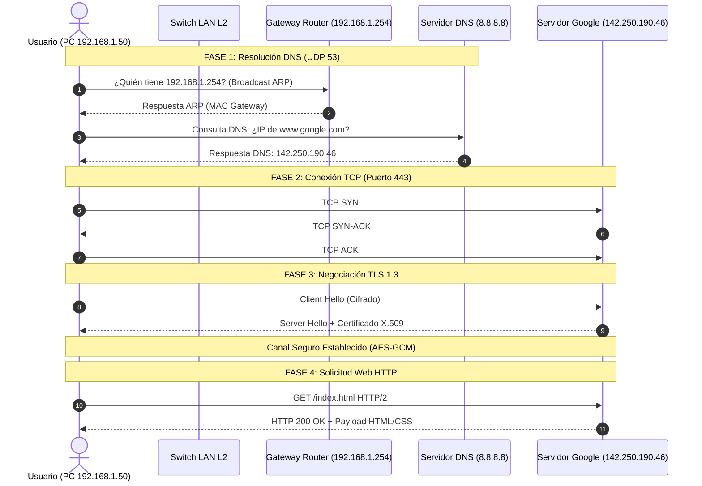

# 08. Comparativa Modelo OSI vs Modelo TCP/IP y El Viaje Completo de un Paquete

> **MODELO OSI (OPEN SYSTEMS INTERCONNECTION) — GUÍA MAESTRA PARA CERTIFICACIONES**  
> *Referencia técnica para ingenieros de redes y preparación para Cisco CCNA 200-301, CompTIA Network+ y Huawei HCIA.*

---

## 1. Comparativa Estructural: Modelo OSI vs Modelo TCP/IP

- **Modelo OSI** (*ISO*): Modelo teórico y didáctico de **7 capas**, diseñado para estandarizar la interoperabilidad universal.
- **Modelo TCP/IP** (*DARPA / DoD / IETF*): Modelo práctico y funcional sobre el cual está construida la red global Internet.

### Mapeo Directo entre Modelos

| Capas del Modelo OSI (7 Capas)<br>*(Referencia Teórica ISO)* | Modelo TCP/IP Original<br>*(4 Capas - RFC 1122)* | Modelo TCP/IP Moderno / Híbrido<br>*(5 Capas)* |
| :--- | :--- | :--- |
| **7. Aplicación** | <br>**4. Aplicación**<br>*(Absorbe Capas 5, 6 y 7)* | **5. Aplicación** |
| **6. Presentación** | *(Manejado por la aplicación)* | *(Manejado por la aplicación)* |
| **5. Sesión** | *(Manejado por la aplicación)* | *(Manejado por la aplicación)* |
| **4. Transporte** | **3. Transporte (Host-to-Host)** | **4. Transporte** |
| **3. Red** | **2. Internet** | **3. Red (Internet)** |
| **2. Enlace de Datos** | <br>**1. Acceso a la Red**<br>*(Network Access / Link Layer)* | **2. Enlace de Datos** |
| **1. Física** | *(Hardware y medios físicos)* | **1. Física** |

> [!NOTE]
> **Diferencias Clave para Exámenes de Certificación:**
> 1. En el modelo TCP/IP, las funciones de **Sesión (Capa 5)**, **Presentación (Capa 6)** y **Aplicación (Capa 7)** están integradas dentro del software de la propia aplicación de usuario.
> 2. En el RFC original de TCP/IP, la Capa de Enlace y la Capa Física se agrupaban bajo el término común **"Acceso a la Red"** (*Network Interface / Link Layer*). El modelo moderno de 5 capas las separa para reflejar la realidad del hardware Ethernet / Wi-Fi y cableado.

---

## 2. El Viaje Completo de un Paquete en la Red (Paso a Paso)

### 📌 Escenario Real
Una empleada abre su navegador en su PC (`192.168.1.50`), escribe `https://www.google.com` y presiona **ENTER**.

¿Qué ocurre exactamente en cada capa y en cada milisegundo?



### Detalle Técnico por Fases:

#### Fase 1: Resolución DNS (Descubrir la IP del Servidor)
1. **Capa 7 (Aplicación):** El navegador web necesita la dirección IP de `www.google.com`. Genera una consulta DNS.
2. **Capa 4 (Transporte):** Encapsula la consulta DNS en un datagrama **UDP** con puerto destino `53` y un puerto efímero origen aleatorio (ej. `51234`).
3. **Capa 3 (Red):** Encapsula en un paquete **IPv4** con IP destino del servidor DNS (`8.8.8.8`) e IP origen local (`192.168.1.50`).
4. **Capa 2 (Enlace de Datos):** La PC consulta su tabla de enrutamiento local y determina que `8.8.8.8` está fuera de su subred local. Por lo tanto, el paquete debe enviarse a su Gateway (`192.168.1.254`).
   - *¿Conoce la PC la dirección MAC del Gateway?*
     - Si no la tiene en su caché ARP, pausa el envío y transmite un broadcast **ARP**:  
       `"¿Quién tiene la IP 192.168.1.254? Dígale a 192.168.1.50"`.
     - El router Gateway responde con su MAC (`00:AA:BB:CC:DD:EE`).
5. **Capa 2 (Trama Ethernet):** La PC crea la trama:  
   `[ MAC Destino: Gateway | MAC Origen: PC | EtherType: 0x0800 ]`
6. **Capa 1 (Física):** Se modula en pulsos eléctricos a través del cable UTP hacia el Switch.
7. El servidor DNS responde con la IP pública de Google: `142.250.190.46`.

#### Fase 2: Establecimiento de Conexión TCP (Three-Way Handshake)
8. **Capa 4:** La PC envía un segmento con bandera `[SYN]` al puerto `443` (HTTPS) de Google (`142.250.190.46`).
9. Google responde con `[SYN, ACK]`.
10. La PC responde con `[ACK]`. La sesión TCP queda formalmente establecida.

#### Fase 3: Negociación Criptográfica TLS (Capas 5 y 6)
11. Se negocian suites de cifrado y claves efímeras Diffie-Hellman (*Client Hello / Server Hello*).
12. El navegador valida el certificado digital X.509 de Google contra sus entidades certificadoras de confianza (CA). El túnel queda cifrado con AES-GCM.

#### Fase 4: Solicitud y Descarga Web (Capa 7)
13. El navegador envía la solicitud HTTP protegida:  
    `GET /index.html HTTP/2`  
    `Host: www.google.com`
14. Google procesa y responde con `HTTP/2 200 OK` junto al código HTML/CSS/JS.
15. El motor de renderizado del navegador procesa el DOM y pinta la página en pantalla.

---

## 3. Regla de Oro de Examen: ¿Qué cambia y qué NO cambia en cada salto?

> [!IMPORTANT]
> **REGLA DE ORO DE NETWORKING:**
> 
> - **LAS DIRECCIONES IP (Capa 3) PERMANECEN CONSTANTES:**  
>   La **IP Origen** (tu PC) y la **IP Destino** (el servidor) **NUNCA** cambian a lo largo de Internet (salvo traducción expresa por un NAT).
> 
> - **LAS DIRECCIONES MAC (Capa 2) CAMBIAN EN CADA SALTO (HOP-BY-HOP):**  
>   Cada router en el camino:
>   1. Valida el FCS (CRC32); si está corrupto descarta la trama.
>   2. **Destruye** el encabezado Ethernet de Capa 2 entrante.
>   3. Consulta su tabla de enrutamiento (Capa 3) para decidir la interfaz de salida y el siguiente salto (*Next-Hop*).
>   4. **Decrementa el campo TTL en 1**.
>   5. **Construye un NUEVO encabezado Ethernet de Capa 2:**
>      - **Nueva MAC Origen:** La dirección MAC de la interfaz de salida del propio router.
>      - **Nueva MAC Destino:** La dirección MAC del siguiente router o host receptor.

---

## 4. Anatomía Visual del Encapsulamiento Completo en el Cable

Estructura capturada en analizador de protocolos (Wireshark) viajando por el medio físico:

```text
+-----------------------------------------------------------------------------+
| PREÁMBULO + SFD (8 Bytes) - Sincronización física de Capa 1                |
+-----------------------------------------------------------------------------+
| ENCABEZADO ETHERNET II (14 Bytes) - Capa 2                                  |
| [ MAC Destino (6B) | MAC Origen (6B) | EtherType 0x0800 (2B) ]              |
+-----------------------------------------------------------------------------+
| ENCABEZADO IPv4 (20 Bytes) - Capa 3                                         |
| [ Versión | IHL | DSCP | Longitud | ID | Flags | TTL | Protocolo 6 (TCP)    |
|   Checksum | IP Origen (4B) | IP Destino (4B) ]                             |
+-----------------------------------------------------------------------------+
| ENCABEZADO TCP (20 Bytes) - Capa 4                                          |
| [ Puerto Origen (2B) | Puerto Destino 443 (2B) | Sequence Num (4B)          |
|   Ack Num (4B) | Flags (SYN/ACK) | Window Size | Checksum | Puntero ]       |
+-----------------------------------------------------------------------------+
| DATOS DE APLICACIÓN CIFRADOS (TLS 1.3 / HTTP) - Capas 5, 6 y 7              |
| [ Mensaje Web / HTML / JSON / Imagen ]                                       |
+-----------------------------------------------------------------------------+
| FCS - FRAME CHECK SEQUENCE (4 Bytes) - Verificación CRC-32 de Capa 2        |
+-----------------------------------------------------------------------------+
```
