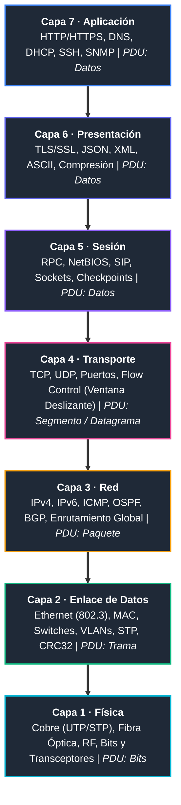

# 🌐 Modelo OSI — Guía Maestra de Ingeniería y Certificaciones

<p align="center">
  
  
  
  
  
</p>

---

## 📌 Acerca de esta Guía

Este repositorio reúne una **guía técnica exhaustiva, modular y de nivel profesional** sobre el **Modelo de Referencia OSI (Open Systems Interconnection - ISO/IEC 7498)** y su comparativa directa con la pila **TCP/IP**.

Diseñado específicamente como manual de estudio y consulta rápida para ingenieros de redes, administradores de sistemas y candidatos a certificaciones internacionales como **Cisco CCNA (200-301)**, **CompTIA Network+ (N10-008)** y **Huawei HCIA-Datacom**.

---

## 🏗️ Mapa Arquitectónico de las 7 Capas



---

## 📊 Matriz Resumen de las 7 Capas

| Capa | Nombre (ES / EN) | PDU | Protocolos Principales | Dispositivos / Hardware | Foco de Certificación |
| :---: | :--- | :--- | :--- | :--- | :--- |
| **7** | **Aplicación**<br>*(Application)* | **Datos** | HTTP/2/3, DNS, DHCP, SSH, FTP, SMTP | Proxy, NGFW (WAF), Balanceadores L7 | Ciclo DORA de DHCP, consultas DNS y códigos HTTP |
| **6** | **Presentación**<br>*(Presentation)* | **Datos** | TLS 1.3, SSL, AES, RSA, JPEG, JSON, UTF-8 | Servidor de terminación TLS, Gateways API | Handshake TLS, cifrado asimétrico/simétrico |
| **5** | **Sesión**<br>*(Session)* | **Datos** | RPC, NetBIOS, PPTP, SIP, NFS | Hosts, Controladores de sesión de voz | Modos Simplex, Half-Duplex, Full-Duplex |
| **4** | **Transporte**<br>*(Transport)* | **Segmento** (TCP)<br>**Datagrama** (UDP) | TCP (RFC 793), UDP (RFC 768) | Firewall con estado (Stateful), L4 Load Balancer | Handshake SYN/SYN-ACK/ACK, ventana deslizante, UDP vs TCP |
| **3** | **Red**<br>*(Network)* | **Paquete** | IPv4, IPv6, ICMP, ARP, OSPF, BGP | Routers, Switches L3 (Multicapa) | Subnetting, VLSM, decremento TTL, tablas de rutas |
| **2** | **Enlace de Datos**<br>*(Data Link)* | **Trama** | Ethernet II, 802.1Q (VLAN), STP (802.1D), LACP | Switches L2, Bridges, NICs, Access Points | Aprendizaje de tabla CAM, dominios de colisión/broadcast, MAC |
| **1** | **Física**<br>*(Physical)* | **Bits** | Manchester, NRZ, 10GBASE-T, 1000BASE-LX | Hubs, Repetidores, Cables UTP/STP, Fibra, SFPs | Categorías UTP (Cat 5e/6/6a), fibra monomodo vs multimodo |

---

## 📚 Temario y Módulos de Estudio

Haga clic en cualquiera de los temas para acceder a la documentación técnica detallada:

1. [**00. Fundamentos e Historia del Modelo OSI**](00_INDICE_Y_FUNDAMENTOS_MODELO_OSI.md)
   - Por qué nació el modelo OSI (romper el *Vendor Lock-in* de IBM/DEC).
   - Concepto de arquitectura por capas y principio de abstracción.
   - Diagrama del proceso de encapsulamiento y desencapsulamiento.

2. [**01. Capa 1: Física (Physical Layer)**](01_CAPA_1_FISICA_PHYSICAL_LAYER.md)
   - Medios de transmisión: Cobre (Cat 5e, 6, 6a, 7, 8), estándares TIA-568A vs 568B.
   - Fibra óptica: Monomodo (SMF) vs Multimodo (MMF), conectores (LC, SC) y transceptores (SFP/QSFP).
   - Problemas físicos reales: Atenuación, diafonía (NEXT/FEXT) y jitter.

3. [**02. Capa 2: Enlace de Datos (Data Link Layer)**](02_CAPA_2_ENLACE_DE_DATOS_DATA_LINK_LAYER.md)
   - Subcapas IEEE 802: LLC (802.2) y MAC (802.3 / 802.11).
   - Anatomía de la trama Ethernet II y direccionamiento MAC (Unicast, Broadcast, Multicast).
   - Operación del Switch: Ciclo de aprendizaje, reenvío, filtrado e inundación (tabla CAM).

4. [**03. Capa 3: Red (Network Layer)**](03_CAPA_3_RED_NETWORK_LAYER.md)
   - Anatomía del encabezado IPv4 (campos TTL, Protocol, Flags DF/MF) e IPv6.
   - Matemáticas de Subnetting: VLSM, CIDR y fórmulas de cálculo para examen.
   - Lógica de enrutamiento: Tablas de rutas, distancia administrativa y métricas (OSPF vs BGP).

5. [**04. Capa 4: Transporte (Transport Layer)**](04_CAPA_4_TRANSPORTE_TRANSPORT_LAYER.md)
   - Números de puerto (Bien conocidos, Registrados, Efímeros) y sockets.
   - Protocolo TCP: Three-Way Handshake, terminación de 4 vías y control de congestión.
   - Comparativa detallada TCP vs UDP: Confiabilidad vs Latencia.

6. [**05. Capa 5: Sesión (Session Layer)**](05_CAPA_5_SESION_SESSION_LAYER.md)
   - Mantenimiento y sincronización de diálogos, puntos de control (*Checkpoints*).
   - Modos de comunicación: Simplex, Half-Duplex y Full-Duplex.
   - Protocolos asociados: RPC, NetBIOS y SIP.

7. [**06. Capa 6: Presentación (Presentation Layer)**](06_CAPA_6_PRESENTACION_PRESENTATION_LAYER.md)
   - Traducción de formatos: ASCII, EBCDIC, Unicode UTF-8.
   - Cifrado y seguridad: TLS/SSL, cifrado simétrico (AES) vs asimétrico (RSA/ECC).
   - Serialización de datos para APIs modernas: JSON, XML, Protobuf.

8. [**07. Capa 7: Aplicación (Application Layer)**](07_CAPA_7_APLICACION_APPLICATION_LAYER.md)
   - Protocolos Web: Evolución de HTTP/1.1 a HTTP/2 (Multiplexación) y HTTP/3 (QUIC/UDP).
   - DNS: Tipos de registros (A, AAAA, CNAME, MX, PTR, TXT) y consultas recursivas vs iterativas.
   - DHCP: Ciclo de 4 pasos DORA y protocolos de mensajería (SMTP, IMAP, SSH).

9. [**08. Comparativa OSI vs TCP/IP y El Viaje Completo de un Paquete**](08_COMPARATIVA_OSI_VS_TCPIP_Y_ENCAPSULAMIENTO.md)
   - Mapeo directo OSI (7 capas) vs TCP/IP (4 y 5 capas).
   - Paso a paso: Qué ocurre cuando un usuario teclea `https://www.google.com` (DNS -> ARP -> TCP -> TLS -> HTTP).
   - **Regla de Oro**: Por qué las IPs permanecen constantes y las MACs cambian en cada salto.

10. [**09. Simulador y Banco de 30 Preguntas Tipo Certificación**](09_BANCO_DE_PREGUNTAS_Y_CASOS_TIPO_CERTIFICACION.md)
    - 30 reactivos reales organizados por bloques temáticos.
    - Respuestas desplegables con explicaciones técnicas profundas diseñadas para poner a prueba tu nivel de preparación.

---

## 🎯 Simulador Interactivo de Examen

El módulo [`09_BANCO_DE_PREGUNTAS_Y_CASOS_TIPO_CERTIFICACION.md`](09_BANCO_DE_PREGUNTAS_Y_CASOS_TIPO_CERTIFICACION.md) incluye reactivos con formato interactivo:

```markdown
### ❓ Pregunta 1
¿Cuál es el orden correcto de encapsulamiento de datos conforme descienden desde
la Capa de Transporte hasta la Capa Física en el modelo OSI?
A) Paquete -> Segmento -> Trama -> Bits
B) Segmento -> Trama -> Paquete -> Bits
C) Segmento -> Paquete -> Trama -> Bits
D) Trama -> Paquete -> Segmento -> Bits

<details>
<summary><b>🔍 Ver Respuesta Correcta y Explicación</b></summary>

> **Respuesta Correcta:** `C`  
> **Explicación:** En la Capa 4 los datos se convierten en Segmentos (TCP)...
</details>
```

---

## 🛠️ Cómo Utilizar este Material

1. **Ruta Progresiva (Estudio desde cero):** Comience en el capítulo `00` y avance de forma ascendente (Capa 1 a Capa 7) para asimilar el principio de encapsulamiento.
2. **Ruta de Repaso Rápido (Pre-examen):** Revise la **Matriz Resumen** de este README, estudie el capítulo `08` (El viaje del paquete) y ponga a prueba sus conocimientos resolviendo las 30 preguntas del capítulo `09`.

---

## 📄 Licencia

Este proyecto está bajo la Licencia **MIT** — consulte el archivo [LICENSE](../LICENSE) para más detalles. Siéntase libre de utilizar este material con fines de estudio, enseñanza y preparación profesional.
