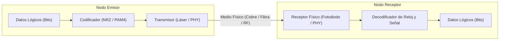
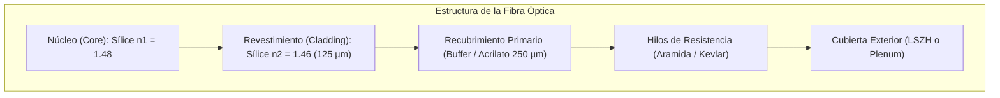

# 🌐 Volumen 01: Fundamentos Físicos, Cableado y Arquitectura de Modelos OSI / TCP-IP
## Wiki Maestra de Ingeniería EDC

> **ESTÁNDARES:** ISO/IEC 7498-1 • RFC 1122 • RFC 9293 • ANSI/TIA-568-D • IEEE 802.3  
> **ALINEACIÓN DE CERTIFICACIÓN:** Cisco CCNA (200-301) • CompTIA Network+ (N10-008) • Huawei HCIA-Datacom  
> **UBICACIÓN:** `Base de Conocimientos_EDC/WIKI_EDC/WIKI_01_Fundamentos_Fisicos_y_Modelo_OSI.md`

---

## 1. Fundamentos de la Capa Física (Capa 1) y Transmisión de Señales

La Capa Física es el estrato fundamental del modelo OSI. Su función exclusiva consiste en transportar la secuencia de bits sin procesar (0s y 1s) a través de medios de transmisión físicos (cobre, fibra óptica o el espectro radioeléctrico). La Capa 1 no interpreta la semántica de los datos, no examina direcciones MAC ni enruta paquetes IP; únicamente transforma los bits lógicos en magnitudes físicas cuantificables (pulsos eléctricos, destellos de luz o variaciones electromagnéticas).



### A. Métodos de Codificación y Señalización
1. **NRZ (Non-Return-to-Zero):** Señalización binaria clásica donde el nivel de tensión representa directamente un bit (ej. $+V$ representa '1' y $-V$ representa '0'). Es susceptible a pérdida de sincronismo cuando se transmiten largas secuencias continuas de ceros o unos.
2. **Manchester y 4B/5B:** Codificaciones en las que la información se modula en las transiciones de voltaje (de bajo a alto o de alto a bajo), garantizando que el receptor mantenga la sincronización de reloj (*Bit Timing*). Utilizado en Ethernet original 10BASE-T y Fast Ethernet 100BASE-TX.
3. **PAM4 (Pulse Amplitude Modulation 4-Level):** Esquema de modulación multinivel estándar en redes modernas de alta velocidad (25G, 100G, 400G y 800G Ethernet). Utiliza 4 niveles de amplitud de voltaje distintos, permitiendo transmitir **2 bits por cada símbolo de modulación**, duplicando la tasa de bits sin incrementar el ancho de banda analógico del canal.

---

## 2. Medios Guiados de Cobre: Par Trenzado UTP / STP

El cable de par trenzado de cobre es el medio predominante en redes LAN corporativas. Los pares de hilos se trenzan helicoidalmente para aprovechar el **efecto de cancelación**: la corriente que circula en sentidos opuestos por cada hilo del par genera campos magnéticos inversos que se anulan mutuamente, eliminando la interferencia electromagnética externa (EMI) y la diafonía (*Crosstalk* o NEXT/FEXT) entre pares adyacentes.

### A. Tipos de Construcción y Blindaje de Cables
* **U/UTP (Unshielded Twisted Pair):** Sin blindaje metálico. Muy flexible y económico; estándar en cableado horizontal de oficinas.
* **F/UTP (Foiled / Unshielded Twisted Pair):** Una lámina de aluminio global envuelve los cuatro pares sin blindaje individual. Proporciona protección moderada contra interferencias de radiofrecuencia (RFI).
* **S/FTP (Shielded / Foiled Twisted Pair):** Cada par individual está protegido por una lámina de papel de aluminio y el conjunto completo está rodeado por una malla trenzada de cobre estañado. Imprescindible en entornos industriales y estándares Cat 7 y Cat 8.

---

### B. Matriz Maestra de Categorías de Cable UTP / STP (ANSI/TIA-568-D)

| Categoría | Ancho de Banda (Frecuencia) | Velocidad Máxima de Enlace | Distancia Máxima Garantizada | Tipo de Blindaje Típico | Casos de Uso y Recomendaciones |
| :--- | :-: | :-: | :-: | :--- | :--- |
| **Cat 5e** | 100 MHz | 1 Gbps (1000BASE-T) | 100 metros | U/UTP | Redes corporativas heredadas; suficiente para telefonía IP básica. |
| **Cat 6** | 250 MHz | 1 Gbps (10 Gbps hasta 55 m)| 100 m (1G) / 55 m (10G) | U/UTP o F/UTP | Estándar comercial común en cableado horizontal de puestos de trabajo. |
| **Cat 6A** | 500 MHz | 10 Gbps (10GBASE-T) | 100 metros | F/UTP o U/FTP | **Estándar corporativo actual recomendado:** Datacenters, APs Wi-Fi 6/7 y PoE++ 90W. |
| **Cat 7** | 600 MHz | 10 Gbps (10GBASE-T) | 100 metros | S/FTP blindado | Ambientes industriales de alto ruido electromagnético. Requiere conector GG45 o TERA. |
| **Cat 8** | 2000 MHz (2 GHz) | 25 Gbps / 40 Gbps | 30 metros (Canal 24m + 6m patch) | S/FTP blindado | Conexión directa Top-of-Rack (ToR) entre conmutadores y servidores en centros de datos. |

---

### C. Estándares de Terminación y Ponchado: T568A vs. T568B

El estándar ANSI/TIA-568-D define dos esquemas de asignación de pines en el conector RJ-45 (8P8C):

| Pin | Función Ethernet 10/100 | TIA/EIA-568A (Residencial / Gobierno) | TIA/EIA-568B (Comercial / Empresa) |
| :-: | :--- | :--- | :--- |
| **1** | Transmit + (Tx+) | Blanco / Verde | **Blanco / Naranja** |
| **2** | Transmit - (Tx-) | Verde | **Naranja** |
| **3** | Receive + (Rx+) | Blanco / Naranja | **Blanco / Verde** |
| **4** | Bidireccional (Gigabit) | Azul | **Azul** |
| **5** | Bidireccional (Gigabit) | Blanco / Azul | **Blanco / Azul** |
| **6** | Receive - (Rx-) | Naranja | **Verde** |
| **7** | Bidireccional (Gigabit) | Blanco / Marrón | **Blanco / Marrón** |
| **8** | Bidireccional (Gigabit) | Marrón | **Marrón** |

* **Cable Directo (Straight-Through):** Mismo estándar en ambos extremos (T568B a T568B). Interconecta dispositivos de distinto nivel OSI (ej. Switch a PC, Switch a Router).
* **Cable Cruzado (Crossover):** Un extremo en T568A y el opuesto en T568B. Históricamente necesario para conectar dispositivos de igual estrato (Switch a Switch, PC a PC, Router a Router).
* **Auto-MDIX (Automatic Medium-Dependent Interface Crossover):** Tecnología presente en prácticamente todos los conmutadores modernos que detecta automáticamente si el cable es directo o cruzado y reconfigura los pines internos del chip PHY, permitiendo el uso universal de cables directos.

---

### D. Alimentación sobre Ethernet (Power over Ethernet - PoE)

| Estándar IEEE | Denominación Comercial | Potencia en el Switch (PSE) | Potencia en el Dispositivo (PD) | Pares Utilizados | Aplicaciones Típicas |
| :--- | :--- | :-: | :-: | :-: | :--- |
| **IEEE 802.3af** | **PoE** (Tipo 1) | 15.4 W | 12.95 W | 2 Pares (1-2 y 3-6 o 4-5 y 7-8) | Teléfonos IP básicos, cámaras de seguridad fijas. |
| **IEEE 802.3at** | **PoE+** (Tipo 2) | 30.0 W | 25.5 W | 2 Pares | Puntos de Acceso Wi-Fi 5/6, cámaras PTZ con zoom motorizado. |
| **IEEE 802.3bt** | **PoE++** (Tipo 3 / 4PPoE)| 60.0 W | 51.0 W | 4 Pares (Todos los pares) | Puntos de Acceso Wi-Fi 6E/7, videocámaras domo térmicas. |
| **IEEE 802.3bt** | **PoE++** (Tipo 4) | **90.0 W** | **71.3 W** | 4 Pares (Todos los pares) | Pantallas inteligentes, iluminación LED conectada, clientes delgados. |

> [!WARNING]
> **Consideración Térmica en Despliegues PoE++ (90W):** Cuando se agrupan cables masivos en mazos cerrados que transportan 90W por puerto, la resistencia óhmica eleva la temperatura interna del mazo, aumentando la atenuación del cobre. Se recomienda utilizar cables con conductores de mayor calibre (**22 o 23 AWG**) como Cat 6A y limitar los mazos a un máximo de 24 cables.

---

## 3. Fibra Óptica, Transceptores y Conectores

La fibra óptica transmite información modulando pulsos de luz en el espectro infrarrojo (de 850 nm a 1550 nm) a través de un núcleo de silicio ultrapuro (dióxido de silicio, $\text{SiO}_2$), guiada por el principio de **reflexión total interna**. El núcleo posee un índice de refracción ligeramente superior ($n_1$) al revestimiento circundante (*Cladding*, $n_2$), confinando la luz dentro del núcleo.



### A. Tipos de Fibra Óptica: Monomodo vs. Multimodo

1. **Fibra Multimodo (MMF - Multi-Mode Fiber):**
   - Núcleo ancho (50 µm o 62.5 µm). La luz viaja a través de múltiples caminos o modos espaciales de propagación.
   - Sufre de **dispersión modal** (los rayos de luz que viajan en ángulos más pronunciados llegan más tarde que los que viajan en línea recta), lo que limita su alcance a distancias cortas (300 a 400 metros).
   - Utiliza transmisores ópticos económicos (LEDs o láseres superficiales VCSEL a 850 nm).
2. **Fibra Monomodo (SMF - Single-Mode Fiber):**
   - Núcleo microscópico (9 µm). La luz viaja a lo largo de un único camino rectilíneo sin dispersión modal.
   - Permite distancias extremas (de 10 km hasta más de 120 km) a través de longitudes de onda en las bandas O (1310 nm) y C (1550 nm).
   - Requiere transmisores láser de precisión (Fabry-Pérot, DFB o moduladores de fase coherentes).

---

### B. Tipos de Conectores Ópticos y Pulidos de Cara Terminal

* **Conectores Habituales:**
  - **LC (Lucent Connector):** Conector pequeño de factor de forma reducido (SFF) con mecanismo de pestillo tipo RJ-45. Es el estándar absoluto en conmutadores y módulos SFP/SFP28.
  - **SC (Subscriber Connector):** Conector cuadrado de inserción y extracción por empuje (Push-Pull). Estándar en telecomunicaciones carrier y cajas de empalme FTTH.
  - **MPO / MTP (Multi-fiber Push-On):** Conector multifibra de alta densidad capaz de terminar 12, 16 o 24 hilos en una sola férula de precisión. Fundamental para enlaces 40G/100G/400G (QSFP).
* **Tipos de Pulido:**
  - **PC (Physical Contact):** Férula ligeramente curvada. Pérdida de retorno óptico: $\approx -30\text{ dB}$.
  - **UPC (Ultra Physical Contact - Color Azul):** Pulido optimizado de máxima planicidad. Pérdida de retorno: $\le -50\text{ dB}$. Estándar en redes LAN y datacenters.
  - **APC (Angled Physical Contact - Color Verde):** La cara terminal del núcleo se pule con una inclinación deliberada de **8 grados**. La luz reflejada se refracta hacia el revestimiento en lugar de rebotar hacia el transmisor láser. Pérdida de retorno: $\le -65\text{ dB}$. Obligatorio en redes de alta potencia como DWDM, RF sobre fibra y PON FTTH.

---

## 4. El Modelo OSI (ISO/IEC 7498-1): Análisis de las 7 Capas

El modelo de Interconexión de Sistemas Abiertos (OSI) divide las funciones de comunicación de red en siete capas abstractas e independientes. Cada estrato ofrece servicios a la capa inmediatamente superior y utiliza los servicios provistos por la capa inferior mediante una interfaz estandarizada (*Service Data Unit* - SDU).

```text
+---------------------------------------------------------------------------------+
| CAPA 7: APLICACIÓN   | Datos   | HTTP, DNS, DHCP, SSH, BGP, SNMP, SIP, Telnet   |
+---------------------------------------------------------------------------------+
| CAPA 6: PRESENTACIÓN | Datos   | TLS 1.3, SSL, Compresión, JSON, ASN.1, Base64   |
+---------------------------------------------------------------------------------+
| CAPA 5: SESIÓN       | Datos   | RPC, NetBIOS, SIP Session Management, SOCKS5   |
+---------------------------------------------------------------------------------+
| CAPA 4: TRANSPORTE   | Segmento| TCP (RFC 9293), UDP (RFC 768), SCTP, QUIC       |
+---------------------------------------------------------------------------------+
| CAPA 3: RED          | Paquete | IPv4, IPv6, ICMP, IPsec, OSPF, EIGRP, BGP-IP   |
+---------------------------------------------------------------------------------+
| CAPA 2: ENLACE DATOS | Trama   | Ethernet 802.3, Wi-Fi 802.11, 802.1Q, LACP, ARP|
+---------------------------------------------------------------------------------+
| CAPA 1: FÍSICA       | Bit     | Bits eléctricos, fotones, conectores, cables   |
+---------------------------------------------------------------------------------+
```

### A. Capa 7: Aplicación
Es la interfaz de software más cercana al usuario y a los procesos de negocio. Proporciona servicios directos a las aplicaciones finales para interactuar con la red.
- **Protocolos Clave:** HTTP/3, HTTPS, DNS (RFC 1035), DHCP (RFC 2131), SSH (RFC 4253), BGP (RFC 4271), SNMPv3 (RFC 3411), NTP (RFC 5905).
- **Dispositivos:** Proxies inversos, cortafuegos NGFW con inspección de aplicaciones, balanceadores de carga L7 y Web Application Firewalls (WAF).

### B. Capa 6: Presentación
Se encarga de la sintaxis, representación semántica y cifrado de la información, asegurando que los datos transmitidos por la capa de aplicación de un emisor puedan ser decodificados correctamente por el receptor, independientemente del sistema operativo o arquitectura de CPU.
- **Funciones:** Cifrado y descifrado de sesiones criptográficas (**TLS 1.3 / SSL**), serialización y serialización de formatos de datos (**JSON, XML, Protocol Buffers, ASN.1**), compresión de datos (GZIP, Brotli).

### C. Capa 5: Sesión
Establece, gestiona, sincroniza y termina las sesiones de diálogo continuas entre dos aplicaciones finales distribuidas. Si una sesión se interrumpe, la Capa 5 gestiona los puntos de control (*Checkpoints*) para reanudar la transferencia sin retransmitir desde el inicio.
- **Protocolos Clave:** RPC (Remote Procedure Call), gestión de diálogo SIP (Session Initiation Protocol para VoIP), NetBIOS Session Service (puerto TCP 139), SOCKS5.

### D. Capa 4: Transporte
Proporciona transferencia de datos de extremo a extremo (*Host-to-Host*) entre aplicaciones, independientemente de la infraestructura de red intermedia. Utiliza **números de puerto (0 a 65535)** para multiplexar flujos concurrentes hacia el proceso de software correspondiente.
- **PDU:** Segmento (en TCP) o Datagrama (en UDP).
- **TCP (RFC 9293):** Confiable, orientado a conexión mediante el saludo de 3 vías (*Three-Way Handshake: SYN, SYN-ACK, ACK*), control de flujo por ventana deslizante y algoritmos de evitación de congestión (BBR, Cubic, Reno).
- **UDP (RFC 768):** No orientado a conexión, no confiable, sin sobrecarga ni confirmaciones; optimizado para baja latencia (VoIP, streaming en vivo, DNS y gaming).
- **QUIC (RFC 9000):** Transporte multiplexado cifrado sobre UDP que solventa el bloqueo de cabeza de línea de TCP.

### E. Capa 3: Red
Responsable del direccionamiento lógico universal y del enrutamiento de paquetes a través de múltiples redes y sistemas autónomos interconectados. Determina la mejor ruta que debe recorrer un paquete basándose en métricas lógicas de costo, retardo o políticas administrativas.
- **PDU:** Paquete (*Packet*).
- **Protocolos Clave:** IPv4 (RFC 791), IPv6 (RFC 8200), ICMP (RFC 792), protocolos de enrutamiento (OSPF, BGP, EIGRP), protocolos de encapsulado (GRE, IPsec ESP).
- **Dispositivos:** Routers, switches multicapa (Capa 3) y gateways de nube híbrida.

### F. Capa 2: Enlace de Datos
Proporciona transferencia confiable de información a través del enlace físico directo entre dos nodos conectados a un mismo medio compartido. Detecta y descarta tramas dañadas y controla el acceso al medio físico mediante direccionamiento físico único (dirección MAC de 48 bits).
- **PDU:** Trama (*Frame*). Estructura estándar Ethernet II:
  ```text
  [ Preámbulo (7B) | SFD (1B) | MAC Destino (6B) | MAC Origen (6B) | EtherType (2B) | Payload (46-1500B) | FCS/CRC (4B) ]
  ```
- **Subcapas IEEE 802:**
  1. **LLC (Logical Link Control - IEEE 802.2):** Interfaz con la Capa 3; multiplexa protocolos de red mediante identificadores SAP o SNAP.
  2. **MAC (Media Access Control - IEEE 802.3 / 802.11):** Ensambla tramas, calcula el CRC del FCS y gestiona el acceso al medio físico.
- **Dispositivos:** Conmutadores (Switches L2), puentes (Bridges), puntos de acceso inalámbricos (WLAN APs) y tarjetas de interfaz de red (NIC).

### G. Capa 1: Física
*(Descrita en la Sección 1).* PDU: **Bit**. Convierte las tramas lógicas en señales físicas y viceversa.

---

## 5. El Ciclo de Encapsulamiento y Desencapsulamiento

Cuando un usuario genera tráfico (ej. envía una petición HTTP `GET /index.html`):
1. **En el Emisor (Encapsulamiento descendente de L7 a L1):**
   - L7 a L5 genera los datos del protocolo de aplicación.
   - L4 antepone la cabecera TCP (puerto origen efímero `54321`, puerto destino `443`, número de secuencia inicial), generando un **Segmento**.
   - L3 antepone la cabecera IPv4 (IP origen `192.168.1.50`, IP destino `93.184.216.34`, TTL `64`, Protocolo `6`), generando un **Paquete**.
   - L2 antepone la cabecera Ethernet (MAC destino del Default Gateway, MAC origen de la PC, EtherType `0x0800`) y añade el trailer de verificación FCS al final, generando una **Trama**.
   - L1 codifica la trama en una secuencia de voltajes o fotones y la transmite al medio.
2. **En los Routers Intermedios (Reenvío L3):**
   - El router recibe los bits en L1, verifica el CRC en L2; si es correcto, desecha la cabecera Ethernet original.
   - En L3 examina la IP destino, consulta la tabla de enrutamiento (*FIB*), decrementa el campo TTL en 1, recalcula el checksum de la cabecera IP, encapsula el paquete en una *nueva trama L2* con la MAC del siguiente salto (*Next-Hop*) y lo envía por la interfaz de salida correspondiente.
3. **En el Receptor (Desencapsulamiento ascendente de L1 a L7):**
   - El receptor valida el FCS en L2, procesa la dirección IP en L3, reensambla los segmentos TCP en orden en L4 y entrega los datos puros a la aplicación servidora en L7.

---

## 6. Banco de Casos de Estudio y Preguntas de Certificación (CCNA / Network+)

#### Caso 1: Flapping de Enlace por Mismatch de Dúplex
- **Síntoma:** El switch reporta un incremento constante de tramas con error *Late Collisions* y *CRC/Alignment Errors* en un puerto hacia un servidor.
- **Causa Raíz:** Desajuste de negociación dúplex. Un extremo fue configurado estáticamente a *Full-Duplex* mientras que el otro quedó en *Auto-Negotiation* (la regla IEEE 802.3 establece que si la negociación automática falla, el equipo debe pasar a modo *Half-Duplex* por compatibilidad).
- **Acción Correctiva:** Configurar ambos extremos de forma idéntica, preferentemente forzando `speed auto` y `duplex auto`, o fijando `speed 1000` y `duplex full` en ambos lados.

#### Caso 2: MTU Blackhole en Enlaces WAN
- **Síntoma:** Los usuarios pueden hacer `ping` exitoso a un servidor remoto, pero las conexiones web HTTPS o transferencias de archivos grandes se congelan indefinidamente tras el saludo TCP inicial.
- **Causa Raíz:** Agregado de túneles IPsec o GRE en el enlace intermedio que sobrepasa los 1500 bytes de MTU. Las estaciones envían paquetes con el flag *Don't Fragment (DF)* activo, y un firewall intermedio bloquea los mensajes de error ICMP Tipo 3 Código 4 (*Fragmentation Needed and DF set*), impidiendo que funcione el mecanismo Path MTU Discovery (PMTUD).
- **Acción Correctiva:** Configurar `ip tcp adjust-mss 1360` en la interfaz de túnel del router para obligar a los clientes a negociar un tamaño de segmento compatible sin fragmentación.
