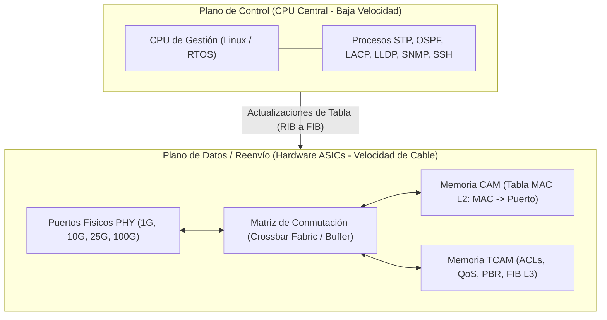
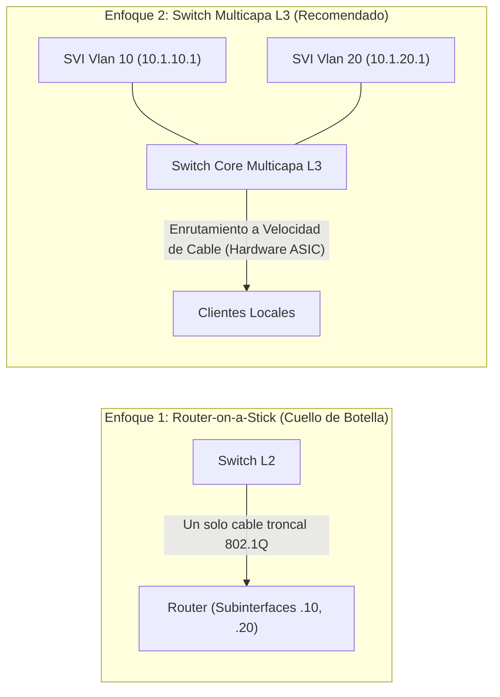
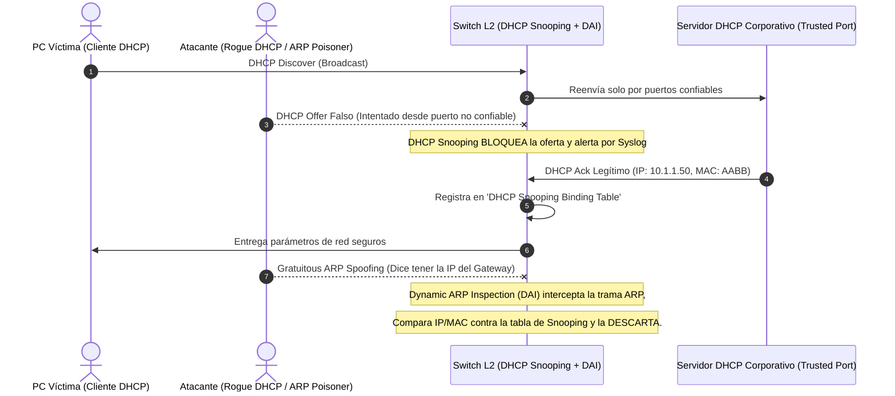

# 🖧 Volumen 02: Conmutación Empresarial Multi-Vendor y Seguridad de Capa 2
## Wiki Maestra de Ingeniería EDC

> **ESTÁNDARES:** IEEE 802.1Q • IEEE 802.1w (RSTP) • IEEE 802.1s (MSTP) • IEEE 802.3ad / 802.1AX (LACP)  
> **FABRICANTES ABORDADOS:** Cisco IOS/IOS-XE • Huawei VRP • ArubaOS-CX • HP AOS-S • 3Com Comware • TP-Link JetStream  
> **ALINEACIÓN DE CERTIFICACIÓN:** Cisco CCNA/CCNP ENCOR • Huawei HCIA/HCIP Datacom • CompTIA Network+  
> **UBICACIÓN:** `Base de Conocimientos_EDC/WIKI_EDC/WIKI_02_Switching_MultiVendor_y_Capa2.md`

---

## 1. Arquitectura Interna del Conmutador Ethernet y Silicio de Red

Un conmutador empresarial moderno no es un ordenador de propósito general; es una máquina de reenvío acelerada por silicio optimizada para procesar millones de tramas por segundo a velocidad de cable (*Line-Rate*).



### A. Componentes de Memoria Críticos
1. **Memoria CAM (Content Addressable Memory):**
   - Realiza búsquedas de coincidencia exacta binaria (`0` o `1`) en un único ciclo de reloj.
   - Almacena la tabla de direcciones MAC del conmutador, vinculando la dirección MAC de 48 bits con la VLAN y el puerto físico donde fue aprendida.
2. **Memoria TCAM (Ternary Content Addressable Memory):**
   - Permite búsquedas mediante tres estados lógicos: `0`, `1` y `X` (*Don't Care* o máscara comodín).
   - Es el componente de silicio más costoso y crucial del switch, permitiendo evaluar listas de control de acceso (ACLs), marcación de Calidad de Servicio (QoS) y tablas de enrutamiento IP (FIB) de forma paralela e instantánea sin ralentizar el tráfico.

### B. Modos de Conmutación de Tramas
* **Store-and-Forward (Almacenamiento y Reenvío):** El conmutador recibe la trama completa en su búfer, calcula el CRC del campo FCS (*Frame Check Sequence*); si el CRC coincide, la reenvía; si la trama está corrupta o mide menos de 64 bytes (*Runt*), la descarta de inmediato. Es el modo predeterminado y más seguro.
* **Cut-Through (Conmutación Rápida):** El switch lee únicamente los primeros 14 bytes de la cabecera Ethernet para extraer la dirección MAC de destino y comienza a reenviar la trama inmediatamente antes de que haya terminado de recibirse. Ofrece latencias ultrabajas (< 1 microsegundo), siendo el estándar en redes financieras de alta frecuencia y centros de datos.

---

## 2. Segmentación VLAN (IEEE 802.1Q) y Enlaces Troncales

Una VLAN (*Virtual Local Area Network*) es un dominio de difusión (*Broadcast Domain*) aislado lógicamente en la Capa 2. Los conmutadores no reenvían tramas de difusión, multidifusión o unidifusión desconocida entre VLANs distintas sin la intervención de un dispositivo de Capa 3.

```text
Estructura de la Trama Ethernet con Etiqueta IEEE 802.1Q (4 Bytes):
+-------------------+-------------------+-------------------+-------------------+
|  TPID (2 Bytes)   |  PCP / CoS (3 b)  |    DEI (1 bit)    |   VLAN ID (12 b)  |
|      0x8100       | Prioridad de QoS  | Descarte Elegible |  Rango: 1 - 4094  |
+-------------------+-------------------+-------------------+-------------------+
```

### A. Tipos de Puertos L2
1. **Puerto de Acceso (Access Port):** Conecta a dispositivos finales (computadoras, servidores, impresoras). Las tramas que ingresan o salen del puerto **no contienen etiqueta 802.1Q**; el switch inserta internamente la etiqueta al recibir la trama y la retira antes de entregarla al host.
2. **Puerto Troncal (Trunk Port):** Interconecta conmutadores entre sí o con enrutadores/firewalls. Transporta el tráfico de múltiples VLANs multiplexadas mediante la etiqueta 802.1Q de 4 bytes.
3. **Puerto Híbrido (Soportado en Huawei VRP y Comware):** Permite enviar el tráfico de ciertas VLANs con etiqueta (*Tagged*) y otras VLANs sin etiqueta (*Untagged*), facilitando la conexión de teléfonos VoIP o servidores de virtualización complejos.
4. **VLAN Nativa:** En un enlace troncal 802.1Q, es la única VLAN cuyo tráfico se transmite sin etiqueta (*Untagged*). Por defecto es la VLAN 1. Por razones de ciberseguridad, **debe modificarse siempre a una VLAN no utilizada (ej. VLAN 999)** para neutralizar ataques de *VLAN Hopping*.

---

### B. Enrutamiento Inter-VLAN: Router-on-a-Stick vs. Conmutación L3 (SVI)



* **Router-on-a-Stick:** Utiliza una sola interfaz física de un router dividida lógicamente en subinterfaces 802.1Q (`interface Gi0/0.10`, `encapsulation dot1Q 10`). Todo el tráfico entre VLANs debe salir del switch, subir al router y volver a bajar, saturando el ancho de banda del enlace físico.
* **Switch Multicapa L3 con SVIs:** Las puertas de enlace predeterminadas residen directamente en el switch en forma de Interfaces Virtuales de Conmutador (**SVIs**). El enrutamiento inter-VLAN se ejecuta en hardware a través de los ASICs a velocidad de cable (*Line-Rate*), liberando a los routers WAN para funciones perimetrales.

---

## 3. Protocolos de Prevención de Bucles (STP, RSTP, MSTP)

En redes Ethernet conmutadas, los enlaces redundantes sin gestión provocan tres catástrofes inmediatas:
1. **Tormentas de Broadcast:** Las tramas de difusión giran indefinidamente en bucle, saturando el 100% del ancho de banda en segundos.
2. **Inestabilidad de la Tabla CAM (MAC Flapping):** El switch aprende continuamente la misma dirección MAC de origen desde puertos físicos opuestos, colapsando la CPU.
3. **Duplicación de Tramas:** Las aplicaciones reciben múltiples copias idénticas del mismo paquete.

### A. Comparativa de Versiones de Spanning Tree

| Parámetro | STP Clásico (IEEE 802.1D) | Rapid STP / RSTP (IEEE 802.1w) | Multiple STP / MSTP (IEEE 802.1s) |
| :--- | :--- | :--- | :--- |
| **Tiempo de Convergencia** | 30 a 50 segundos | **Sub-segundo (< 1 segundo)** | Sub-segundo (< 1 segundo) |
| **Estados de Puerto** | Blocking, Listening, Learning, Forwarding, Disabled | **Discarding, Learning, Forwarding** | Discarding, Learning, Forwarding |
| **Roles de Puerto** | Root Port, Designated Port, Blocking Port | Root, Designated, **Alternate, Backup** | Root, Designated, Alternate, Backup |
| **Mecanismo de Transición**| Temporizadores estáticos (Hello 2s, Fwd Delay 15s) | **Apretón de Manos Propuesta/Acuerdo (Proposal/Agreement)** | Negociación activa en cada región MST |
| **Consumo de CPU en Switch**| Bajo (un árbol para toda la red) | Alto en PVST+ (una instancia por cada VLAN) | **Óptimo:** Mapea cientos de VLANs en pocas instancias |

---

### B. Mecanismos de Protección y Hardening de Spanning Tree

1. **BPDU Guard:**
   - Se aplica en puertos conectados a hosts finales donde se ha habilitado `PortFast` o `Edge-Port`.
   - Si un usuario malintencionado conecta un switch no autorizado y el puerto recibe una sola BPDU, el puerto se desactiva inmediatamente pasando al estado de error **`err-disabled`**, protegiendo la topología.
2. **BPDU Filter:**
   - Suprime la transmisión y recepción de BPDUs en un puerto. Debe utilizarse con extrema precaución; si se conecta un switch por error, provocará un bucle de red instantáneo.
3. **Root Guard:**
   - Se configura en los puertos troncales hacia switches de menor jerarquía (switches de acceso).
   - Impide que un switch nuevo o mal configurado con una prioridad STP de `0` usurpe el rol de Switch Raíz (*Root Bridge*). Si recibe una BPDU superior, pone el puerto en estado *Root-Inconsistent* (bloqueado) hasta que cesen las BPDUs anómalas.
4. **Loop Guard:**
   - Evita que un puerto alternativo o de respaldo pase erróneamente a estado de reenvío (*Forwarding*) si las BPDUs dejan de recibirse debido a una falla unidireccional de enlace de fibra óptica.

---

## 4. Agregación Dinámica de Enlaces con LACP (IEEE 802.3ad / 802.1AX)

El protocolo de control de agregación de enlaces (**LACP**) permite agrupar hasta 8 interfaces Ethernet físicas activas (y hasta 8 de respaldo) en un único canal lógico de alta velocidad denominado **Port-Channel** (Cisco), **Eth-Trunk** (Huawei) o **LAG** (Aruba / HP / TP-Link).

```mermaid
graph LR
    SW_A["Switch Core A"] ===|Link 1: Gi0/1 (1 Gbps)| SW_B["Switch Core B"]
    SW_A ===|Link 2: Gi0/2 (1 Gbps)| SW_B
    SW_A ===|Link 3: Gi0/3 (1 Gbps)| SW_B
    SW_A ===|Link 4: Gi0/4 (1 Gbps)| SW_B

    note["Port-Channel 1 Lógico: 4 Gbps Agregados con Redundancia Total N-1"]
```

### A. Modos de Negociación LACP
* **Modo Activo (`mode active`):** El puerto transmite activamente paquetes LACP para negociar el canal con el vecino remoto.
* **Modo Pasivo (`mode passive`):** El puerto solo responde si recibe paquetes LACP; no inicia la negociación.
* *Regla de Establecimiento:* Al menos uno de los dos extremos debe estar en modo **Activo** para que el canal se forme. Si ambos extremos están en modo Pasivo, el enlace agregado jamás levantará.

### B. Algoritmos de Distribución de Tráfico (Hash Load Balancing)
LACP no balancea paquetes de forma rotatoria (*Round-Robin*) para evitar que las tramas TCP lleguen desordenadas al receptor. Utiliza una función hash matemática aplicada a los campos de la cabecera:
- `src-mac` / `dst-mac`: Recomendado en switches de capa 2 pura.
- `src-dst-ip`: Recomendado en enlaces de distribución y core corporativo.
- `src-dst-mixed-ip-port` (IP y Puertos L4): **Configuración óptima**. Garantiza que múltiples sesiones TCP simultáneas entre los mismos dos servidores se distribuyan equitativamente entre todos los enlaces físicos del canal.

---

## 5. Hardening y Seguridad Avanzada de Capa 2

### A. Port Security (Seguridad de Puertos Físicos)
Limita la cantidad de direcciones MAC permitidas en un puerto de acceso para neutralizar ataques de inundación de tablas CAM (*MAC Flooding*).
* **Tipos de Aprendizaje MAC:**
  - *Estática:* Definida manualmente por el administrador.
  - *Dinámica:* Aprendida en memoria volátil; se pierde al reiniciar.
  - *Sticky:* El switch aprende dinámicamente las primeras MACs conectadas y las escribe automáticamente en el archivo `running-config`.
* **Acciones de Violación:**
  - `protect`: Descarta silenciosamente las tramas de direcciones MAC no autorizadas; no envía alertas ni incrementa contadores.
  - `restrict`: Descarta el tráfico no autorizado, genera un mensaje de Syslog/SNMP Trap e incrementa el contador de violaciones.
  - `shutdown`: **Estándar corporativo**. Desactiva inmediatamente la interfaz física poniéndola en estado `err-disabled`.

---

### B. Tríada de Mitigación: DHCP Snooping, DAI e IP Source Guard



1. **DHCP Snooping:**
   - Construye dinámicamente la tabla *DHCP Snooping Binding Table* registrando la tupla: `[Dirección MAC, Dirección IP, Tiempo de Concesión, VLAN, Puerto Físico]`.
   - Bloquea cualquier mensaje `DHCP Offer` o `DHCP Ack` originado en puertos marcados como **Untrusted**.
2. **Dynamic ARP Inspection (DAI):**
   - Intercepta todas las solicitudes y respuestas ARP en puertos no confiables.
   - Valida la relación IP-MAC contra la tabla de DHCP Snooping. Si un host intenta enviar una respuesta ARP con una IP que no le fue asignada por DHCP, la trama es destruida en el acto, neutralizando el ataque de *Man-in-the-Middle*.
3. **IP Source Guard (IPSG):**
   - Previene el spoofing de direcciones IP a nivel de Capa 3 local. Instala un filtro de hardware en el puerto que descarta cualquier paquete IP cuyo origen no coincida exactamente con la asignación registrada por DHCP Snooping.

---

## 6. Plantilla Maestra Homologada de Hardening de Conmutador (Cisco IOS-XE)

A continuación se presenta una plantilla completa y probada para endurecer un switch de acceso de 24 puertos en producción:

```cisco
! =====================================================================
! PLANTILLA DE ENDURECIMIENTO (HARDENING) DE SWITCH L2 - CISCO IOS-XE
! =====================================================================

! 1. Protección Global de Spanning Tree y VLANs
spanning-tree mode rapid-pvst
spanning-tree portfast default
spanning-tree portfast bpduguard default
spanning-tree extend system-id

vlan 10
 name DATOS_USUARIOS
vlan 20
 name VOIP_TELEFONIA
vlan 99
 name GESTION_SVI
vlan 999
 name NATIVA_CUARENTENA

! 2. Activación Global de DHCP Snooping y DAI
ip dhcp snooping
ip dhcp snooping vlan 10,20
no ip dhcp snooping information option
ip arp inspection vlan 10,20

! 3. Configuración de Puerto Troncal hacia el Switch Core (Uplink)
interface GigabitEthernet0/24
 description UPLINK_HACIA_CORE_SWITCH
 switchport mode trunk
 switchport trunk native vlan 999
 switchport trunk allowed vlan 10,20,99
 switchport nonegotiate
 ip dhcp snooping trust
 ip arp inspection trust
 no shutdown

! 4. Configuración Segura de Puertos de Usuario Final (Access)
interface range GigabitEthernet0/1 - 23
 description PUESTOS_DE_TRABAJO_CON_VOIP
 switchport mode access
 switchport access vlan 10
 switchport voice vlan 20
 switchport nonegotiate
 spanning-tree bpduguard enable
 ! Seguridad de Puerto
 switchport port-security
 switchport port-security maximum 3
 switchport port-security violation shutdown
 switchport port-security mac-address sticky
 ! Mitigación de Tormentas
 storm-control broadcast level 2.0 1.0
 storm-control multicast level 5.0 3.0
 storm-control action shutdown
 ! Protección de IP
 ip verify source
 no shutdown

! 5. Recuperación Automática de Puertos Errdisabled (Opcional, 5 Minutos)
errdisable recovery cause bpduguard
errdisable recovery cause psecure-violation
errdisable recovery cause storm-control
errdisable recovery interval 300
```
