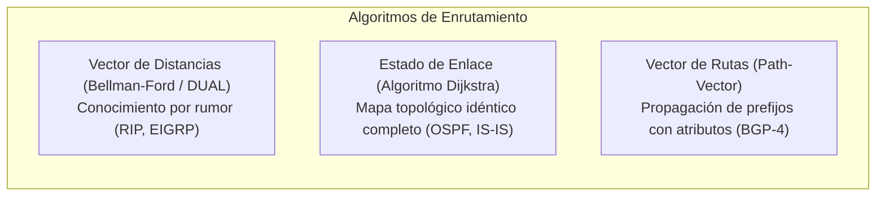
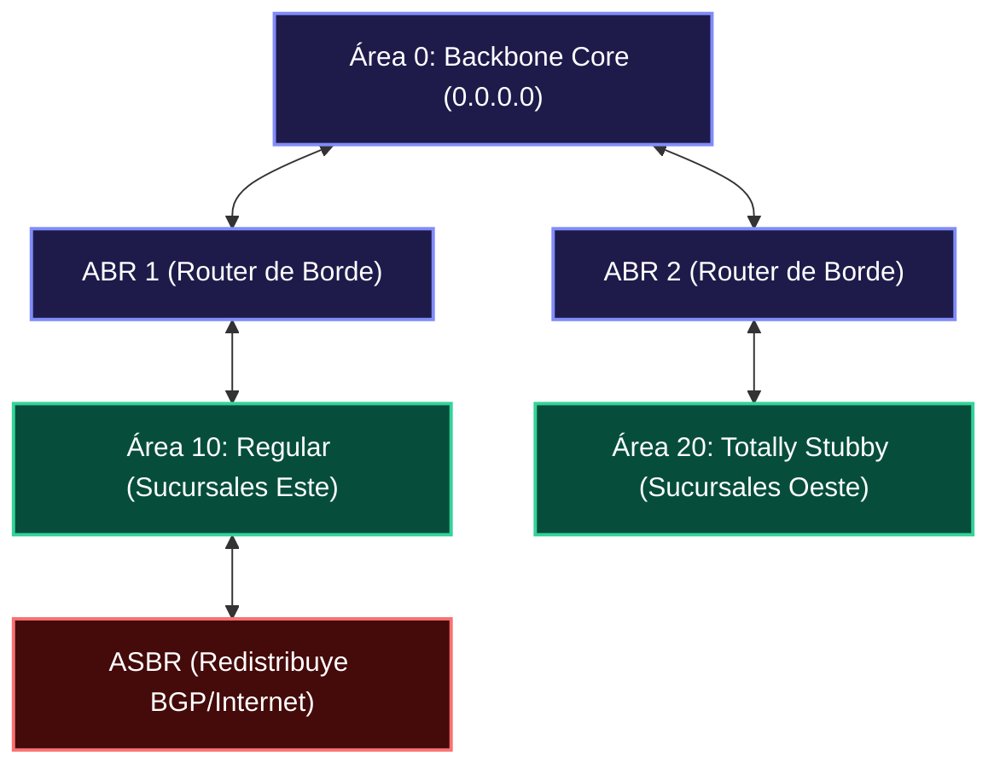
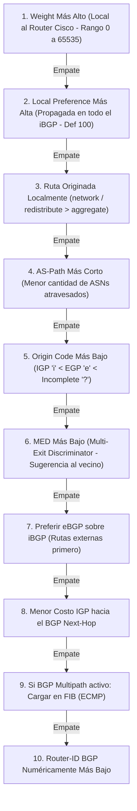
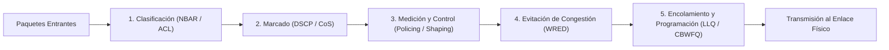

# 🛣️ Volumen 03: Enrutamiento Avanzado, Redes WAN y Telecomunicaciones Carrier
## Wiki Maestra de Ingeniería EDC

> **ESTÁNDARES:** RFC 2328 (OSPFv2) • RFC 5340 (OSPFv3) • RFC 4271 (BGP-4) • RFC 4364 (MPLS L3VPN) • RFC 8986 (SRv6) • RFC 4594 (QoS)  
> **ALINEACIÓN DE CERTIFICACIÓN:** Cisco CCNP Enterprise (ENCOR / ENARSI) • Huawei HCIP-Datacom • Cisco CCIE Enterprise  
> **UBICACIÓN:** `Base de Conocimientos_EDC/WIKI_EDC/WIKI_03_Routing_Avanzado_WAN_y_Carrier.md`

---

## 1. Fundamentos y Algoritmos de Enrutamiento IP

El enrutamiento es el proceso mediante el cual los conmutadores multicapa y routers determinan la trayectoria óptima para reenviar paquetes a través de redes interconectadas.



### A. Distancia Administrativa (AD) vs. Métricas
Cuando un router aprende la misma red de destino a través de múltiples protocolos de enrutamiento distintos, utiliza la **Distancia Administrativa (AD)** para evaluar la confiabilidad del origen de la ruta (a menor valor numérico, mayor prioridad):

| Protocolo de Enrutamiento / Origen | Distancia Administrativa (Cisco) | Distancia / Preferencia (Huawei VRP) | Métrica Utilizada |
| :--- | :-: | :-: | :--- |
| **Interfaz Directamente Conectada** | **0** | **0** | Costo = 0 |
| **Ruta Estática** | **1** | **60** | Asignada por administrador |
| **BGP Externo (eBGP)** | **20** | **255** | Atributos de ruta BGP (Weight, LocPref, AS-Path) |
| **EIGRP Interno** | **90** | *N/A (Propietario)* | Compuesta: Ancho de banda + Retardo + Carga + Confiabilidad |
| **OSPF** | **110** | **10** (Interno) / **150** (Externo)| Costo de Referencia / Ancho de banda ($10^8 / \text{Bps}$) |
| **IS-IS** | **115** | **15** | Costo de interfaz métrico arbitrario |
| **RIPv1 / RIPv2** | **120** | **100** | Conteo de saltos (*Hop Count*, máximo 15 saltos) |
| **BGP Interno (iBGP)** | **200** | **255** | Mismo cálculo que eBGP |

---

## 2. OSPFv2 y OSPFv3 Multi-Área: Arquitectura y LSAs

OSPF (*Open Shortest Path First*) es un protocolo de estado de enlace no propietario gobernado por el algoritmo **SPF de Dijkstra**. Cada router construye una Base de Datos de Estado de Enlace (**LSDB**) idéntica para toda el área, calculando el árbol de rutas de costo mínimo hacia cada destino.



### A. Máquina de Estados de Adyacencia OSPF
Para formar una adyacencia completa (**FULL**), dos routers vecinos deben progresar secuencialmente a través de 8 estados:
1. `Down`: Ningún paquete Hello recibido del vecino.
2. `Attempt`: Específico para redes NBMA; se transmiten Hellos unicast.
3. `Init`: Se recibió un paquete Hello del vecino, pero el Router-ID propio aún no figura en la lista de vecinos vistos.
4. `2-Way`: Comunicación bidireccional confirmada (el Router-ID local aparece en el Hello del vecino). **En redes multiacceso Ethernet, aquí se eligen el DR y el BDR**. Entre routers normales (DROther), la adyacencia se estabiliza en este estado.
5. `ExStart`: Se negocia la relación maestro/esclavo y el número de secuencia inicial mediante paquetes DBD (*Database Description*).
6. `Exchange`: Los routers intercambian descriptores de su LSDB (paquetes DBD).
7. `Loading`: Se solicitan LSAs detalladas faltantes mediante paquetes **LSR** (*Link State Request*) y se responden con **LSU** (*Link State Update*).
8. `Full`: Las bases de datos LSDB de ambos routers son 100% idénticas. Adyacencia plenamente operativa.

---

### B. Catálogo Completo de Tipos de LSA (Link State Advertisements)

| Tipo | Denominación Oficial | Generado Por | Alcance de Inundación (*Flooding Scope*) | Propósito y Contenido Técnico |
| :---: | :--- | :--- | :--- | :--- |
| **LSA 1** | **Router LSA** | Cada router del área | Confinado dentro de su propia área local | Lista todas las interfaces directas del router, su estado y costo. |
| **LSA 2** | **Network LSA** | Router DR (*Designated*) | Confinado dentro de su propia área local | Representa el segmento multiacceso y lista todos los routers adyacentes. |
| **LSA 3** | **Summary LSA (Network)** | Router ABR | Se propaga hacia las demás áreas OSPF | Anuncia las redes aprendidas de un área hacia el resto del dominio (*Inter-Area*). |
| **LSA 4** | **ASBR Summary LSA** | Router ABR | Se propaga hacia las demás áreas OSPF | Anuncia la ubicación y métrica para llegar a la dirección IP del router ASBR. |
| **LSA 5** | **AS External LSA** | Router ASBR | Se inunda por todo el dominio OSPF completo | Transporta rutas externas redistribuidas hacia OSPF (ej. BGP o estáticas). |
| **LSA 7** | **NSSA External LSA** | ASBR dentro de NSSA | Confinado exclusivamente dentro del área NSSA | Transporta rutas externas en áreas NSSA. El ABR las convierte en LSA 5 hacia el Área 0. |
| **LSA 8** | **Link-LSA (OSPFv3)** | Cada router IPv6 | Confinado exclusivamente al enlace local | Anuncia la dirección Link-Local IPv6 (`fe80::`) y prefijos locales del enlace. |
| **LSA 9** | **Intra-Area-Prefix (v3)**| Router o DR en v3 | Confinado dentro de su propia área local | Asocia prefijos de red IPv6 a routers específicos o segmentos multiacceso. |
| **LSA 10/11**| **Opaque LSAs** | Routers MPLS/SR | Área local o dominio completo | Transporta parámetros de ingeniería de tráfico (MPLS-TE) y Segment Routing (SR). |

---

### C. Tipos de Áreas OSPF Especiales y Reducción de Tablas

| Tipo de Área | Permite LSA 1 y 2 | Permite LSA 3 (Inter-Area) | Permite LSA 4 y 5 (Externas) | Permite LSA 7 (NSSA) | Inyecta Ruta por Defecto Automática |
| :--- | :-: | :-: | :-: | :-: | :--- |
| **Área Regular** | Sí | Sí | Sí | No | No |
| **Stub Area** | Sí | Sí | **No (Bloqueadas)** | No | **Sí (LSA 3 default `0.0.0.0/0`)** |
| **Totally Stubby Area** | Sí | **No (Bloqueadas)** | **No (Bloqueadas)** | No | **Sí (LSA 3 default `0.0.0.0/0`)** |
| **Not-So-Stubby (NSSA)** | Sí | Sí | No (Externas estándar) | **Sí (LSA 7 locales)** | No (Requiere comando explícito) |
| **Totally NSSA** | Sí | **No (Bloqueadas)** | **No (Bloqueadas)** | **Sí (LSA 7 locales)** | **Sí (LSA 3 default `0.0.0.0/0`)** |

---

## 3. BGP-4 e Internet Routing: Arquitectura, Atributos y Seguridad

BGP (*Border Gateway Protocol*, RFC 4271) es el protocolo de vector de rutas estándar que hace funcionar Internet. Opera sobre el puerto **TCP 179**, lo que garantiza entrega confiable sin requerir mecanismos propios de fragmentación o retransmisión.

### A. Peering eBGP vs. iBGP
* **eBGP (External BGP):** Conecta routers en **Sistemas Autónomos (AS) distintos**. Por defecto, requiere conexión física directa (TTL = 1). Cada vez que una ruta cruza un AS, el número de ASN local se antepone a la cabecera `AS-Path`.
* **iBGP (Internal BGP):** Conecta routers dentro del **mismo Sistema Autónomo**. Se despliega sobre interfaces Loopback y soporta múltiples saltos físicos gracias al enrutamiento IGP subyacente.
  - *Regla de División de Horizonte iBGP:* Una ruta aprendida a través de un vecino iBGP **nunca** se propaga a otro vecino iBGP. Esto evita bucles de enrutamiento pero exige una malla completa (*Full Mesh: $N(N-1)/2$ sesiones*).
  - *Solución de Escalabilidad:* Uso obligatorio de **Route Reflectors (RR - RFC 4456)** o **Confederaciones BGP (RFC 5065)**.

---

### B. Algoritmo de Decisión de Rutas BGP (BGP Best Path Selection)

Cuando un router BGP recibe múltiples caminos válidos hacia un mismo prefijo de red, evalúa secuencialmente la siguiente jerarquía de atributos hasta romper el empate:



---

### C. Seguridad BGP Carrier: RPKI y BGP FlowSpec
1. **RPKI (Resource Public Key Infrastructure - RFC 6811):**
   - Resuelve el grave problema del **secuestro de rutas (BGP Hijacking)**. Los registros regionales (RIRs como LACNIC, RIPE, ARIN) emiten certificados X.509 firmados criptográficamente denominados **ROA** (*Route Origin Authorization*).
   - El router de borde valida si el ASN que anuncia el prefijo está autorizado en la base de datos RPKI:
     - `Valid`: El prefijo y el ASN coinciden con la firma autorizada.
     - `Invalid`: Ataque de secuestro detectado o error de configuración. **La ruta se descarta de inmediato**.
     - `NotFound`: El prefijo no ha sido registrado formalmente en RPKI.
2. **BGP FlowSpec (RFC 8955):**
   - Permite a un centro de operaciones (NOC/SOC) propagar dinámicamente reglas de filtrado de Capa 3 y Capa 4 a través de la red carrier mediante sesiones BGP para mitigar ataques masivos de **DDoS** en segundos (descartando tráfico por puerto, IP origen o limitando la tasa a pocos megabits).

---

## 4. Transporte Carrier: MPLS L3VPN (RFC 4364) y Segment Routing (SRv6)

### A. MPLS L3VPN: Concepto y Componentes
MPLS permite a los operadores de telecomunicaciones construir redes privadas virtuales de capa 3 seguras y aisladas sobre una única infraestructura IP compartida:
* **Customer Edge (CE):** Router del cliente en la sucursal. No tiene conocimiento de MPLS ni de etiquetas.
* **Provider Edge (PE):** Router del operador que conecta al cliente. Mantiene instancias de enrutamiento virtuales (**VRF**) separadas por cliente, ejecuta sesiones MP-BGP e inserta/retira etiquetas MPLS.
* **Provider Core (P):** Routers internos del núcleo del operador. Solo conmutan paquetes basados en la etiqueta de transporte externa mediante ASICs de ultra-alta velocidad, desconociendo por completo las IPs privadas del cliente.

```text
Estructura de la Doble Etiqueta en Paquete MPLS L3VPN:
[ Cabecera IP Externa ] 
  [ Etiqueta de Transporte (LDP / SR) ] -> Reenviada por Routers P centrales
    [ Etiqueta VPN Interna (MP-BGP) ]    -> Identifica la VRF destino en el PE receptor
      [ Paquete IP Privado Original del Cliente (RFC 1918) ]
```

* **Route Distinguisher (RD):** Valor de 64 bits (`ASN:ID` o `IP:ID`) antepuesto al prefijo IPv4 del cliente (ej. `65001:100:192.168.1.0/24`) para transformarlo en un prefijo globalmente único denominado **VPN-IPv4**.
* **Route Target (RT):** Atributo BGP extendido de comunidad que controla la política de importación y exportación de rutas entre las tablas VRF de los distintos routers PE.

---

### B. Segment Routing (SR-MPLS / SRv6 - RFC 8402 / RFC 8986)
Segment Routing revoluciona el transporte carrier eliminando la necesidad de protocolos complejos de señalización como LDP y RSVP-TE:
- **Paradigma de Enrutamiento en el Origen:** El nodo de entrada (*Ingress PE*) inserta una lista ordenada de identificadores de segmento (**SIDs**) en la cabecera del paquete.
- **SRv6 (Segment Routing sobre IPv6):** No utiliza etiquetas MPLS; aprovecha las direcciones IPv6 nativas de 128 bits codificadas en una cabecera de extensión de enrutamiento de segmento (**SRH - Segment Routing Header**). Cada segmento representa una instrucción de red programable (ej. reenviar por el enlace más corto, atravesar una función de firewall virtual o garantizar latencia menor a 5 ms).

---

## 5. Arquitectura de Calidad de Servicio (QoS DiffServ - RFC 4594)

En enlaces congestionados, el modelo de entrega por mejor esfuerzo (*Best Effort*) degrada drásticamente las aplicaciones sensibles al tiempo (Voz sobre IP y videoconferencia interactiva).



### A. Mapeo de Clases DiffServ y Valores DSCP Estándar

| Aplicación / Flujo | Clase DiffServ | Valor DSCP (Decimal) | Valor DSCP (Binario) | CoS (802.1p) | Cola de Transmisión Recomendada |
| :--- | :--- | :-: | :-: | :-: | :--- |
| **Voz IP (Payload de Audio)** | **EF (Expedited Fwd)** | **46** | `101110` | 5 | **Cola de Prioridad Estricta (LLQ)** |
| **Señalización de Llamadas (SIP/H.323)** | **CS3 / AF31** | **24 / 26** | `011000` / `011010` | 3 | Cola Garantizada CBWFQ (5% Ancho Banda) |
| **Videoconferencia Interactiva** | **AF41 / AF42** | **34 / 36** | `100010` / `100100` | 4 | Cola Garantizada CBWFQ con baja latencia |
| **Datos Críticos de Negocio (ERP/SAP)** | **AF21 / AF22** | **18 / 20** | `010010` / `010100` | 2 | Cola Garantizada CBWFQ (20-30% Ancho Banda) |
| **Gestión de Red (SSH, SNMPv3, Syslog)**| **CS2** | **16** | `010000` | 2 | Cola Garantizada CBWFQ (5% Ancho Banda) |
| **Tráfico Web y Mejor Esfuerzo (Default)**| **DF (Default / CS0)** | **0** | `000000` | 0 | Cola de Mejor Esfuerzo (*Best Effort*) |
| **Scavenger / Tráfico Indeseado (P2P)**| **CS1** | **8** | `001000` | 1 | Cola con descarte agresivo inmediato |

---

### B. Algoritmos de Encolamiento: LLQ vs. CBWFQ vs. WRED
1. **LLQ (Low Latency Queuing):** Diseñado exclusivamente para tráfico de voz y video en tiempo real. Siempre que haya paquetes en la cola LLQ, el programador del router los transmite de inmediato antes que cualquier otra cola. Incluye un *policer* interno para evitar que sature el enlace físico.
2. **CBWFQ (Class-Based Weighted Fair Queuing):** Asigna anchos de banda mínimos garantizados por porcentaje o tasa fija (`bandwidth percent 30`) a clases de datos no sensibles al retardo inmediato.
3. **WRED (Weighted Random Early Detection):** Monitorea la profundidad media de los búferes del router. Si el búfer comienza a llenarse, comienza a descartar paquetes TCP de baja prioridad (ej. paquetes con marcado AFx3) de forma aleatoria para forzar a las aplicaciones TCP a reducir su tasa de transmisión antes de que ocurra una saturación total.

---

## 6. Plantilla Maestra de Enrutamiento BGP e IGP Multi-Área (Cisco IOS-XE)

```cisco
! =====================================================================
! ENRUTAMIENTO ENTERPRISE DUAL: OSPFv2 MULTI-AREA + BGP PEERING WAN
! =====================================================================

! 1. Proceso de Enrutamiento Interior OSPFv2
router ospf 1
 router-id 1.1.1.1
 auto-cost reference-bandwidth 100000 ! Base 100 Gbps para interfaces modernas
 passive-interface default
 no passive-interface GigabitEthernet0/0/0
 no passive-interface GigabitEthernet0/0/1
 ! Conexión al Área 0 Backbone
 network 10.255.0.0 0.0.0.3 area 0
 ! Conexión a Sucursal (Área 10 - Stubby)
 network 10.10.0.0 0.0.255.255 area 10
 area 10 stub no-summary ! Convierte el Área 10 en Totally Stubby
 bfd all-interfaces       ! Convergencia por fallas de enlace sub-segundo

! 2. Proceso BGP Enterprise hacia Proveedor ISP Dual
router bgp 65001
 router-id 1.1.1.1
 bgp log-neighbor-changes
 no bgp default ipv4-unicast

 address-family ipv4
  ! Redes Propias a Publicar en Internet
  network 198.51.100.0 mask 255.255.255.0
  
  ! Peering eBGP con ISP Principal (ASN 64512)
  neighbor 203.0.113.1 remote-as 64512
  neighbor 203.0.113.1 description ISP_PRINCIPAL_FIBRA
  neighbor 203.0.113.1 activate
  neighbor 203.0.113.1 route-map MAP_PREFERENCIA_ISP1 in
  neighbor 203.0.113.1 route-map MAP_ANUNCIOS_PROPIOS out
  
  ! Peering eBGP con ISP de Respaldo (ASN 64513)
  neighbor 198.51.100.254 remote-as 64513
  neighbor 198.51.100.254 description ISP_BACKUP_RADIO
  neighbor 198.51.100.254 activate
  neighbor 198.51.100.254 route-map MAP_PREFERENCIA_ISP2 in
  neighbor 198.51.100.254 route-map MAP_AS_PREPENDING out
 exit-address-family

! Políticas de Tráfico de Entrada (Local Preference)
route-map MAP_PREFERENCIA_ISP1 permit 10
 set local-preference 200 ! Prioriza la salida por ISP 1

route-map MAP_PREFERENCIA_ISP2 permit 10
 set local-preference 100 ! Respaldo por ISP 2

! Políticas de Tráfico de Retorno (AS-Path Prepending para hacer menos atractivo ISP 2)
route-map MAP_AS_PREPENDING permit 10
 set as-path prepend 65001 65001 65001
```
