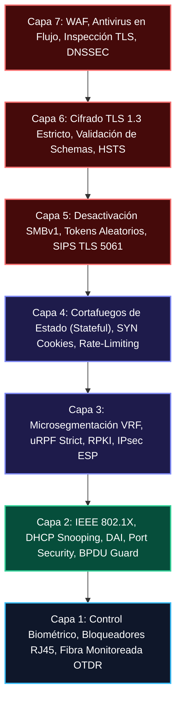
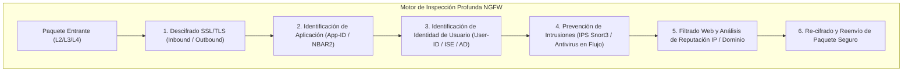
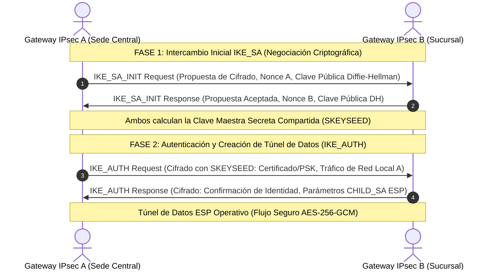
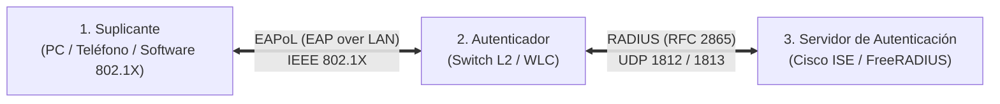
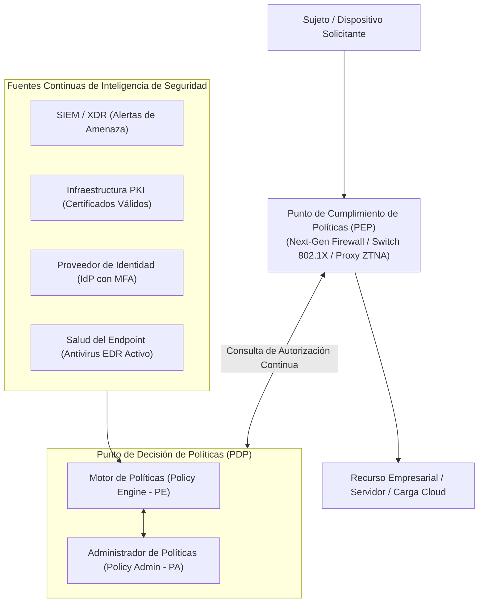

# 🛡️ Volumen 04: Ciberseguridad Defensiva, Firewalls NGFW y Zero Trust (NIST SP 800-207)
## Wiki Maestra de Ingeniería EDC

> **ESTÁNDARES:** NIST SP 800-207 • RFC 7296 (IKEv2) • RFC 8907 (TACACS+) • RFC 2865 (RADIUS) • MITRE ATT&CK  
> **ALINEACIÓN DE CERTIFICACIÓN:** CompTIA Security+ (SY0-701) • Cisco CCNP Security • Fortinet NSE 4 / FCP • Palo Alto PCNSE  
> **UBICACIÓN:** `Base de Conocimientos_EDC/WIKI_EDC/WIKI_04_Ciberseguridad_Firewalls_ZeroTrust.md`

---

## 1. Defensa en Profundidad a lo Largo del Modelo OSI

El principio de **Defensa en Profundidad** establece que ningún control de seguridad aislado es suficiente para proteger una red empresarial. La seguridad debe desplegarse en capas superpuestas e independientes de Capa 1 a Capa 7, de modo que si un atacante elude una barrera perimetral, los controles internos contengan y neutralicen la amenaza.

---

### A. Matriz Maestra de Amenazas, Herramientas y Controles L1 a L7

A diferencia de las versiones previas del compendio que contenían tablas rotas a partir de la Capa 6, esta matriz consolida el análisis exhaustivo y riguroso de cada capa:

| Capa OSI | Amenaza / Vector de Ataque Principal | Herramienta Común de Intrusión | Control Técnico Recomendado | Comando / Configuración Clave |
| :--- | :--- | :--- | :--- | :--- |
| **7. Aplicación** | Inyección SQL (SQLi) y Cross-Site Scripting (XSS) | SQLmap, Burp Suite, OWASP ZAP | Prepared Statements, Web Application Firewall (WAF) | ModSecurity / AWS WAF / CSP Headers |
| **7. Aplicación** | Envenenamiento de Caché DNS (DNS Cache Poisoning) | Scapy, Kamus | DNSSEC con validación de firmas criptográficas RRSIG | `dnssec-validation auto;` (BIND9) |
| **6. Presentación**| Descifrado Man-in-the-Middle y SSL Stripping | SSLstrip, Bettercap | HTTP Strict Transport Security (HSTS) con Preload | `Strict-Transport-Security: max-age=31536000; includeSubDomains; preload` |
| **6. Presentación**| Cifrados Obsoletos y Débiles (RC4, 3DES, CBC) | Testssl.sh, SSLScan | Restricción estricta a TLS 1.3 / TLS 1.2 con PFS | `ssl_protocols TLSv1.2 TLSv1.3; ssl_ciphers HIGH:!aNULL:!MD5;` |
| **5. Sesión** | Secuestro de Sesión Web (Session Hijacking) | Wireshark, EditThisCookie | Banderas HttpOnly y Secure en Cookies de sesión | `Set-Cookie: ID=xyz; Secure; HttpOnly; SameSite=Strict` |
| **5. Sesión** | Fraude Telefónico y Registro Falso en VoIP SIP | SIPVicious, Svwar | Señalización SIPS sobre TLS (TCP 5061) y SBC perimetral | `transport=tls` (PJSIP Asterisk) |
| **5. Sesión** | Explotación de Protocolos SMB / RPC (WannaCry) | EternalBlue, Metasploit | Desactivación absoluta de SMBv1 en servidores Windows | `Set-SmbServerConfiguration -EnableSMB1Protocol $false` |
| **4. Transporte** | Inundación TCP SYN Flood (Denegación de Servicio)| Hping3, LOIC | Mecanismo de TCP SYN Cookies en kernel del sistema operativo | `sysctl -w net.ipv4.tcp_syncookies=1` |
| **4. Transporte** | Ataques DDoS de Amplificación UDP (NTP/DNS/SSDP) | NTPmon, Memcrashed | Rate Limiting L4 e inspección Stateful en Firewall | `iptables -A INPUT -p udp -m limit --limit 50/s -j ACCEPT` |
| **3. Red** | Falsificación de Dirección IP de Origen (IP Spoofing) | Scapy, PackETH | Unicast Reverse Path Forwarding (uRPF Strict Mode) | `ip verify unicast source reachable-via rx` (Cisco) |
| **3. Red** | Secuestro de Prefijos Globales (BGP Hijacking) | BGP Inquirer, Peering malicioso| Validación criptográfica de origen de ruta (RPKI / ROA) | `bgp rpki enable` |
| **2. Enlace Datos**| Envenenamiento de Caché ARP (ARP Poisoning / MitM)| Ettercap, Bettercap, Arpspoof | Dynamic ARP Inspection (DAI) validado con DHCP Snooping | `ip arp inspection vlan 10,20` |
| **2. Enlace Datos**| Inundación de Tabla CAM (MAC Address Flooding) | Macof, Dsniff | Port Security con aprendizaje Sticky y apagado automático | `switchport port-security violation shutdown` |
| **2. Enlace Datos**| Servidor DHCP Falso (Rogue DHCP Server) | Yersinia | DHCP Snooping con puertos confiables definidos explícitamente | `ip dhcp snooping vlan 10` |
| **1. Física** | Intercepción de Cables y Tapping Óptico no invasivo| Acopladores macrocurvatura, Clamps | Cifrado de capa 1/2 (MACsec IEEE 802.1AE) y OTDR continuo | `macsec` (enlaces WAN ópticos) |
| **1. Física** | Implantes de Hardware Físico en Puertos de Pared | LAN Turtle, Rubber Ducky | Bloqueadores físicos mecánicos de RJ45 y control de acceso 802.1X | Control de acceso físico biométrico a rosetas |

---

## 2. Cortafuegos de Siguiente Generación (Next-Generation Firewalls - NGFW)

A diferencia de los cortafuegos de estado tradicionales que filtraban tráfico basándose únicamente en la 5-tupla (IP origen, IP destino, Protocolo, Puerto origen, Puerto destino), los **NGFWs inspeccionan la carga útil completa del paquete en la Capa 7**, identificando la aplicación real con independencia del puerto que utilice (ej. detectar tráfico de BitTorrent o Tor camuflado a través del puerto TCP 443).

### A. Comparativa de Arquitecturas: Fortinet vs. Palo Alto Networks vs. Cisco FTD

| Característica Técnica | Fortinet FortiGate (FortiOS) | Palo Alto Networks (PAN-OS) | Cisco Secure Firewall (FTD / FMC) |
| :--- | :--- | :--- | :--- |
| **Arquitectura de Procesamiento**| **Aceleración por Silicio Propietario (SPU/NPU):** Chips dedicados para enrutamiento (NP7) y cifrado (CP9). | **Single-Pass Parallel Processing (SP3):** Escanea decodificación, App-ID y firmas en un solo pase de memoria. | Basado en software optimizado y appliances acelerados x86 con motor **Snort 3**. |
| **Identificación de Aplicaciones**| Firmas de aplicación en flujo (*Flow-based*) o por proxy (*Proxy-based*). | **App-ID:** Motor de clasificación heurística patentado; no evalúa reglas hasta identificar la app. | Motor **OpenAppID** integrado en la arquitectura Snort 3. |
| **Identificación de Identidades**| FSSO (Fortinet Single Sign-On), integración con LDAP y agente de DC. | **User-ID:** Monitorea logs de seguridad de Active Directory, Syslog de VPNs y API XML. | Integración nativa con **Cisco ISE** mediante protocolo pxGrid. |
| **Virtualización de Instancias** | **VDOMs (Virtual Domains):** Múltiples firewalls virtuales completamente aislados por hardware/software. | **VSYS (Virtual Systems):** Partición lógica de políticas y tablas de enrutamiento virtuales. | Múltiples instancias virtuales en chasis Firepower (*Multi-Instance* con Docker/KVM). |
| **Descifrado SSL/TLS** | Modo Inspección Profunda (*Deep SSL Inspection*) de alto rendimiento gracias al chip CP9. | Descifrado SSL Inbound (para servidores propios) y Forward Proxy (para salida de usuarios a Internet). | Inspección TLS/SSL gestionada desde la política unificada de FMC. |

---

## 3. Redes Privadas Virtuales (VPN) y Criptografía de Red

### A. Protocolo IPsec IKEv2 (RFC 7296): Estructura en Dos Fases

IKEv2 moderniza el establecimiento de túneles VPN reemplazando los complejos intercambios de IKEv1 por un modelo optimizado de 4 mensajes:

1. **Intercambio IKE_SA_INIT (Mensajes 1 y 2):**
   - Se negocian los parámetros criptográficos del canal de control: Algoritmo de cifrado simétrico (AES-256-GCM), función hash/PRF (SHA-384) y Grupo Diffie-Hellman (**Grupos modernos recomendados: Grupo 19 de 256 bits o Grupo 20 de 384 bits basados en Curvas Elípticas NIST**).
2. **Intercambio IKE_AUTH (Mensajes 3 y 4):**
   - Transcurre de forma 100% cifrada. Se valida la identidad mutua de los extremos (mediante certificados digitales **X.509** o clave precompartida robusta PSK) y se establecen las asociaciones de seguridad para el plano de datos (**CHILD_SA** utilizando protocolo **ESP RFC 4303**).

---

### B. WireGuard: La Revolución Moderna de las VPNs

WireGuard (RFC 8439 / RFC 7748) representa una alternativa ultraligera frente a la enorme complejidad de IPsec y OpenVPN:
* **Base de Código Minimalista:** Cuenta con menos de 4,000 líneas de código fuente en C (frente a las más de 400,000 de OpenVPN + OpenSSL), lo que permite una auditoría formal completa de vulnerabilidades.
* **Criptografía de Última Generación Fija (*Cryptokey Routing*):** Elimina por completo la negociación de algoritmos vulnerables (no permite seleccionar cifrados débiles por error). Emplea exclusivamente:
  - **Curve25519:** Para intercambio de claves Diffie-Hellman elíptico.
  - **ChaCha20:** Para cifrado simétrico a alta velocidad.
  - **Poly1305:** Para autenticación e integridad del mensaje (AEAD).
  - **BLAKE2s:** Para cálculo de funciones hash criptográficas.

---

## 4. Control de Acceso Basado en Red (IEEE 802.1X y AAA)

El estándar **IEEE 802.1X** bloquea los puertos físicos de conmutadores y canales Wi-Fi hasta que el dispositivo o usuario demuestre su identidad de forma válida.

### A. Comparativa de Métodos de Autenticación EAP

| Método EAP | Mecanismo de Seguridad | Certificado en Cliente | Certificado en Servidor | Nivel de Seguridad | Escenario de Uso Típico |
| :--- | :--- | :-: | :-: | :--- | :--- |
| **EAP-TLS** | **Autenticación Mutua Asimétrica:** Ambas partes validan certificados X.509 mediante su CA corporativa. | **Sí (Obligatorio)** | **Sí (Obligatorio)** | **Máximo (Inmune a phishing y fuerza bruta)** | Laptops corporativas, dispositivos móviles administrados por MDM. |
| **PEAP-MSCHAPv2** | Crea un túnel TLS seguro entre cliente y servidor; dentro del túnel viaja el usuario y contraseña del Active Directory. | No (Solo confía en la CA del servidor)| **Sí (Obligatorio)** | Alto (Vulnerable si el usuario ignora avisos de certificado inválido) | Puestos de trabajo donde los usuarios ingresan credenciales de dominio. |
| **EAP-FAST** | Desarrollado por Cisco; utiliza credenciales PAC (*Protected Access Credential*) dinámicas. | No | Opcional | Medio | Redes donde no se dispone de una Infraestructura de Clave Pública (PKI). |
| **MAB (MAC Bypass)**| No es EAP formal. El switch toma la dirección MAC del dispositivo y la envía como credencial RADIUS. | No | No | **Bajo (Fácilmente suplantable por spoofing)** | Dispositivos sin soporte 802.1X (impresoras de red, cámaras IP). |

---

### B. Comparativa Técnica de Protocolos AAA: TACACS+ vs. RADIUS

| Característica | TACACS+ (RFC 8907) | RADIUS (RFC 2865 / RFC 2866) |
| :--- | :--- | :--- |
| **Transporte L4** | **TCP Puerto 49** (Confiable, orientado a conexión) | **UDP Puertos 1812 (Auth) y 1813 (Acct)** |
| **Separación de AAA** | **Totalmente Modular:** Autenticación, Autorización y Accounting son procesos independientes. | **Acoplado:** Combina Autenticación y Autorización en el mismo paquete. |
| **Nivel de Cifrado** | **Cifra el cuerpo completo del paquete** (Solo la cabecera fija de 12 bytes va en texto plano). | **Cifra únicamente el campo de la contraseña**; el nombre de usuario y atributos van expuestos. |
| **Control de Comandos** | **Autorización comando por comando granular** (evalúa cada comando que el ingeniero escribe en CLI). | Muy limitado para autorización de comandos; orientado a perfiles globales. |
| **Propósito Principal** | **Administración de Equipos de Red** (Consola de switches, routers y firewalls). | **Control de Acceso a la Red (NAC)** (Clientes 802.1X, Wi-Fi empresarial, VPNs). |

---

## 5. Arquitectura Zero Trust (NIST SP 800-207)

El modelo de seguridad tradicional basado en perímetros ("Castillo y Foso") asume que todo dispositivo dentro de la red corporativa es confiable. La arquitectura **Zero Trust (Confianza Cero)** destruye este supuesto bajo el axioma: **"Nunca confíes, siempre verifica explícitamente"**.

### Los 7 Principios Fundamentales del NIST SP 800-207:
1. **Todas las fuentes de datos y servicios de cómputo se consideran recursos.**
2. **Todas las comunicaciones se aseguran con independencia de la ubicación de la red** (dentro o fuera de la oficina).
3. **El acceso a recursos individuales se concede por sesión individual;** no existen privilegios globales permanentes.
4. **El acceso a los recursos se determina mediante una política dinámica** (evaluando la postura de salud del endpoint, la ubicación geográfica y la identidad con MFA).
5. **La organización supervisa y mide continuamente la integridad y la postura de seguridad** de todos los activos conectados.
6. **Toda autenticación y autorización de recursos es dinámica y estrictamente aplicada** antes de permitir el acceso.
7. **La organización recopila la mayor cantidad posible de información sobre el estado de la red y las comunicaciones** para mejorar continuamente la seguridad (visibilidad total mediante telemetría y SIEM).
