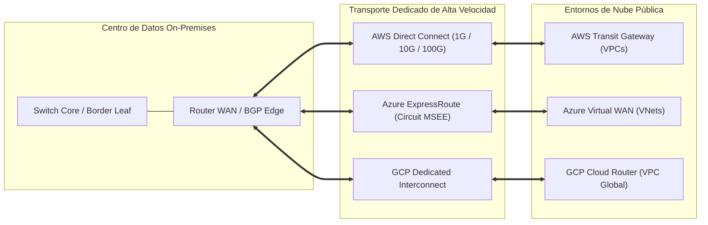
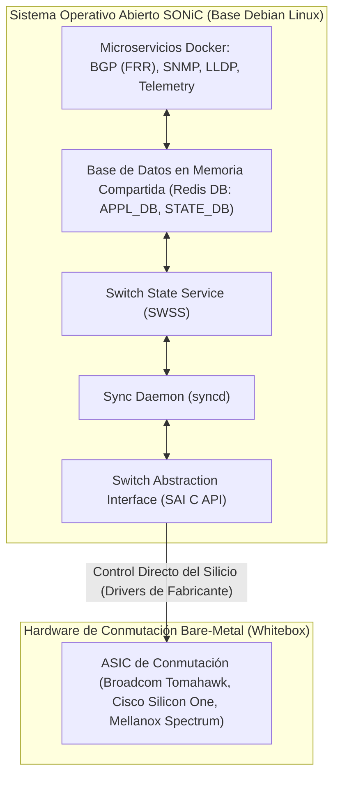

# 🏢 Volumen 05: Data Center Fabrics, Virtualización VXLAN EVPN y Cloud Networking Híbrido
## Wiki Maestra de Ingeniería EDC

> **ESTÁNDARES:** RFC 7348 (VXLAN) • RFC 7432 (BGP EVPN) • RFC 8365 (NVO3) • RFC 7938 (BGP en Datacenters)  
> **TECNOLOGÍAS:** Spine-and-Leaf Clos • Cisco NX-OS • AWS Direct Connect • Azure ExpressRoute • SONiC / FRR  
> **ALINEACIÓN DE CERTIFICACIÓN:** Cisco CCNP Data Center • AWS Certified Advanced Networking • Azure Solutions Architect  
> **UBICACIÓN:** `Base de Conocimientos_EDC/WIKI_EDC/WIKI_05_DataCenter_Fabric_y_Cloud_Hybrid.md`

---

## 1. Evolución Arquitectónica del Centro de Datos: De STP a Spine-and-Leaf Clos

Los centros de datos históricos se diseñaban bajo una topología jerárquica de 3 capas (*Core, Aggregation, Access*) fuertemente dependiente de **Spanning Tree (STP)**. Esta arquitectura presentaba fallas estructurales insalvables para aplicaciones modernas en la nube:
1. **Enlaces Bloqueados y Desperdicio de Ancho de Banda:** Para evitar bucles, STP apagaba administrativamente el 50% de los cables de interconexión de alta velocidad.
2. **Incompatibilidad con Tráfico Este-Oeste:** El patrón de tráfico predominante mutó del esquema clásico Norte-Sur (cliente web consultando a un servidor) al esquema **Este-Oeste** (comunicación masiva inter-servidores generada por clusters de Kubernetes, microservicios, bases de datos distribuidas y procesamiento analítico Big Data).

```mermaid
graph TD
    classDef spine fill:#1e1b4b,stroke:#818cf8,stroke-width:2px,color:#fff;
    classDef leaf fill:#064e3b,stroke:#34d399,stroke-width:2px,color:#fff;
    classDef srv fill:#0f172a,stroke:#38bdf8,stroke-width:2px,color:#fff;

    Spine1["Spine 1 (Core L3 Fabric)"]:::spine
    Spine2["Spine 2 (Core L3 Fabric)"]:::spine
    Spine3["Spine 3 (Core L3 Fabric)"]:::spine
    Spine4["Spine 4 (Core L3 Fabric)"]:::spine

    Leaf1["Leaf 1 / VTEP (ToR)"]:::leaf
    Leaf2["Leaf 2 / VTEP (ToR)"]:::leaf
    Leaf3["Leaf 3 / VTEP (ToR)"]:::leaf
    Leaf4["Leaf 4 / VTEP (Border)"]:::leaf

    Spine1 --- Leaf1 & Leaf2 & Leaf3 & Leaf4
    Spine2 --- Leaf1 & Leaf2 & Leaf3 & Leaf4
    Spine3 --- Leaf1 & Leaf2 & Leaf3 & Leaf4
    Spine4 --- Leaf1 & Leaf2 & Leaf3 & Leaf4

    Server1["Servidor / Hipervisor"]:::srv --- Leaf1
    Server2["Servidor / Hipervisor"]:::srv --- Leaf2
    WAN["Salida WAN / Multi-Cloud"]:::srv --- Leaf4
```



### Principios de la Fábrica Spine-and-Leaf Clos de 2 Etapas:
* **Conectividad Total No Bloqueante:** Cada conmutador Leaf se conecta físicamente a todos los conmutadores Spine mediante enlaces de 40G, 100G o 400G.
* **Prohibición de Enlaces Horizontales:** Los conmutadores Spine **nunca** se conectan entre sí; los Leafs **nunca** se conectan entre sí en Capa 3.
* **Latencia Determinista y Baja:** Cualquier servidor conectado a la fábrica alcanza a cualquier otro servidor en exactamente **3 saltos físicos** (Leaf origen $\rightarrow$ Spine intermedio $\rightarrow$ Leaf destino).
* **Balanceo de Carga ECMP:** Todo el plano físico (*Underlay*) enruta tráfico mediante **eBGP u OSPF** utilizando balanceo de rutas de igual costo (**ECMP - Equal-Cost Multi-Path**) a través de todos los Spines disponibles simultáneamente.

---

## 2. Redes Overlay con VXLAN (RFC 7348) y BGP EVPN (RFC 7432 / RFC 8365)

Para superar el límite de las 4,094 VLANs tradicionales y permitir que las máquinas virtuales se muevan libremente entre racks sin alterar sus direcciones IP, los datacenters modernos implementan redes superpuestas (**Overlays**) con **VXLAN**.

```text
Estructura de Encapsulamiento del Paquete VXLAN en Tránsito:
+--------------------------------------------------------------------------+
| 1. Cabecera Ethernet Externa (MAC Outer: Leaf-A a Spine-1)                | 14 Bytes
+--------------------------------------------------------------------------+
| 2. Cabecera IP Externa (IP Underlay Origen VTEP-A, Destino VTEP-B)       | 20 Bytes
+--------------------------------------------------------------------------+
| 3. Cabecera UDP Externa (Dst Port: 4789, Src Port: Hash L2/L3 Servidor)  |  8 Bytes
+--------------------------------------------------------------------------+
| 4. Cabecera VXLAN (Flags + Identificador de Red VNI de 24 Bits)          |  8 Bytes
+--------------------------------------------------------------------------+
| 5. TRAMA ETHERNET INTERNA COMPLETA DEL CLIENTE O SERVIDOR                |
|    (MAC Dst Servidor-B, MAC Src Servidor-A, Payload IP/TCP Original...)  | 1500 Bytes
+--------------------------------------------------------------------------+
| 6. Secuencia de Verificación de Trama Externa (FCS / CRC)                |  4 Bytes
+--------------------------------------------------------------------------+
SOBRECARGA TOTAL (OVERHEAD) DE VXLAN: 50 a 54 Bytes adicionales por paquete.
```

### A. Componentes Clave de VXLAN
1. **VNI (VXLAN Network Identifier):** Identificador numérico de **24 bits** presente en la cabecera VXLAN que soporta hasta **16,777,216 redes virtuales independientes**, garantizando el aislamiento total de miles de clientes (*Multi-Tenancy*).
2. **VTEP (VXLAN Tunnel Endpoint):** Entidad de conmutación ubicada en los switches Leaf (o en el kernel del hipervisor) responsable de encapsular las tramas del servidor en paquetes UDP y desencapsularlas al recibirlas.
3. **Requisito Obligatorio de MTU (Jumbo Frames):** Dado que VXLAN agrega 54 bytes de sobrecarga, los conmutadores del underlay deben configurarse obligatoriamente con una MTU mínima de **1600 bytes (estándar recomendado en la industria: 9000 o 9216 bytes)** para impedir la fragmentación de paquetes IP en hardware.

---

### B. El Plano de Control BGP EVPN y sus 5 Tipos de Rutas

Históricamente, VXLAN utilizaba inundación multicast (*Flood-and-Learn*) para descubrir direcciones MAC, saturando la red. **BGP EVPN (RFC 7432)** introduce un plano de control inteligente que distribuye las direcciones MAC e IP como prefijos de enrutamiento:

| Tipo de Ruta BGP EVPN | Nombre Oficial | Propósito Arquitectónico y Función en el Fabric |
| :---: | :--- | :--- |
| **Route Type 1** | **Ethernet Auto-Discovery** | Permite el multihoming activo-activo (*Dual-Homing*) de servidores hacia dos switches Leaf distintos y acelera la convergencia de fallas retirando masivamente todas las MACs asociadas al puerto caído. |
| **Route Type 2** | **MAC/IP Advertisement** | **La ruta más importante de EVPN**. Publica la dirección MAC de la máquina virtual junto con su dirección IP y el VTEP que la hospeda, eliminando por completo la necesidad de inundación ARP en la fábrica. |
| **Route Type 3** | **Inclusive Multicast Ethernet Tag** | Establece los túneles para el tráfico de difusión, multidifusión y unidifusión desconocida (**tráfico BUM**), utilizando replicación en el origen (*Ingress Replication*) sin requerir multicast PIM en el underlay. |
| **Route Type 4** | **Ethernet Segment Route** | Descubre switches Leaf redundantes que comparten la misma conexión física hacia un servidor (identificada por un **ESI - Ethernet Segment Identifier**) para elegir el reenviador designado (DF). |
| **Route Type 5** | **IP Prefix Route** | Transporta subredes IPv4 e IPv6 completas de Capa 3 (enrutamiento inter-VRF) para interconectar el centro de datos con la red WAN corporativa o nubes públicas externas. |

---

### C. Anycast Gateway Distribuido
En un centro de datos tradicional, la puerta de enlace predeterminada residía en un par centralizado de conmutadores Core mediante VRRP. En una fábrica EVPN:
- **La misma dirección IP y la misma dirección MAC virtual residen de forma idéntica en todos los switches Leaf del centro de datos.**
- Cuando una máquina virtual o contenedor se migra en vivo (*vMotion / Live Migration*) de un rack a otro extremo del edificio, su Default Gateway permanece disponible en el switch Leaf local a velocidad de cable, sin trompeteo de tráfico (*Traffic Tromboning*).

---

## 3. Arquitectura de Cloud Networking Híbrido (AWS, Azure, GCP)

La interconexión corporativa hacia nubes públicas exige extender las políticas de seguridad y enrutamiento privado de la empresa hacia las infraestructuras de los proveedores de nube (*CSPs*).



### A. Matriz Comparativa de Componentes de Red en Nubes Públicas

| Concepto Arquitectónico | Amazon Web Services (AWS) | Microsoft Azure | Google Cloud Platform (GCP) |
| :--- | :--- | :--- | :--- |
| **Red Virtual Aislada** | **VPC** (Virtual Private Cloud) | **VNet** (Virtual Network) | **VPC** (Nativa Global Multi-Región) |
| **Concentrador Hub Central**| **AWS Transit Gateway (TGW)** | **Azure Virtual WAN / Virtual Hub** | **Network Connectivity Center (NCC)** |
| **Enlace Físico Dedicado** | **AWS Direct Connect (DX)** | **Azure ExpressRoute** | **Cloud Interconnect (Dedicated / Partner)** |
| **Enrutador BGP Dinámico** | Virtual Private Gateway (VGW) / TGW | ExpressRoute Gateway / VPN Gateway | **Cloud Router** |
| **Traducción de Salida NAT**| **NAT Gateway** (Gestionado en zona) | **Azure NAT Gateway** | **Cloud NAT** (Distribuido sin VMs) |
| **Inspección Centralizada** | Gateway Load Balancer (GWLB) | Azure Firewall / NVA en VNet Hub | Private Service Connect / NVA |

---

## 4. Conmutación Abierta (Whitebox) y Sistemas Operativos de Red: SONiC y FRR

El movimiento de desagregación de hardware separa el silicio de conmutación del software del sistema operativo de red (**NOS - Network Operating System**).



### A. Componentes Clave de SONiC (Software for Open Networking in the Cloud)
1. **SAI (Switch Abstraction Interface):** API abierta estandarizada en lenguaje C que proporciona una interfaz de programación uniforme para controlar las tablas de reenvío de hardware de cualquier fabricante de ASICs sin modificar el código superior.
2. **Arquitectura Centralizada en Base de Datos (Redis):** Los procesos no se comunican directamente entre sí mediante sockets frágiles; el estado de la red se publica en bases de datos en memoria Redis (`APPL_DB`, `ASIC_DB`). Si el proceso BGP se reinicia tras una falla, la tabla de reenvío del silicio sigue operando sin interrupción (*Hitless Restart*).
3. **FRRouting (FRR):** La suite de enrutamiento IP de código abierto más potente de Linux que ejecuta los protocolos BGP, OSPF e IS-IS dentro del contenedor de control de SONiC.
