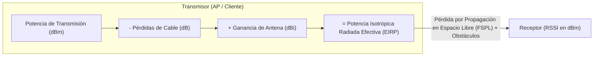
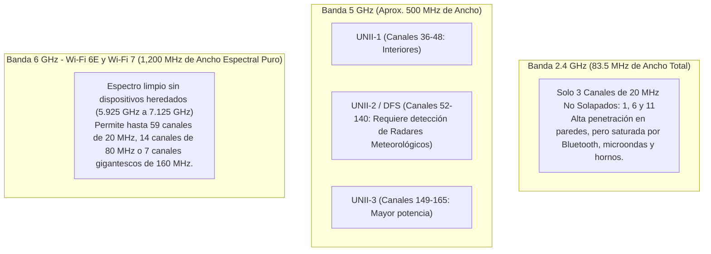
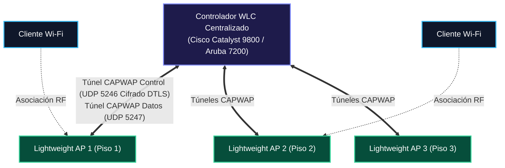
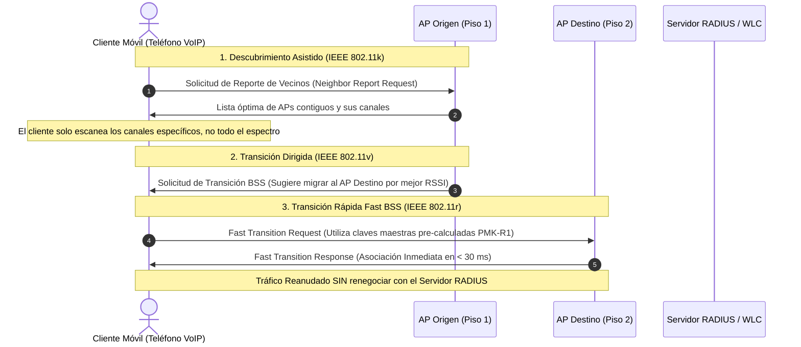

# 📡 Volumen 06: Redes Inalámbricas Corporativas (Wireless Enterprise) y Movilidad
## Wiki Maestra de Ingeniería EDC

> **ESTÁNDARES:** IEEE 802.11ax (Wi-Fi 6/6E) • IEEE 802.11be (Wi-Fi 7) • RFC 5415/5416 (CAPWAP) • WPA3 Specification  
> **TECNOLOGÍAS:** Puntos de Acceso Ligeros (LAP) • Controladores WLC • Roaming 802.11k/v/r • Planificación de RF  
> **ALINEACIÓN DE CERTIFICACIÓN:** Cisco CCNA / CCNP Enterprise Wireless • CWNA (Certified Wireless Network Administrator)  
> **UBICACIÓN:** `Base de Conocimientos_EDC/WIKI_EDC/WIKI_06_Wireless_Enterprise_y_Movilidad.md`

---

## 1. Fundamentos de Radiofrecuencia (RF) y Propagación Electromagnética

A diferencia de los medios guiados de cobre o fibra donde las señales están confinadas físicamente, las comunicaciones inalámbricas utilizan el aire como medio compartido no acotado regido por las leyes del electromagnetismo.

### A. Parámetros de Medición de RF Críticos
1. **RSSI (Received Signal Strength Indicator):**
   - Medida en **dBm** de la potencia de señal recibida por el cliente o AP. Al ser valores inferiores a 1 milivatio, se representan siempre con signo negativo:
     - **$-30\text{ a }-50\text{ dBm}$:** Señal excelente (muy cerca del AP).
     - **$-65\text{ a }-67\text{ dBm}$:** **Umbral mínimo corporativo recomendado** para garantizar servicios de voz sobre Wi-Fi (VoWLAN) y video sin interrupciones.
     - **$-75\text{ dBm}$:** Señal deficiente; comienzan las retransmisiones y la degradación de modulación.
     - **$-85\text{ dBm}$ o inferior:** Límite de desconexión (*Cell Edge*).
2. **SNR (Signal-to-Noise Ratio):**
   - Relación matemática en dB entre la señal deseada y el piso de ruido térmico (*Noise Floor*, típicamente entre $-90\text{ y }-95\text{ dBm}$). Un SNR de **$25\text{ dB}$ o superior** es obligatorio para que los clientes alcancen las tasas de modulación más altas (256-QAM o 1024-QAM).

---

### B. Distribución del Espectro Electromagnético en Wi-Fi

---

## 2. Evolución de los Estándares IEEE 802.11: Wi-Fi 6, 6E y Wi-Fi 7

| Característica Técnica | Wi-Fi 5 (IEEE 802.11ac Wave 2) | Wi-Fi 6 y 6E (IEEE 802.11ax) | Wi-Fi 7 (IEEE 802.11be) |
| :--- | :--- | :--- | :--- |
| **Bandas de Frecuencia** | Exclusivamente 5 GHz | **2.4 GHz, 5 GHz y 6 GHz (en 6E)**| **2.4 GHz, 5 GHz y 6 GHz simultáneos** |
| **Ancho Máximo de Canal** | 80 MHz (y 160 MHz contiguo) | 160 MHz | **320 MHz (Canal Ultra-Ancho)** |
| **Esquema de Modulación** | 256-QAM (8 bits/símbolo) | **1024-QAM (10 bits/símbolo)** | **4096-QAM / 4K-QAM (12 bits/símbolo)** |
| **Esquema de Acceso al Medio**| OFDM (Un usuario por canal a la vez)| **OFDMA (Múltiples usuarios concurrentes)**| **OFDMA Avanzado con Multi-RU** |
| **MIMO Multi-Usuario** | Solo Downlink (AP a Clientes) | **MU-MIMO Bidireccional (DL y UL)** | **MU-MIMO 16x16 Flujos Espaciales** |
| **Operación Multi-Enlace** | No soportado | No soportado | **MLO (Multi-Link Operation Simultáneo)** |
| **Tasa de Datos Teórica Máx.**| 6.9 Gbps | 9.6 Gbps | **46 Gbps** |

---

### A. Innovaciones de Wi-Fi 6 (802.11ax)
1. **OFDMA (Orthogonal Frequency-Division Multiple Access):**
   - En Wi-Fi tradicional (OFDM), si un dispositivo transmite un paquete pequeño de confirmación (ACK), monopoliza el canal completo de 20 MHz.
   - OFDMA divide el canal en subportadoras individuales denominadas **Unidades de Recurso (RUs - Resource Units)**, permitiendo que el AP atienda hasta a 37 clientes simultáneamente en un solo ciclo de transmisión, reduciendo radicalmente la latencia en auditorios y estadios.
2. **BSS Coloring (Reutilización Espacial):**
   - Añade un identificador numérico de 6 bits (un "color") a las tramas inalámbricas. Si un AP escucha una transmisión vecina en su mismo canal pero con un color distinto, la ignora y transmite en paralelo sin esperar, duplicando la densidad de red en campus corporativos.
3. **Target Wake Time (TWT):**
   - Permite que el AP negocie horarios precisos de sincronización con dispositivos IoT (sensores, medidores). El cliente apaga su radio durante minutos u horas, multiplicando la duración de las baterías.

---

### B. La Revolución de Wi-Fi 7 (802.11be): Latencia Determinista
* **MLO (Multi-Link Operation):** Históricamente, un cliente inalámbrico sólo podía asociarse a una sola banda y canal a la vez (ej. 5 GHz). Con MLO, el dispositivo transmite paquetes agregados a través de **2.4 GHz, 5 GHz y 6 GHz en paralelo**. Si un canal sufre interferencia repentina, los paquetes fluyen instantáneamente por las otras bandas sin desconexión, logrando latencias de grado industrial (< 5 ms).
* **Multi-RU Puncturing:** Si una porción de un canal de 160 o 320 MHz es utilizada por un radar o una red secundaria, Wi-Fi 7 "perfora" únicamente los 20 MHz afectados y continúa transmitiendo en el resto del canal, evitando degradarse a un canal estrecho.

---

## 3. Arquitectura Centralizada de Puntos de Acceso (WLC y CAPWAP)

En despliegues empresariales, la gestión individual de Puntos de Acceso autónomos (*Standalone*) es inviable. La industria adopta la arquitectura de **Controlador de LAN Inalámbrica (WLC)** y **Puntos de Acceso Ligeros (Lightweight APs - LAP)**:

### A. La Arquitectura Split-MAC
Las funciones clásicas de la Capa 2 (MAC) se dividen estratégicamente entre el AP ligero y el WLC:
* **Funciones en Tiempo Real (Ejecutadas localmente por el AP):** Transmisión y recepción de balizas (*Beacons*), acuses de recibo ACK de Capa 2, cifrado/descifrado de tramas en hardware a velocidad de cable, sondeo y colas prioritarias de radiofrecuencia.
* **Funciones de Gestión y Control (Centralizadas en el WLC):** Autenticación e integración con servidores RADIUS/ISE, gestión y asignación de políticas de VLANs, calidad de servicio (QoS), roaming inter-AP, coordinación de potencias y canales de radiofrecuencia automáticos (**RRM - Radio Resource Management**).

### B. Modos Operativos de Despliegue de Puntos de Acceso
* **Local Mode (Modo Centralizado Estándar):** Todo el tráfico de datos del cliente inalámbrico se encapsula en el túnel CAPWAP y viaja hasta el WLC, donde se desencapsula y se inyecta en la red cableada corporativa.
* **FlexConnect (Cisco) / Hybrid AP:** Diseñado para sucursales remotas conectadas por enlaces WAN lentos. El control se gestiona desde el WLC central, pero **el tráfico de datos de los usuarios se conmuta localmente en el switch de la sucursal**, garantizando que los usuarios continúen navegando aunque el túnel WAN hacia el WLC se corte.
* **Sniffer Mode:** El AP dedica sus radios exclusivamente a capturar todas las tramas inalámbricas del aire en un canal específico y reenviarlas por IP hacia una instancia de Wireshark para análisis forense.
* **Monitor / Rogue Detector:** Escanea el espectro en busca de Puntos de Acceso no autorizados (*Rogue APs*), ataques de desautenticación maliciosos e interferencias no Wi-Fi.

---

## 4. Seguridad Inalámbrica Empresarial (WPA3) y Roaming Rápido

### A. WPA2-Personal vs. WPA3-Personal (SAE - RFC 7664)
* **La Vulnerabilidad Histórica de WPA2-PSK:** Un atacante que capture pasivamente el saludo de cuatro vías (*4-Way Handshake*) entre un cliente y el AP puede realizar ataques masivos de fuerza bruta fuera de línea (*Offline Dictionary Attack*) con tarjetas gráficas (GPUs) para descubrir la contraseña de la red sin interactuar con el router.
* **WPA3-Personal con SAE (Simultaneous Authentication of Equals):**
  - Implementa el protocolo criptográfico Dragonfly (basado en Curvas Elípticas).
  - Cada intento de autenticación requiere un intercambio matemático activo y único con el AP.
  - Ofrece **Perfect Forward Secrecy (PFS):** Si un atacante descubre la contraseña en el futuro, no podrá descifrar las sesiones de tráfico capturadas en el pasado.

### B. WPA3-Enterprise de 192 Bits (Suite B Criptográfica)
Destinado a entidades gubernamentales, financieras e infraestructuras críticas:
- Autenticación obligatoria mediante **IEEE 802.1X** con método **EAP-TLS**.
- Cifrado simétrico autenticado de datos con **AES-256 en modo GCM/GCMP-256**.
- Firma digital de certificados con **ECDSA Curva P-384**.
- Derivación de claves con **HMAC-SHA-384**.

---

### C. Roaming Rápido sin Cortes para Voz y Video (802.11k / 802.11v / 802.11r)

Para que un usuario pueda desplazarse por un edificio manteniendo una videollamada sin experimentar congelamientos ni cortes de audio, el proceso de cambio de AP debe completarse en menos de **50 milisegundos**.

1. **IEEE 802.11k (Radio Resource Measurement):** Proporciona al cliente una lista optimizada de los APs circundantes más convenientes. El dispositivo móvil no pierde tiempo escaneando los 25 canales de la banda de 5 GHz; solo consulta los canales de sus vecinos inmediatos.
2. **IEEE 802.11v (BSS Transition Management):** Permite a la infraestructura de red informar al cliente cuándo su señal está degradándose y sugerirle formalmente asociarse a un AP específico con menor carga de usuarios.
3. **IEEE 802.11r (Fast BSS Transition - FT):** Pre-autentica las claves criptográficas con los APs vecinos antes de que el cliente abandone el AP actual. Elimina la necesidad de repetir todo el intercambio EAP-TLS con el servidor RADIUS central, reduciendo el tiempo de conmutación de 1,200 ms a **menos de 30 milisegundos**, imperceptible para el oído humano.
