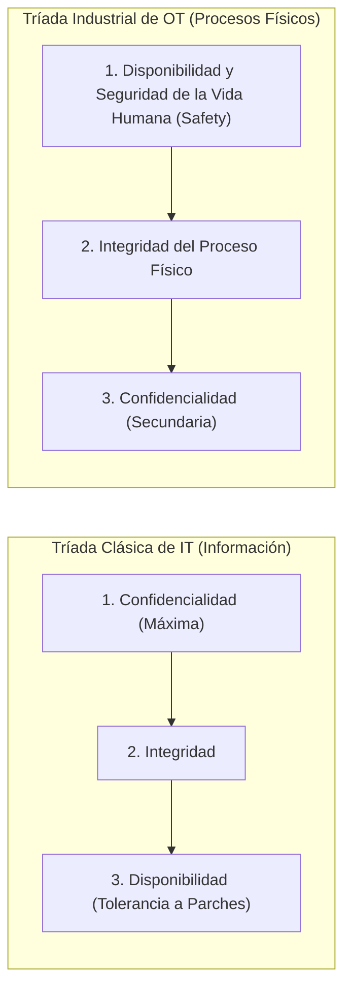
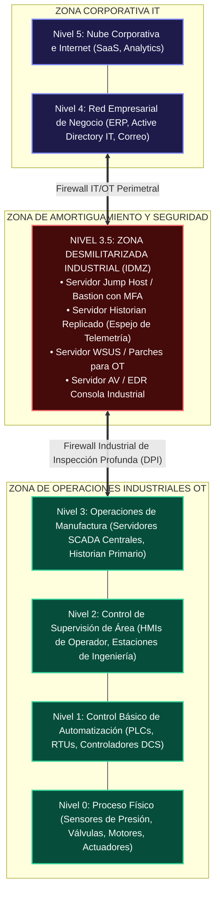
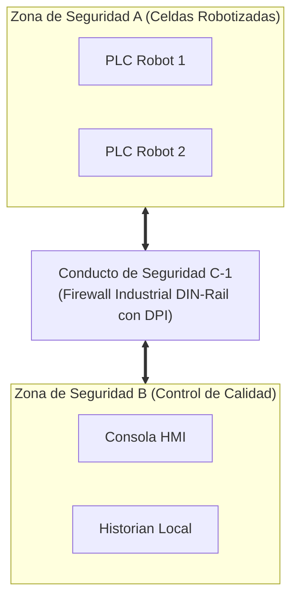

# 🏭 Volumen 07: Redes Industriales OT, SCADA y Ciberseguridad ISA/IEC 62443
## Wiki Maestra de Ingeniería EDC

> **ESTÁNDARES:** ISA/IEC 62443 • ANSI/ISA-95 (Purdue Model) • IEEE 1815 (DNP3) • Modbus TCP Spec  
> **ÁREAS DE APLICACIÓN:** Infraestructuras Críticas • Plantas de Manufactura • Sector Eléctrico, Petróleo y Gas  
> **ALINEACIÓN DE CERTIFICACIÓN:** GICSP (Global Industrial Cyber Security Professional) • CompTIA Security+  
> **UBICACIÓN:** `Base de Conocimientos_EDC/WIKI_EDC/WIKI_07_Redes_Industriales_OT_e_IoT.md`

---

## 1. La Convergencia IT/OT y el Choque de Paradigmas

Las **Tecnologías de Operación (OT - Operational Technology)** abarcan el hardware y software diseñado para monitorear y controlar directamente procesos físicos en el mundo real (generadores eléctricos, plantas de tratamiento de agua, refinerías y brazos robóticos). Históricamente, las redes industriales operaban bajo "seguridad por oscuridad" completamente aisladas (*Air-Gapped*). La digitalización industrial (Industria 4.0) ha forzado la interconexión con las redes empresariales de IT, exponiendo sistemas vulnerables de más de 20 años a ciberamenazas globales.



### Tabla Comparativa de Requerimientos: IT vs. OT

| Criterio Operativo | Redes Empresariales de Tecnologías de la Información (IT) | Redes Industriales y de Automatización (OT) |
| :--- | :--- | :--- |
| **Prioridad Máxima** | **Confidencialidad de la Información y Datos** | **Seguridad de la Vida Humana (*Safety*) y Disponibilidad Operativa** |
| **Impacto de una Falla** | Pérdida de dinero, daño reputacional, fuga de datos. | **Catástrofe física: explosiones, derrames químicos, corte eléctrico nacional.** |
| **Tolerancia a la Latencia**| Blanda (retrasos de segundos o retransmisiones son tolerables).| **Determinista Estricta (Lazos de control en tiempo real en microsegundos o milisegundos).** |
| **Gestión de Parches** | Continua (actualizaciones automáticas semanales de SO y reinicios).| **Extremadamente Restrictiva (Los parches requieren meses de pruebas; paradas de planta anuales).** |
| **Ciclo de Vida de Activos**| Rápido (3 a 5 años de vida útil en servidores y PCs). | **Extendido (15 a 30 años en controladores PLCs, RTUs y sensores).** |
| **Protocolos de Red** | TCP/IP, HTTPS, SSH, DNS, LDAP (con cifrado robusto). | **Modbus, DNP3, CIP, Profinet (Históricamente diseñados SIN autenticación ni cifrado).** |

---

## 2. El Modelo Purdue (PERA / ISA-95): Segmentación Jerárquica de Planta

El **Modelo de Referencia Empresarial de Purdue (PERA)** es la arquitectura arquitectónica fundamental para estructurar y proteger las redes industriales, dividiéndolas en 6 niveles funcionales estrictos:



### Reglas de Oro de la Zona Desmilitarizada Industrial (IDMZ Nivel 3.5):
1. **Ninguna comunicación directa debe cruzar desde el Nivel 4 (IT) hacia el Nivel 3 (OT).** Todo tráfico debe originarse o terminar en un servidor intermediario de la IDMZ.
2. **Los controladores de dominio de Active Directory deben estar separados:** El bosque de Active Directory de IT **nunca** debe extenderse a la planta industrial. La zona OT debe disponer de su propio bosque aislado sin relaciones de confianza bidireccionales.
3. **Acceso Remoto exclusivamente mediante Jump Hosts:** Los ingenieros de planta o proveedores externos deben conectarse primero mediante VPN corporativa con autenticación multifactor (MFA), acceder a una estación bastión en la IDMZ y desde allí iniciar una sesión supervisada por RDP/SSH hacia las HMIs de Nivel 2/3.

---

## 3. Protocolos Industriales Nativos y sus Debilidades de Seguridad

La inmensa mayoría de los protocolos de automatización de planta fueron concebidos hace décadas asumiendo que la red física era inaccesible para atacantes.

### A. Protocolo Modbus TCP (Puerto TCP 502)
* **Arquitectura:** Modelo Cliente/Servidor (Maestro/Esclavo). El cliente envía solicitudes de lectura o escritura de registros numéricos hacia el esclavo (PLC).
* **Códigos de Función Críticos:**
  - `01 (Read Coils)`: Lee el estado binario (On/Off) de salidas digitales.
  - `03 (Read Holding Registers)`: Lee valores numéricos analógicos (ej. presión de caldera, temperatura).
  - `05 (Write Single Coil)` / `06 (Write Single Register)`: **Escritura forzada**. Modifica el estado de una salida o parámetro.
  - `16 / 0x10 (Write Multiple Registers)`: Sobrescribe bloques enteros de memoria del PLC.
* **Debilidad:** **Carece por completo de autenticación y cifrado.** Cualquier computadora conectada a la red industrial puede enviar un paquete TCP al puerto 502 con un código de función `16` y detener una turbina o alterar los límites de presión de una tubería.

---

### B. Protocolo DNP3 (IEEE 1815 - Puerto TCP/UDP 20000)
* **Sector Predominante:** Redes eléctricas (subestaciones, control de transformadores) y distribución de agua potable.
* **Características:** Admite sincronización horaria de eventos milimétricos y transmisión no solicitada (*Unsolicited Reporting*).
* **Seguridad:** En su versión clásica, carece de autenticación. El estándar **Secure DNP3 (SAv5)** introduce autenticación criptográfica de desafío-respuesta (*Challenge-Response*) basada en algoritmos HMAC-SHA256, impidiendo la inyección de comandos de maniobra falsos hacia interruptores de alta tensión.

---

### C. CIP (Common Industrial Protocol) y Ethernet/IP (Puertos TCP/UDP 44818 y 2222)
* **Gobernanza:** Desarrollado por ODVA (estándar IEC 61158).
* **Funcionamiento:** Transporta objetos de automatización sobre TCP (mensajes explícitos de configuración en puerto 44818) y sobre UDP (mensajes implícitos de control de movimiento y E/S en tiempo real en puerto 2222).
* **Solución Moderna:** Despliegue de **CIP Security**, que incorpora túneles TLS e IPsec encapsulados para autenticar mutuamente a los PLCs y estaciones de trabajo.

---

## 4. El Marco de Seguridad Industrial ISA/IEC 62443

La serie de normas **ISA/IEC 62443** es el estándar de referencia mundial para la ciberseguridad en redes de automatización y control industrial (IACS).



### A. Los Tres Pilares de la ISA/IEC 62443
1. **Zonas (Zones):** Agrupación lógica o física de activos industriales que comparten los mismos requisitos de seguridad y nivel de criticidad.
2. **Conductos (Conduits):** Canales de comunicación controlados que interconectan dos o más zonas distintas. **Todo conducto debe implementar controles de seguridad proporcionales a las zonas que comunica** (filtrado de paquetes en firewall, cifrado VPN o listas de control de acceso).
3. **Niveles de Seguridad (Security Levels - SL):**

| Nivel de Seguridad | Definición del Amenazante y Motivación | Capacidades Técnicas del Atacante |
| :---: | :--- | :--- |
| **SL 1** | Protección contra violaciones **casuales o no intencionales**. | Errores humanos, empleados distraídos, malware genérico de consumo. |
| **SL 2** | Protección contra violaciones intencionales con **bajos recursos**. | Cibercriminales genéricos, herramientas públicas de escaneo de vulnerabilidades. |
| **SL 3** | Protección contra violaciones intencionales con **habilidades sofisticadas**. | Grupos de cibercrimen organizado con conocimiento de sistemas industriales (Ransomware OT). |
| **SL 4** | Protección contra violaciones intencionales con **recursos ilimitados**. | **Actores de Estado-Nación (Ciberguerra, espionaje avanzado APT militar).** |

---

## 5. Hardening de Redes y Conmutadores Industriales (DIN-Rail)

### A. Especificaciones Físicas de Hardware Industrial
Los switches instalados en plantas industriales (ej. series Cisco Catalyst IE3400, Siemens SCALANCE o Phoenix Contact) presentan requisitos mecánicos extremos:
- **Montaje en Riel DIN:** Fijación en gabinetes eléctricos estándar de 35 mm.
- **Disipación Pasiva sin Ventiladores:** Eliminación de piezas móviles para evitar la succión de polvo metálico, vapores químicos y partículas de carbón.
- **Rango de Temperatura Extendido:** Operación ininterrumpida garantizada entre **$-40^\circ\text{C}$ y $+75^\circ\text{C}$**.
- **Entrada de Alimentación Redundante:** Bornes para fuentes de poder dobles de corriente continua (12V / 24V / 48V DC).

---

### B. Inspección Profunda de Paquetes Industriales (DPI en Firewalls OT)

Un firewall perimetral estándar sólo evalúa si el puerto TCP 502 está abierto o cerrado. Un **Firewall Industrial con Deep Packet Inspection (DPI)** analiza el contenido interno de la cabecera industrial:

```mermaid
graph TD
    PktModbus["Paquete Modbus TCP (Puerto 502)"] --> DPI["Motor DPI Industrial en Firewall"]
    DPI --> Check{"¿Qué Código de Función solicita?"}
    Check -->|"Función 03 (Lectura de Sensores)"| Permit["PERMITIR (Tráfico Normal de Monitoreo)"]
    Check -->|"Función 16 (Escritura Forzada de PLC)"| Rule{"¿Viene de Estación de Ingeniería Autorizada?"}
    Rule -->|Sí| PermitWrite["PERMITIR con Registro en Auditoría"]
    Rule -->|No (Viene de PC desconocida)| Block["BLOQUEAR INMEDIATAMENTE + ALERTA SIEM"]
```

Regla de filtrado conceptual en firewall industrial (ej. Fortinet / Palo Alto / Moxa):
```text
security-policy {
    rule "PERMITIR-SOLO-LECTURA-SCADA" {
        from zone OT-SUPERVISION;
        to zone OT-CONTROL-PLCS;
        service modbus-tcp;
        application modbus-read-holding-registers;
        action permit;
    }
    rule "BLOQUEAR-ESCRITURA-NO-AUTORIZADA" {
        from zone ANY;
        to zone OT-CONTROL-PLCS;
        service modbus-tcp;
        application modbus-write-registers;
        action deny-and-alert;
    }
}
```
