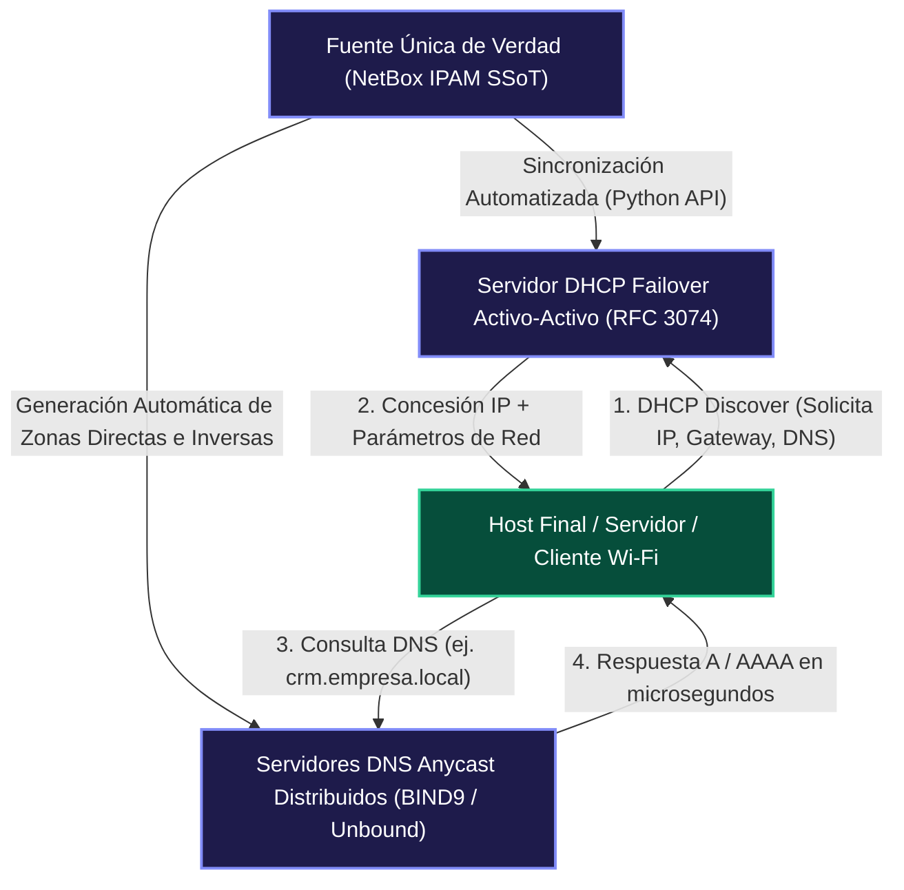
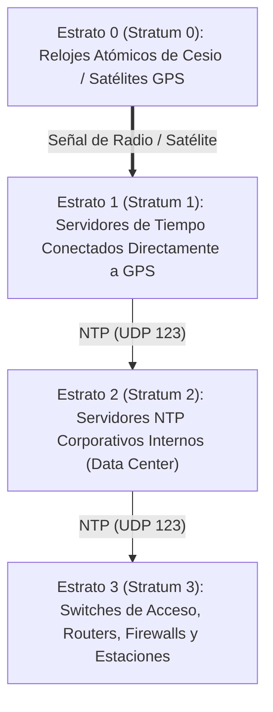
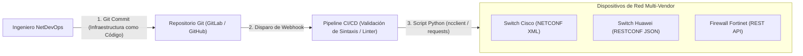

# 🗂️ Volumen 08: Servicios Centrales DDI, Sincronización y NetDevOps Programático
## Wiki Maestra de Ingeniería EDC

> **ESTÁNDARES:** RFC 1035 (DNS) • RFC 2131 (DHCP) • RFC 5905 (NTPv4) • RFC 3411 (SNMPv3) • RFC 6241 (NETCONF) • RFC 8040 (RESTCONF)  
> **TECNOLOGÍAS:** Anycast DNS • DHCP Failover • NetBox IPAM SSoT • Streaming Telemetry • Python NetDevOps  
> **ALINEACIÓN DE CERTIFICACIÓN:** Cisco DevNet Associate / Professional • Cisco CCNP Enterprise Core • CompTIA Linux+  
> **UBICACIÓN:** `Base de Conocimientos_EDC/WIKI_EDC/WIKI_08_Servicios_DDI_NetDevOps_y_Gestion.md`

---

## 1. La Tríada Crítica DDI: DNS, DHCP e IPAM

Los servicios **DDI (DNS, DHCP, IPAM)** constituyen el sistema nervioso central de cualquier infraestructura digital. Si los servicios DDI fallan, toda la conectividad de aplicaciones corporativas colapsa de forma instantánea, aunque la infraestructura física y los enlaces de conmutación se encuentren 100% operativos.



---

### A. DNS Empresarial y Anycast Distribuido
* **Jerarquía de Espacio de Nombres:** Servidores Raíz (Root `.` administrados por la IANA), TLDs (`.com`, `.net`, `.org`), Servidores Autoritativos y Resolvedores Recursivos locales.
* **Tipos de Registros DNS Fundamentales:**
  - `A`: Mapea un nombre FQDN a una dirección IPv4 de 32 bits.
  - `AAAA`: Mapea un nombre a una dirección IPv6 de 128 bits.
  - `CNAME`: Alias canónico hacia otro nombre FQDN.
  - `PTR`: Registro de resolución inversa (IP a nombre, zona `in-addr.arpa` o `ip6.arpa`).
  - `SRV`: Localizador de servicios (identifica puerto, peso y prioridad de un protocolo; crítico para Directorio Activo y telefonía SIP).
  - `TXT`: Cadenas de texto utilizadas para autenticación de correos (**SPF, DKIM, DMARC**).
* **BGP Anycast DNS:** Múltiples servidores DNS en diferentes edificios anuncian la misma dirección IP (ej. `10.10.10.10`) mediante BGP. Si un servidor se cae, BGP redirige instantáneamente las consultas hacia el nodo más cercano en milisegundos sin intervención manual.

---

### B. DHCP Corporativo y Relay Agent (Opción 82)
En redes con decenas de VLANs, no se despliega un servidor DHCP en cada segmento local; se centraliza en servidores de alta disponibilidad y los switches L3 / routers actúan como agentes de retransmisión (**DHCP Relay Agent**):

```cisco
interface Vlan10
 description SEGMENTO_USUARIOS
 ip address 10.1.10.1 255.255.255.0
 ip helper-address 10.254.1.10 ! Reenvía broadcasts DHCP a la IP unicast del servidor
```

* **DHCP Option 82 (Relay Agent Information Option):** El switch inserta dos sub-opciones en el paquete `DHCP Discover`:
  - `Circuit ID`: Identifica el puerto físico exacto donde está conectado el usuario (ej. GigabitEthernet0/5).
  - `Remote ID`: Identifica la dirección MAC del switch de acceso.
  - *Utilidad:* Permite al servidor DHCP asignar direcciones IP específicas según el puerto físico del conmutador, facilitando el despliegue automático de cámaras o teléfonos VoIP.

---

### C. NetBox como Fuente Única de Verdad (Single Source of Truth - SSoT)
NetBox no es una herramienta pasiva de escaneo; es una plataforma de **modelado previo a la configuración**. Los administradores definen en NetBox cómo *debe* ser la red:
- Asignación de Prefijos jerárquicos (Supernets y Subnets).
- Catálogo de fabricantes, modelos de dispositivos y módulos SFP.
- Mapeo exacto de cables físicos (puerto origen a puerto destino con número de patch panel).
- Consumo mediante **API REST y GraphQL** para aprovisionamiento automatizado.

---

## 2. Sincronización Horaria Crítica: NTPv4 (RFC 5905) y PTP (IEEE 1588)

La sincronización de relojes es un requisito técnico y legal estricto. Si los conmutadores y servidores difieren en apenas un par de segundos:
1. La autenticación Kerberos en Active Directory falla de inmediato (tolerancia máxima de desajuste: 5 minutos).
2. Los certificados digitales X.509 son rechazados antes de tiempo o después de su revocación.
3. **El análisis forense en el SIEM queda destruido:** Resulta imposible correlacionar cronológicamente si un log de firewall precedió a un evento de inicio de sesión malicioso.



### Configuración Hardened de NTPv4 con Autenticación Criptográfica (Cisco IOS-XE)
```cisco
! Clave de Autenticación Criptográfica SHA-1 (o MD5)
ntp authentication-key 1 sha1 MiClaveSeguraNTP123
ntp trusted-key 1
ntp authenticate

! Servidores NTP Corporativos en Sede Central y Nube
ntp server 10.254.1.10 key 1 prefer
ntp server 10.254.2.10 key 1
ntp source Loopback0

! Control de Acceso: Restringe qué hosts pueden sincronizarse con este equipo
access-list 10 permit 10.254.1.10
access-list 10 permit 10.254.2.10
ntp access-group peer 10
```

---

## 3. Monitoreo, Telemetría y Gestión de Infraestructura

### A. Comparativa de Versiones SNMP: La Urgencia de Migrar a SNMPv3 (RFC 3411)

| Característica de Seguridad | SNMPv1 (Histórico) | SNMPv2c (Comercial Común) | SNMPv3 (Estándar Corporativo Seguro) |
| :--- | :--- | :--- | :--- |
| **Mecanismo de Autenticación**| *Community String* (Texto plano)| *Community String* (Texto plano)| **Usuarios con Criptografía Hash (HMAC-SHA-256)** |
| **Confidencialidad / Cifrado**| Ninguna (Payload expuesto) | Ninguna (Payload expuesto) | **Cifrado Simétrico Robusto (AES-128 / AES-256)** |
| **Protección contra Repetición**| No soportado | No soportado | **Sí (Marcas temporales del motor SNMP EngineID)** |
| **Nivel de Seguridad** | Inseguro (Vulnerable a sniffing)| Inseguro (Vulnerable a sniffing)| **Totalmente Confiable (authPriv)** |

Configuración de SNMPv3 con cifrado completo (`authPriv`):
```cisco
! 1. Definición del Grupo SNMPv3 con permisos de solo lectura
snmp-server group GRUPO_MONITOREO v3 priv read VISTA_COMPLETA

! 2. Vista de MIBs permitidas (acceso a todo el árbol ISO)
snmp-server view VISTA_COMPLETA iso included

! 3. Usuario SNMPv3 con autenticación SHA-256 y cifrado AES-256
snmp-server user USUARIO_NOC GRUPO_MONITOREO v3 auth sha256 ClaveAuthNOC2026 priv aes 256 ClavePrivCifrado2026
```

---

### B. Análisis de Tráfico de Flujo: NetFlow v9 e IPFIX (RFC 7011)
Mientras que SNMP informa *cuánto* tráfico transita por una interfaz (ej. "el enlace está al 85% de utilización"), **NetFlow/IPFIX explica *quién* y *qué* está consumiendo el ancho de banda**:
- Identifica la 7-tupla de cada flujo: IP origen, IP destino, Puerto origen, Puerto destino, Protocolo L4, Interfaz de entrada y byte de ToS/DSCP.
- Facilita la detección inmediata de exfiltración masiva de datos, escaneos de puertos y minería clandestina de criptomonedas.

---

## 4. NetDevOps: Automatización con YANG, NETCONF y Python

El paradigma **NetDevOps** aplica las mejores prácticas del desarrollo de software moderno (control de versiones Git, integración continua CI/CD y pruebas automáticas) a la operación de redes empresariales.



### A. YANG (RFC 6020 / RFC 7950) y Protocolos de Gestión Programática
* **YANG:** Lenguaje formal de modelado de datos que define la estructura jerárquica, tipos de datos y restricciones de configuración de los equipos de red de forma independiente del protocolo de transporte.
* **NETCONF (RFC 6241):**
  - Opera sobre sesiones **SSH seguras (puerto TCP 830)**.
  - Mensajería estructurada en **XML**.
  - Soporta transacciones atómicas con validación previa: Modifica la configuración en el almacén de prueba (`candidate`), valida que no haya errores de sintaxis y la confirma definitivamente (`commit`). Si el enlace se pierde, revierte automáticamente los cambios (*Rollback on error*).
* **RESTCONF (RFC 8040):**
  - Opera sobre **HTTPS (puerto TCP 443)** utilizando los verbos estándar de la web:
    - `GET`: Consultar información de estado o configuración activa.
    - `POST`: Crear un nuevo recurso (ej. crear una nueva VLAN).
    - `PUT`: Reemplazar un recurso existente.
    - `PATCH`: Modificar selectivamente atributos específicos de un recurso.
    - `DELETE`: Eliminar una interfaz o política.
  - Admite codificación de datos en formato **JSON o XML**.

---

### B. Script de Automatización en Python: Consulta de Inventario NetBox y Configuración de VLANs

A continuación se ilustra un script profesional en Python que consume la API de NetBox para aprovisionar automáticamente VLANs en conmutadores corporativos:

```python
#!/usr/bin/env python3
"""
NetDevOps Automation Script - Provisionamiento de VLANs desde NetBox hacia Cisco IOS-XE
Librerías Requeridas: requests, netmiko
"""
import requests
from netmiko import ConnectHandler

# 1. Parámetros de Conexión a la API de NetBox
NETBOX_URL = "https://netbox.empresa.local/api"
NETBOX_TOKEN = "0123456789abcdef0123456789abcdef01234567"
HEADERS = {
    "Authorization": f"Token {NETBOX_TOKEN}",
    "Accept": "application/json"
}

def obtener_vlans_netbox():
    """Consulta la lista de VLANs autorizadas desde la Fuente Única de Verdad (NetBox)"""
    url = f"{NETBOX_URL}/ipam/vlans/?status=active"
    response = requests.get(url, headers=HEADERS, verify=False)
    response.raise_for_status()
    datos = response.json()
    
    vlans = []
    for item in datos.get("results", []):
        vlans.append({
            "vid": item["vid"],
            "name": item["name"].replace(" ", "_").upper()
        })
    return vlans

def desplegar_vlans_en_switch(dispositivo_ip, vlans):
    """Aplica las VLANs en el switch físico mediante comandos CLI estructurados con Netmiko"""
    device = {
        "device_type": "cisco_ios",
        "host": dispositivo_ip,
        "username": "admin_netdevops",
        "password": "PasswordSeguro2026!",
        "secret": "EnablePassword2026!"
    }
    
    comandos_config = []
    for vlan in vlans:
        comandos_config.extend([
            f"vlan {vlan['vid']}",
            f" name {vlan['name']}"
        ])
        
    print(f"[*] Conectando a {dispositivo_ip} para desplegar {len(vlans)} VLANs...")
    with ConnectHandler(**device) as net_connect:
        net_connect.enable()
        salida = net_connect.send_config_set(comandos_config)
        net_connect.save_config()
        print(f"[+] Despliegue exitoso en {dispositivo_ip}:\n{salida}")

if __name__ == "__main__":
    try:
        lista_vlans = obtener_vlans_netbox()
        print(f"[+] Se obtuvieron {len(lista_vlans)} VLANs activas desde NetBox.")
        # Despliegue en Switch de Acceso del Piso 1
        desplegar_vlans_en_switch("10.1.99.10", lista_vlans)
    except Exception as e:
        print(f"[-] Error en el proceso de automatización: {e}")
```
