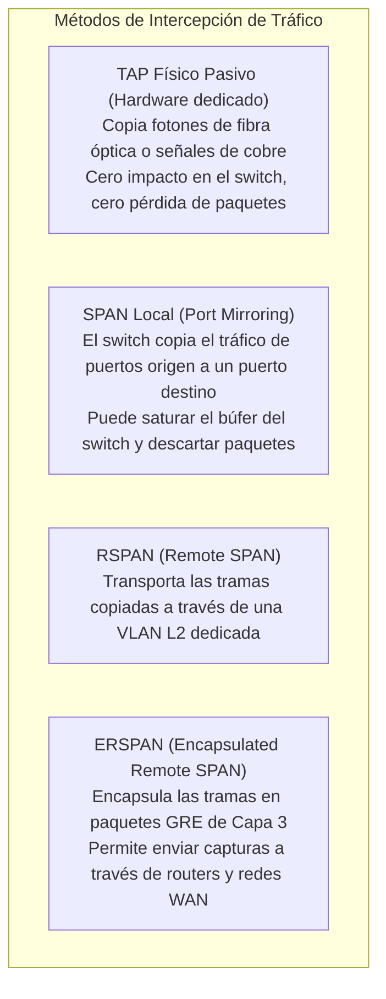
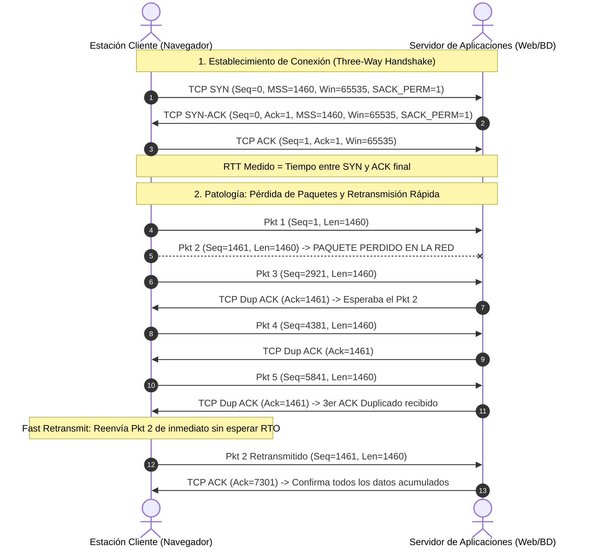
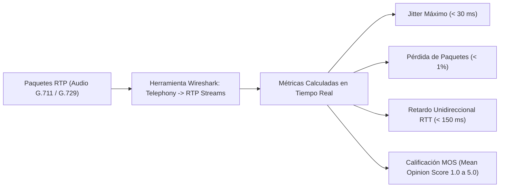
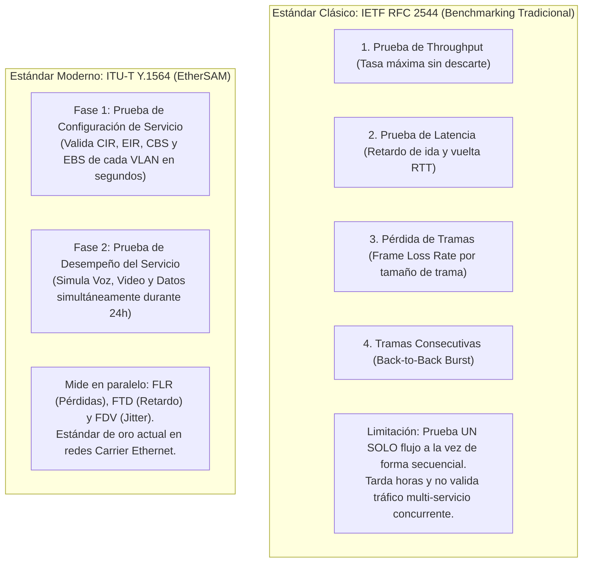

# 🦈 Volumen 09: Análisis Forense con Wireshark, Diagnóstico TCP/VoIP y Metrología RFC 2544
## Wiki Maestra de Ingeniería EDC

> **ESTÁNDARES:** RFC 9293 (TCP) • RFC 3550 (RTP) • RFC 2544 (Benchmarking) • ITU-T Y.1564 (EtherSAM)  
> **HERRAMIENTAS:** Wireshark • TShark • Tcpdump • Iperf3 • SPAN / ERSPAN  
> **ALINEACIÓN DE CERTIFICACIÓN:** WCNA (Wireshark Certified Network Analyst) • Cisco CCNP Enterprise Core  
> **UBICACIÓN:** `Base de Conocimientos_EDC/WIKI_EDC/WIKI_09_Analisis_Wireshark_y_Troubleshooting.md`

---

## 1. Metodología de Captura e Intercepción de Tráfico de Red

El análisis profundo de paquetes (*Deep Packet Analysis*) es la prueba forense definitiva ante incidentes de ciberseguridad, degradación de rendimiento y fallas intermitentes de red. Para capturar tráfico con precisión científica, el ingeniero debe seleccionar el método de intercepción adecuado:

### A. Filtros de Captura (BPF) vs. Filtros de Visualización (Display Filters)

| Criterio de Comparación | Filtros de Captura (Capture Filters / BPF) | Filtros de Visualización (Display Filters) |
| :--- | :--- | :--- |
| **Motor de Evaluación** | Evaluados por la librería de captura (**libpcap / WinPcap / Npcap**) a nivel de kernel. | Evaluados por el motor de **Wireshark** en espacio de usuario. |
| **Momento de Aplicación**| **Antes de guardar los paquetes en disco**. Los paquetes no coincidentes se descartan irrevocablemente. | **Después de la captura**. Oculta o resalta paquetes sin borrarlos del archivo `.pcapng`. |
| **Sintaxis** | Notación BPF (Berkeley Packet Filter): `host 192.168.1.1 and port 443`. | Sintaxis relacional rica de Wireshark: `ip.addr == 192.168.1.1 && tcp.port == 443`. |
| **Uso Recomendado** | Capturas masivas en enlaces de alta velocidad (10G/40G) para no saturar memoria RAM. | Análisis forense interactivo, resolución de fallas y búsqueda de anomalías. |

---

## 2. Diagnóstico de Patologías de Capa 4 (TCP Troubleshooting)

El protocolo TCP (RFC 9293) proporciona transporte confiable y orientado a conexión mediante el saludo de tres vías (*Three-Way Handshake*), control de flujo y gestión dinámica de congestión.

---

### A. Diagnóstico de Retransmisiones TCP
1. **TCP Retransmission (Por Expiración de RTO):**
   - Si el emisor no recibe confirmación (ACK) antes de que expire su temporizador de retransmisión (*Retransmission Timeout - RTO*, derivado del RTT medio), reenvía el segmento.
   - *Causas habituales:* Pérdida física de paquetes por cables defectuosos, colisiones dúplex o descartes por desbordamiento de búfer (*Tail Drop*) en switches congestionados.
2. **Fast Retransmit (Retransmisión Rápida):**
   - Desencadenada cuando el emisor recibe **3 confirmaciones duplicadas idénticas (TCP Dup ACK)** consecutivas. El emisor comprende que un segmento intermedio se perdió pero que los posteriores llegaron al destino, retransmitiendo el paquete perdido de inmediato sin degradar la tasa de transferencia de forma tan agresiva como el RTO.

---

### B. La Crisis de la Ventana Cero (TCP ZeroWindow)
* **Mecanismo:** El campo *Window Size* en la cabecera TCP informa cuántos bytes está dispuesto a recibir el receptor antes de que su búfer en memoria RAM se desborde.
* **TCP ZeroWindow:** El receptor envía un segmento con `Win=0`. Esto significa: **"Mi búfer de memoria está completamente lleno; la aplicación local (ej. base de datos SQL o servidor web) no puede procesar los datos con la suficiente rapidez. ¡DETÉN EL ENVÍO INMEDIATAMENTE!"**.
* **Diagnóstico en Wireshark:**
  - Filtro de visualización: `tcp.window_size == 0 && tcp.flags.reset == 0`
  - *Interpretación Técnica:* **No es un problema de red ni de switches**. Es un síntoma clásico de saturación de CPU, disco lento o mala optimización de memoria en el servidor receptor.
* **TCP Window Update:** Segmento posterior transmitido por el receptor indicando que su aplicación ha liberado memoria (`Win > 0`) y que el tráfico puede reanudarse.

---

### C. Restablecimiento Abrupto de Conexión (TCP Reset - RST)
El flag `RST` destruye inmediatamente la conexión TCP sin pasar por el cierre ordenado de 4 pasos (FIN-ACK).
* **Filtro de visualización:** `tcp.flags.reset == 1`
* **Principales Causas Raíz:**
  1. *Puerto Destino Cerrado:* El cliente intenta conectarse a un puerto L4 donde ningún servicio está escuchando (el sistema operativo receptor devuelve un RST inmediato).
  2. *Intercepción por Firewall / IPS:* Un firewall perimetral detecta una violación de política (ej. palabra prohibida o firma de ataque) y transmite paquetes `RST` artificiales forzados a ambos extremos para abortar la sesión.
  3. *Agotamiento de Temporizadores NAT:* La tabla de estado de un router NAT expira la traducción de una sesión inactiva y descarta los paquetes posteriores enviando un reset.

---

## 3. Diagnóstico de Tráfico de Telefonía IP y Streaming (VoIP RTP)

La voz sobre IP es la aplicación más intolerante a problemas de Capa 4 en toda la red corporativa.

### Tabla de Calificación de Calidad de Voz (MOS / Factor R)

| Rango MOS | Factor R | Calidad Subjetiva del Usuario | Impacto Técnico en la Comunicación |
| :---: | :---: | :--- | :--- |
| **4.3 a 5.0** | **90 - 100** | **Excelente (Calidad Toll / HD)**| Comunicación perfecta; idéntica a una llamada local fija. |
| **4.0 a 4.2** | **80 - 89** | **Buena** | Muy bajo retardo; casi imperceptible para usuarios corporativos. |
| **3.6 a 3.9** | **70 - 79** | **Aceptable** | Retardo leve o pequeña compresión acústica (típico de códec G.729). |
| **3.1 a 3.5** | **60 - 69** | **Deficiente** | Los interlocutores se interrumpen al hablar; pequeñas sílabas cortadas. |
| **1.0 a 3.0** | **< 60** | **Inaceptable** | Voz robotizada, eco masivo, pérdida de frases completas. |

---

## 4. Metrología y Certificación Formal de Enlaces: RFC 2544 vs. ITU-T Y.1564

Cuando un proveedor de telecomunicaciones entrega un enlace de fibra óptica o circuito corporativo, se deben ejecutar pruebas estandarizadas de aceptación formal de SLAs:

---

## 5. Tabla Maestra de Filtros de Visualización Avanzados en Wireshark

| Patología o Caso de Diagnóstico | Filtro de Visualización en Wireshark (Display Filter) | Explicación Técnica del Filtro |
| :--- | :--- | :--- |
| **Retransmisiones TCP Críticas** | `tcp.analysis.retransmission` | Identifica paquetes reenviados por expiración del temporizador RTO. |
| **Confirmaciones Duplicadas (Dup-ACK)**| `tcp.analysis.duplicate_ack` | Señal inequívoca de pérdida de paquetes previa a un *Fast Retransmit*. |
| **Saturación de Servidor (ZeroWindow)**| `tcp.analysis.zero_window` | El servidor avisa que su memoria RAM está colapsada (`Win=0`). |
| **Conexiones Reseteadas Abruptamente** | `tcp.flags.reset == 1 && tcp.seq > 1` | Detecta cortes de sesión provocados por firewalls o caídas de puertos. |
| **Fallas en Resolución DNS** | `dns.flags.rcode != 0` | Muestra consultas DNS que fallaron (ej. `NXDOMAIN`, `Server Failure`). |
| **Errores HTTP de Servidor (5xx)** | `http.response.code >= 500` | Filtra errores de aplicación interna (500 Internal Server Error, 502 Bad Gateway). |
| **Señalización SIP de Voz con Errores** | `sip.Status-Code >= 400` | Localiza llamadas rechazadas (404 Not Found, 486 Busy Here, 503 Unavailable). |
| **Ataques de Envenenamiento ARP** | `arp.duplicate-address-frame` | Alerta cuando múltiples direcciones MAC reclaman la misma dirección IP. |
| **Aleteo de Enlaces OSPF (LSUs)** | `ospf.msg == 4` | Captura paquetes Link State Update; útil para diagnosticar flapping de rutas. |
| **Rechazos de Autenticación 802.1X** | `eapol.type == 0 && radius.code == 3` | Captura solicitudes de acceso denegadas (*Access-Reject*) en RADIUS. |
