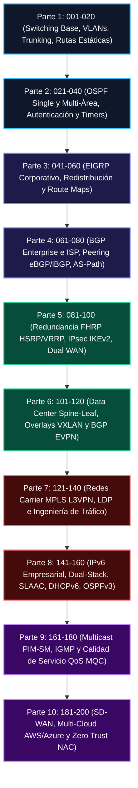
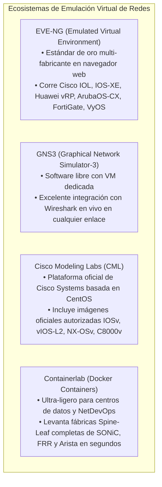

# 🧪 Volumen 10: Banco de 200 Laboratorios Prácticos y Guías de Emulación Virtual
## Wiki Maestra de Ingeniería EDC

> **PLATAFORMAS DE EMULACIÓN:** EVE-NG Professional • GNS3 • Cisco Modeling Labs (CML) • Containerlab  
> **ALCANCE:** 200 Escenarios de Laboratorio Práctico Mapeados a Certificaciones CCNA/CCNP/HCIP/Security+  
> **UBICACIÓN:** `Base de Conocimientos_EDC/WIKI_EDC/WIKI_10_Banco_Laboratorios_y_Guias_Paso_a_Paso.md`

---

## 1. Catálogo Estructurado del Banco de 200 Laboratorios Prácticos

El repositorio incorpora en su carpeta [`Ejemplos/`](file:///c:/Users/z_eke/OneDrive/Escritorio/BC/Ejemplos) un banco masivo de **200 laboratorios prácticos documentados con diagramas ASCII, configuración de partida, configuración solución y comandos de verificación**. Se organizan en 10 partes temáticas progresivas:



---

### Desglose de Competencias Desarrolladas por Bloque de Laboratorios

| Bloque | Rango de Labs | Tecnologías Centrales Desarrolladas | Nivel de Complejidad | Certificación de Impacto |
| :-: | :-: | :--- | :-: | :--- |
| **Parte 1** | **001 - 020** | VLANs 802.1Q, VTPv3, LACP EtherChannel, Rapid-PVST+, SVI L3, Rutas flotantes. | Asociado (CCNA) | Cisco CCNA / Huawei HCIA |
| **Parte 2** | **021 - 040** | OSPFv2, tipos de redes (Point-to-Point, Broadcast), DR/BDR, Áreas Stub y NSSA, BFD. | Profesional (CCNP) | Cisco CCNP ENCOR / HCIP |
| **Parte 3** | **041 - 060** | EIGRP Named Mode, sumarización manual, redistribución mutua OSPF-EIGRP con tags. | Profesional (CCNP) | Cisco CCNP ENARSI |
| **Parte 4** | **061 - 080** | BGP multihoming, manipulación de Local-Preference, AS-Path Prepending, Route Reflectors.| Profesional (CCNP) | Cisco CCNP ENARSI / BGP |
| **Parte 5** | **081 - 100** | HSRPv2 con tracking de interfaces, VRRPv3, túneles VPN IPsec IKEv2 Site-to-Site. | Profesional | Cisco CCNP Security / Network+ |
| **Parte 6** | **101 - 120** | Clos Spine-Leaf, VTEPs en Nexus 9000v, simulación de túneles VXLAN EVPN Route Type 2. | Experto (Data Center) | Cisco CCNP Data Center |
| **Parte 7** | **121 - 140** | MPLS Core, distribución de etiquetas LDP, VRF-Lite, BGP/MPLS L3VPN con Route Targets. | Experto (Carrier) | Cisco Service Provider |
| **Parte 8** | **141 - 160** | Direccionamiento Global IPv6, túneles 6to4, OSPFv3 multi-proceso, MP-BGP para IPv6. | Profesional | Cisco CCNP / CompTIA Net+ |
| **Parte 9** | **161 - 180** | Multicast Sparse Mode (PIM-SM), Rendezvous Point (RP) estático y Auto-RP, QoS MQC LLQ. | Profesional | Cisco CCNP Enterprise |
| **Parte 10**| **181 - 200** | Topologías SD-WAN corporativas, VPNs hacia AWS VPC / Azure VNet y políticas 802.1X. | Especialidad Avanzada | Multi-Cloud / Security+ |

---

## 2. Guía Comparativa de Plataformas de Simulación y Emulación Virtual

Para ejecutar los 200 laboratorios sin requerir decenas de conmutadores físicos en racks costosos, se utilizan entornos de emulación virtual sobre hipervisores (VMware ESXi, Workstation o Proxmox VE):



### Tabla Comparativa de Requerimientos de Plataforma

| Entorno de Laboratorio | Consumo de RAM Típico | Curva de Aprendizaje | Soporte Multi-Fabricante | Ideal Para |
| :--- | :-: | :-: | :-: | :--- |
| **EVE-NG Community / Pro** | 16 GB a 64 GB | Media | **Universal (Cisco, Huawei, Aruba, Fortinet, Linux)**| Preparación formal de certificaciones CCNP, HCIP y CCIE. |
| **GNS3 con GNS3 VM** | 16 GB a 32 GB | Media | Muy Alto | Pruebas rápidas de laboratorio e inspección con Wireshark. |
| **Cisco Modeling Labs (CML)** | 16 GB a 64 GB | Baja (Fácil despliegue) | Limitado (Optimizado para Cisco) | Laboratorios oficiales de certificación Cisco CCNA/CCNP. |
| **Containerlab** | **4 GB a 8 GB (Muy ligero)**| Alta (Requiere YAML/Docker)| Muy Alto en NOS abiertos (SONiC, FRR) | Automatización CI/CD, pipelines NetDevOps y datacenters. |

---

## 3. Metodología de 5 Fases para la Resolución Exitosa de Laboratorios

Para maximizar el aprovechamiento pedagógico y operativo de cada uno de los 200 ejercicios:

### Fase 1: Análisis Topológico y Plan de Direccionamiento
- Antes de escribir una sola línea de configuración en la consola, examine la topología provista en el archivo markdown.
- Verifique las subredes asignadas a cada enlace, las direcciones IP de las interfaces Loopback y el número de VLAN correspondiente.

### Fase 2: Configuración Base y Conectividad L1/L2
- Asigne hostnames identificables (`hostname R1_CORE_SEDE`).
- Desactive la resolución de nombres DNS no deseada en consola (`no ip domain-lookup`).
- Configure las interfaces físicas, subinterfaces 802.1Q o canales de enlace agregados LACP (`channel-group 1 mode active`).

### Fase 3: Despliegue del Plano de Enrutamiento y Políticas
- Habilite los procesos dinámicos (OSPF, EIGRP o BGP) siguiendo el orden estricto de las dependencias topológicas (iniciando siempre por el núcleo o Backbone Área 0 y extendiéndose hacia las áreas periféricas).
- Aplique las listas de control de acceso (ACLs), filtros de ruta (*Prefix-Lists*) y políticas de calidad de servicio (QoS MQC).

### Fase 4: Batería Metódica de Comandos de Verificación
Ejecute la secuencia estándar de comprobación según el estrato técnico:
```cisco
! Verificación de Interfaces y Conectividad Física
show interfaces status
show ip interface brief

! Verificación de Vecindades y Adyacencias
show cdp neighbors
show lldp neighbors
show ip ospf neighbor
show ip bgp summary

! Verificación de la Tabla de Enrutamiento
show ip route
show ip route ospf
show ip route bgp

! Verificación de Políticas y Listas de Acceso
show access-lists
show policy-map interface
```

### Fase 5: Pruebas de Estrés y Simulación de Fallas de Enlace
- **Prueba de Resiliencia:** Apague administrativamente una interfaz troncal primaria (`shutdown`) para verificar si el protocolo de redundancia (HSRP, VRRP o convergencia OSPF con BFD) conmuta el tráfico hacia el camino de respaldo en menos de un segundo sin interrumpir las sesiones de usuario.
- **Validación con Ping Extendido:** Lance 1000 pings continuos mientras apaga el enlace para medir con precisión cuántos paquetes se perdieron durante la reconvergencia:
  ```cisco
  ping 10.20.0.1 repeat 1000 timeout 1
  ```
