# 🌐 Network Engineering & Cybersecurity Master Compendium
## Base de Conocimientos Unificada EDC (Enterprise Data & Connectivity)

  
  
  
  
  
  
  

---

## 📌 Portal de Acceso Principal a la Base de Conocimientos

Toda la infraestructura documental y técnica de este repositorio ha sido auditada, perfeccionada y centralizada en la carpeta maestra:

### 📁 [**`Base de Conocimientos_EDC/`**](./Base%20de%20Conocimientos_EDC/README.md)

Esta base de conocimientos consolida **332 archivos técnicos, 48 subdirectorios y más de 2.08 MB de documentación especializada**, estructurada bajo rigurosos estándares internacionales (**IETF RFCs, IEEE, TIA/EIA, ISO/IEC, NIST y 3GPP**).

---

## 🏛️ Mapa Arquitectónico Global del Compendio

```mermaid
graph TD
    classDef foundation fill:#0f172a,stroke:#38bdf8,stroke-width:2px,color:#fff;
    classDef switching fill:#1e1b4b,stroke:#818cf8,stroke-width:2px,color:#fff;
    classDef routing fill:#064e3b,stroke:#34d399,stroke-width:2px,color:#fff;
    classDef security fill:#450a0a,stroke:#f87171,stroke-width:2px,color:#fff;
    classDef datacenter fill:#3b0764,stroke:#c084fc,stroke-width:2px,color:#fff;
    classDef ops fill:#713f12,stroke:#facc15,stroke-width:2px,color:#fff;

    subgraph P1["Pilar 1: Fundamentos y Medios Físicos"]
        OSI["🌐 Modelo OSI y Stack TCP/IP (L1 a L7)"]:::foundation
        CAB["🔌 Cableado TIA-568-D y Fibra Óptica SMF/MMF"]:::foundation
    end

    subgraph P2["Pilar 2: Conmutación Multi-Vendor y Wireless"]
        SW["🖧 Switching CLI (Cisco, Huawei, Aruba, HP, 3Com, TP-Link)"]:::switching
        TRB["🔍 Troubleshooting de Switches y Spanning Tree"]:::switching
        WIFI["📡 Wireless Enterprise: Wi-Fi 6/6E/7 (802.11ax/be)"]:::switching
    end

    subgraph P3["Pilar 3: Enrutamiento, WAN, Carrier y QoS"]
        RUT["🛣️ Routing Avanzado: OSPFv2/v3, EIGRP, BGP-4 e Internet"]:::routing
        CAR["🚄 Telecom Carrier: MPLS L3VPN, Segment Routing (SRv6), DWDM"]:::routing
        QOS["⚖️ Calidad de Servicio: DiffServ RFC 4594, LLQ, CBWFQ, WRED"]:::routing
    end

    subgraph P4["Pilar 4: Ciberseguridad, Firewalls y Zero Trust"]
        SEC["🛡️ Defensa en Profundidad OSI L1 a L7 (MITRE ATT&CK)"]:::security
        AAA["🔑 Control de Acceso: IEEE 802.1X, TACACS+, RADIUS e ISE"]:::security
        FW["🧱 Firewalls NGFW Líderes: Fortinet, Palo Alto, Cisco FTD"]:::security
        VPN["🔒 Túneles VPN: IPsec IKEv2, WireGuard y DMVPN"]:::security
        OT["🏭 Ciberseguridad Industrial OT: Modelo Purdue & ISA/IEC 62443"]:::security
    end

    subgraph P5["Pilar 5: Data Center Fabric, Cloud y Whitebox"]
        DC["🏢 Data Center Fabric: Spine-and-Leaf Clos y VXLAN EVPN"]:::datacenter
        CLOUD["☁️ Cloud Networking Híbrido: AWS DirectConnect, ExpressRoute"]:::datacenter
        NOS["🐧 Sistemas Operativos Abiertos: SONiC (Docker/SAI), FRR, VyOS"]:::datacenter
    end

    subgraph P6["Pilar 6: Operaciones, DDI, Forense y Labs"]
        DDI["🗂️ Servicios DDI: Anycast DNS, DHCP Failover, NetBox SSoT"]:::ops
        TEL["📞 Telefonía IP: Avaya IP Office, Asterisk y FreePBX"]:::ops
        WSH["🦈 Análisis Forense con Wireshark y Diagnóstico TCP/VoIP"]:::ops
        MET["📐 Metodología IT: HLD, LLD, MOP y Certificación RFC 2544"]:::ops
        LAB["🧪 Banco de 200 Laboratorios Prácticos Paso a Paso"]:::ops
        TLS["🛠️ Suite Nativa de Herramientas PowerShell para Windows"]:::ops
    end

    P1 ==> P2 ==> P3 ==> P4 ==> P5 ==> P6
```

---

## 📚 Índice Rápido de la Base de Conocimientos

| Recurso Documental | Descripción Técnica | Enlace Directo |
| :--- | :--- | :---: |
| **Portal Maestro** | Manual central de navegación, alineación a certificaciones e instrucciones de estudio. | [**Abrir Portal**](./Base%20de%20Conocimientos_EDC/README.md) |
| **Auditoría Técnica del Proyecto** | Análisis "dato por dato" del repositorio, tablas reparadas y corrección de ortografía/typos. | [**Ver Auditoría**](./Base%20de%20Conocimientos_EDC/00_AUDITORIA_Y_DIAGNOSTICO_COMPLETO_PROYECTO.md) |
| **Arquitectura Global y Ontología** | Grafo de dependencias técnicas, flujo de datos End-to-End L1 a L7 y modelos. | [**Ver Arquitectura**](./Base%20de%20Conocimientos_EDC/01_ARQUITECTURA_Y_MAPA_GLOBAL_EDC.md) |
| **Diccionario y Glosario A-Z** | Diccionario enciclopédico (+160 conceptos) con capa, RFC, estándar y uso real. | [**Consultar Glosario**](./Base%20de%20Conocimientos_EDC/02_DICCIONARIO_DEFINICIONES_Y_GLOSARIO_TECNICO.md) |
| **Biblioteca Documental y Recursos** | Bibliografía canónica, RFCs con enlaces activos a la IETF, normas IEEE/NIST y PDFs oficiales. | [**Explorar Biblioteca**](./Base%20de%20Conocimientos_EDC/03_BIBLIOTECA_DOCUMENTAL_Y_RECURSOS_OFICIALES.md) |
| **Matriz CLI y Cheat Sheets** | Equivalencias CLI (Cisco, Huawei, Aruba, HP, 3Com, TP-Link), Subnetting, Puertos y Fórmulas. | [**Ver Cheat Sheets**](./Base%20de%20Conocimientos_EDC/04_MATRIZ_TABLAS_COMPARATIVAS_Y_CHEAT_SHEETS.md) |

---

## 📖 Wiki Modular EDC (10 Volúmenes Temáticos)

Acceso directo a los 10 volúmenes monográficos enriquecidos:

1. [**Volumen 01: Fundamentos Físicos, Cableado TIA-568-D y Modelos OSI / TCP-IP**](./Base%20de%20Conocimientos_EDC/WIKI_EDC/WIKI_01_Fundamentos_Fisicos_y_Modelo_OSI.md)
2. [**Volumen 02: Conmutación Multi-Vendor, VLANs 802.1Q, STP, LACP y Hardening L2**](./Base%20de%20Conocimientos_EDC/WIKI_EDC/WIKI_02_Switching_MultiVendor_y_Capa2.md)
3. [**Volumen 03: Enrutamiento Avanzado (OSPF/BGP), Redes Carrier (MPLS/SRv6) y QoS**](./Base%20de%20Conocimientos_EDC/WIKI_EDC/WIKI_03_Routing_Avanzado_WAN_y_Carrier.md)
4. [**Volumen 04: Ciberseguridad Defensiva, Firewalls NGFW, VPNs y Zero Trust (NIST SP 800-207)**](./Base%20de%20Conocimientos_EDC/WIKI_EDC/WIKI_04_Ciberseguridad_Firewalls_ZeroTrust.md)
5. [**Volumen 05: Data Center Fabrics (Spine-Leaf / VXLAN EVPN), Nube Híbrida y Whitebox**](./Base%20de%20Conocimientos_EDC/WIKI_EDC/WIKI_05_DataCenter_Fabric_y_Cloud_Hybrid.md)
6. [**Volumen 06: Redes Inalámbricas Corporativas (Wi-Fi 6/6E/7), WLC CAPWAP y Roaming**](./Base%20de%20Conocimientos_EDC/WIKI_EDC/WIKI_06_Wireless_Enterprise_y_Movilidad.md)
7. [**Volumen 07: Redes Industriales OT, SCADA, Modelo Purdue y Ciberseguridad ISA/IEC 62443**](./Base%20de%20Conocimientos_EDC/WIKI_EDC/WIKI_07_Redes_Industriales_OT_e_IoT.md)
8. [**Volumen 08: Servicios Centrales DDI (Anycast/NetBox), NTPv4 y Automatización NetDevOps**](./Base%20de%20Conocimientos_EDC/WIKI_EDC/WIKI_08_Servicios_DDI_NetDevOps_y_Gestion.md)
9. [**Volumen 09: Análisis Forense de Paquetes con Wireshark, Patologías TCP y Metrología RFC 2544**](./Base%20de%20Conocimientos_EDC/WIKI_EDC/WIKI_09_Analisis_Wireshark_y_Troubleshooting.md)
10. [**Volumen 10: Banco de 200 Laboratorios Prácticos y Guías de Emulación (EVE-NG / GNS3 / CML)**](./Base%20de%20Conocimientos_EDC/WIKI_EDC/WIKI_10_Banco_Laboratorios_y_Guias_Paso_a_Paso.md)

---

## 🗂️ Módulos Técnicos Clasificados y Mejorados

Todos los temas originales del repositorio se encuentran clasificados en **6 Pilares de Especialidad** con tablas reparadas y ortografía saneada:

* 🌐 [**Pilar 01: Fundamentos Físicos y Modelo OSI**](./Base%20de%20Conocimientos_EDC/Modulos_Clasificados/01_Fundamentos_Fisicos_y_OSI/README.md) (OSI, Cableado y Fibra)
* 🖧 [**Pilar 02: Conmutación Multi-Vendor y Wireless**](./Base%20de%20Conocimientos_EDC/Modulos_Clasificados/02_Conmutacion_MultiVendor_y_Wireless/README.md) (Cisco, Huawei, Aruba, HP, 3Com, TP-Link, Troubleshooting, Wireless)
* 🛣️ [**Pilar 03: Enrutamiento WAN, Carrier y QoS**](./Base%20de%20Conocimientos_EDC/Modulos_Clasificados/03_Enrutamiento_WAN_Carrier_y_QoS/README.md) (Routing, WAN, 5G, DWDM, SRv6, QoS)
* 🛡️ [**Pilar 04: Ciberseguridad, Firewalls y Acceso**](./Base%20de%20Conocimientos_EDC/Modulos_Clasificados/04_Ciberseguridad_Firewalls_y_Acceso/README.md) (Defensa L1-L7, AAA 802.1X, Firewalls, NGFW, Redes Industriales OT)
* 🏢 [**Pilar 05: Data Center Fabrics y Cloud Híbrido**](./Base%20de%20Conocimientos_EDC/Modulos_Clasificados/05_DataCenter_Cloud_y_Whitebox/README.md) (Spine-Leaf, VXLAN EVPN, AWS/Azure/GCP, SONiC/FRR)
* 🛠️ [**Pilar 06: DDI, Telefonía, Forense, Métodos, Labs y Tools**](./Base%20de%20Conocimientos_EDC/Modulos_Clasificados/06_Operaciones_DDI_Telefonia_Herramientas_y_Labs/README.md) (DDI, VoIP, Wireshark, Metodología, 200 Labs, Suite PowerShell)

---

## 🎓 Alineación con Exámenes de Certificación

- **Cisco CCNA (200-301) & CCNP Enterprise (350-401 ENCOR / 300-410 ENARSI)**
- **Huawei HCIA-Datacom & HCIP-Datacom (H12-821 / H12-831)**
- **CompTIA Network+ (N10-008) & Security+ (SY0-701)**
- **Fortinet NSE 4 / Fortinet Certified Professional (FCP Network Security)**
- **Palo Alto Networks Certified Network Security Engineer (PCNSE)**
- **Certified Wireless Network Administrator (CWNA)**

---

## ⚖️ Licencia y Gobernanza

Este proyecto se distribuye bajo los términos de la licencia **MIT**. Para directrices sobre cómo reportar sugerencias o extender el contenido, consulte [`CONTRIBUTING.md`](./CONTRIBUTING.md).
