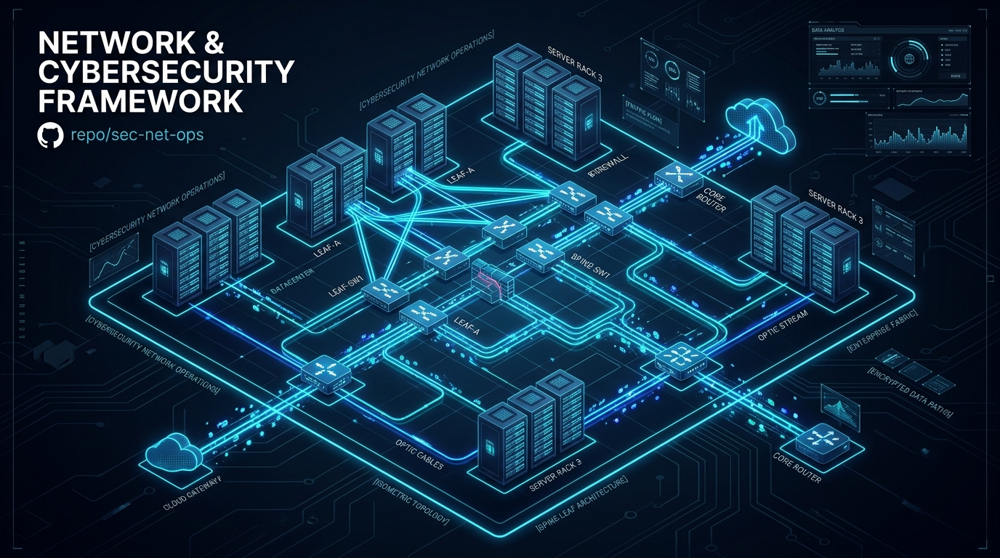
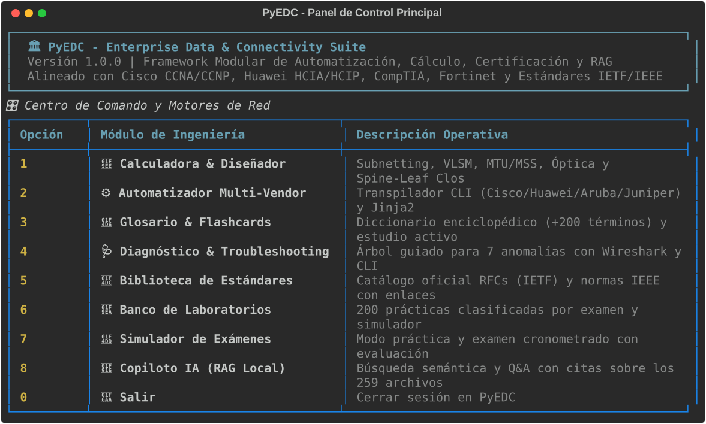
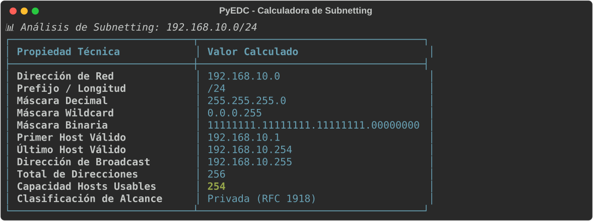
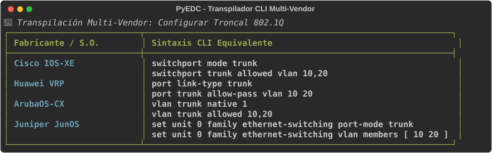

<p align="center">
  
</p>

# 🏛️ Base de Conocimientos EDC (Enterprise Data & Connectivity)
## Network Engineering & Cybersecurity Master Compendium

<p align="center">
  
  
  
  
  
  
  
</p>

---

## 🚀 Inicio Rápido en 1 Clic (Suite Interactiva PyEDC)

Este repositorio no solo contiene documentación enciclopédica: **incluye una suite de ingeniería y ciberseguridad interactiva en Python (`PyEDC`)** con 8 motores funcionales (calculadoras, transpilador multi-marca, diagnóstico guiado, simulador de exámenes y copiloto con IA).

<p align="center">
  
</p>

> [!TIP]
> **¿No sabes cómo crear entornos virtuales (`.venv`) ni usar `pip`? ¡No te preocupes!**
> El repositorio incluye lanzadores automáticos que configuran todo por ti en segundos.

### 🖱️ Opción 1: En Windows con 1 Clic (Recomendado para principiantes)
Solo haz **doble clic** sobre el archivo:
📁 **`iniciar.bat`**

*Automáticamente creará el entorno virtual `.venv`, instalará las dependencias necesarias de forma silenciosa y abrirá la aplicación.*

---

### ⚡ Opción 2: Desde PowerShell (Windows)
Abre tu terminal en la carpeta del proyecto y ejecuta:
```powershell
.\iniciar.ps1
```

---

### 💻 Opción 3: Cualquier Sistema Operativo (Linux, macOS, Windows)
Si tienes Python instalado, solo abre una terminal y escribe:
```bash
python run.py
```
*(El script `run.py` detecta si faltan librerías o si el entorno virtual no existe, configurándolo todo automáticamente al instante).*

---

### 🎮 Los 8 Módulos de la Suite PyEDC

Al iniciar la aplicación tendrás acceso al panel interactivo:

| Módulo | Capacidades y Funcionalidades |
| :--- | :--- |
| **1. 🧮 Calculadora & Diseñador** | Subnetting IPv4/IPv6, VLSM paso a paso, MTU/MSS WAN & VPN, Presupuesto Óptico (dB) y Arquitectura Spine-Leaf Clos para Data Centers. |
| **2. ⚙️ Automatizador Multi-Vendor** | Transpilador de comandos CLI (Cisco IOS-XE, Huawei VRP, ArubaOS-CX, Juniper JunOS), Generador Jinja2 y Auditor de puertos IANA. |
| **3. 📖 Glosario & Flashcards** | Diccionario técnico A-Z (+200 términos y estándares) y tarjetas interactivas de estudio activo para certificación. |
| **4. 🩺 Diagnóstico & Troubleshooting** | Asistente de resolución guiada para 7 anomalías críticas (Loops L2, flappings OSPF/BGP, túneles IPsec caídos, Rogue DHCP, Jitter VoIP, etc.) con filtros Wireshark y comandos CLI. |
| **5. 📜 Biblioteca de Estándares** | Catálogo oficial de RFCs de la IETF y normas IEEE/TIA/NIST con enlaces web directos a los documentos originales. |
| **6. 🧪 Banco de Laboratorios (200)** | Catálogo de prácticas clasificadas por examen (CCNA, CCNP, HCIP, Security+) y software de emulación (EVE-NG, GNS3, CML). |
| **7. 📝 Simulador de Exámenes** | Modo de práctica interactivo y modo examen cronometrado con evaluación de puntaje y explicaciones técnicas inmediatas. |
| **8. 🤖 Copiloto IA / RAG Local** | Motor de consulta y búsqueda semántica sobre los 259 archivos del repositorio para resolver dudas con citas exactas. |

#### 📸 Capturas en Vivo de la Suite (Rich Terminal Engine)

<p align="center">
  
  
</p>

---

## 📌 Presentación y Propósito de la Base de Conocimientos EDC

La **Base de Conocimientos EDC** es un repositorio enciclopédico, riguroso y exhaustivo diseñado para resolver de forma definitiva las necesidades de diseño, despliegue, hardening, diagnóstico y certificación en infraestructuras digitales empresariales e industriales de misión crítica.

Nace a partir de una **auditoría profunda "dato por dato"** realizada sobre los 259 archivos del repositorio maestro, corrigiendo errores sistemáticos de renderizado markdown, tablas rotas, omisión de acentos diacríticos y desactualización de estándares. Integra especificaciones de la **IETF (RFCs activos)**, normas **IEEE / TIA / ISO**, marcos del **NIST** y arquitecturas validadas de los principales fabricantes de la industria (**Cisco, Huawei, Aruba, Fortinet, Palo Alto Networks**).

---

## 🧭 Mapa de Navegación del Repositorio

```text
Base de Conocimientos_EDC/
├── .github/workflows/tests.yml                        <- 🟢 CI/CD: Validación automática de pruebas unitarias
├── docs/assets/                                       <- 🖼️ Recursos visuales, capturas y diagramas de la suite
│   ├── banner.png                                     <- Hero banner con topología Spine-Leaf y centro de datos
│   ├── pyedc_menu.svg                                 <- Captura vectorial interactiva del menú principal
│   ├── pyedc_subnet.svg                               <- Captura vectorial de la calculadora de subredes
│   └── pyedc_transpiler.svg                           <- Captura vectorial del transpilador multi-vendor
├── iniciar.bat                                        <- 🚀 Lanzador automático en 1 clic para Windows (.venv + dependencias)
├── iniciar.ps1                                        <- ⚡ Lanzador automático para PowerShell
├── run.py                                             <- 💻 Lanzador multiplataforma auto-configurable
├── requirements.txt                                   <- Dependencias del ecosistema Python (rich, jinja2, etc.)
├── pyedc/                                             <- 🧠 Plataforma Interactiva Modular en Python
│   ├── cli.py                                         <- Menú principal interactivo en terminal (Rich UI)
│   ├── modules/                                       <- Los 8 motores técnicos (calculadoras, labs, exámenes, copiloto...)
│   └── data/                                          <- Base de datos JSON de preguntas, laboratorios y glosario
├── tests/                                             <- 🧪 Suite de pruebas unitarias automatizadas (14 tests)
├── LICENSE                                            <- 📜 Licencia de código abierto MIT
├── README.md                                          <- Portal Maestro y Guía de Navegación (Este archivo)
├── 00_AUDITORIA_Y_DIAGNOSTICO_COMPLETO_PROYECTO.md    <- Evaluación analítica dato por dato de los 22 pilares originales
├── 01_ARQUITECTURA_Y_MAPA_GLOBAL_EDC.md               <- Ontología técnica, Grafo de Conocimiento y Flujo End-to-End
├── 02_DICCIONARIO_DEFINICIONES_Y_GLOSARIO_TECNICO.md   <- Diccionario Enciclopédico de la A a la Z (+200 conceptos)
├── 03_BIBLIOTECA_DOCUMENTAL_Y_RECURSOS_OFICIALES.md   <- Bibliografía maestra, RFCs con enlace oficial, normas y PDFs
├── 04_MATRIZ_TABLAS_COMPARATIVAS_Y_CHEAT_SHEETS.md    <- Tablas CLI 6 fabricantes, Subnetting, Puertos IANA, Fórmulas
└── WIKI_EDC/                                         <- Wiki Modular de Conocimiento Técnico Profundo
    ├── README.md                                      <- Índice y Metodología de la Wiki EDC
    ├── WIKI_01_Fundamentos_Fisicos_y_Modelo_OSI.md   <- Medios, TIA-568-D, Fibra, Transceptores, OSI L1-L7, TCP/IP
    ├── WIKI_02_Switching_MultiVendor_y_Capa2.md      <- Conmutación 6 marcas, VLANs, Troncales, STP, LACP, DAI
    ├── WIKI_03_Routing_Avanzado_WAN_y_Carrier.md     <- OSPFv2/v3, BGP-4, MPLS L3VPN, SRv6, SD-WAN, QoS DiffServ
    ├── WIKI_04_Ciberseguridad_Firewalls_ZeroTrust.md <- Defensa L1-L7, NGFWs, IPsec IKEv2, WireGuard, Zero Trust
    ├── WIKI_05_DataCenter_Fabric_y_Cloud_Hybrid.md   <- Spine-Leaf Clos, VXLAN EVPN (RFC 7348/8365), Cloud, SONiC
    ├── WIKI_06_Wireless_Enterprise_y_Movilidad.md    <- Wi-Fi 6/6E/7 (802.11ax/be), WLC CAPWAP, WPA3, Roaming
    ├── WIKI_07_Redes_Industriales_OT_e_IoT.md        <- Modelo Purdue, ISA/IEC 62443, Modbus, DNP3, CIP, Hardening
    ├── WIKI_08_Servicios_DDI_NetDevOps_y_Gestion.md  <- DNS Anycast, DHCP Failover, NetBox SSoT, NTP, YANG/NETCONF
    ├── WIKI_09_Analisis_Wireshark_y_Troubleshooting.md<- Análisis L2-L7, anomalías TCP, VoIP Jitter, RFC 2544 / Y.1564
    └── WIKI_10_Banco_Laboratorios_y_Guias_Paso_a_Paso.md <- Guía de los 200 labs, emulación en EVE-NG, GNS3, CML
```

---

## 🎯 Alineación con Certificaciones de la Industria

Esta base de conocimientos cubre el 100% de los temarios oficiales de las siguientes certificaciones de nivel Asociado, Profesional y Experto:

| Examen de Certificación | Fabricante / Entidad | Módulos Clave de la Base de Conocimientos EDC |
| :--- | :--- | :--- |
| **Cisco CCNA (200-301)** | Cisco Systems | [Wiki-01](./WIKI_EDC/WIKI_01_Fundamentos_Fisicos_y_Modelo_OSI.md), [Wiki-02](./WIKI_EDC/WIKI_02_Switching_MultiVendor_y_Capa2.md), [Wiki-03](./WIKI_EDC/WIKI_03_Routing_Avanzado_WAN_y_Carrier.md), [Cheat Sheets](./04_MATRIZ_TABLAS_COMPARATIVAS_Y_CHEAT_SHEETS.md) |
| **Cisco CCNP Enterprise (350-401 ENCOR)** | Cisco Systems | [Wiki-03](./WIKI_EDC/WIKI_03_Routing_Avanzado_WAN_y_Carrier.md), [Wiki-04](./WIKI_EDC/WIKI_04_Ciberseguridad_Firewalls_ZeroTrust.md), [Wiki-05](./WIKI_EDC/WIKI_05_DataCenter_Fabric_y_Cloud_Hybrid.md), [Wiki-08](./WIKI_EDC/WIKI_08_Servicios_DDI_NetDevOps_y_Gestion.md) |
| **Huawei HCIA / HCIP-Datacom** | Huawei Enterprise | [Wiki-02](./WIKI_EDC/WIKI_02_Switching_MultiVendor_y_Capa2.md) (Sintaxis VRP), [Wiki-03](./WIKI_EDC/WIKI_03_Routing_Avanzado_WAN_y_Carrier.md), [Tablas CLI](./04_MATRIZ_TABLAS_COMPARATIVAS_Y_CHEAT_SHEETS.md) |
| **CompTIA Network+ (N10-008)** | CompTIA | [Wiki-01](./WIKI_EDC/WIKI_01_Fundamentos_Fisicos_y_Modelo_OSI.md), [Wiki-06](./WIKI_EDC/WIKI_06_Wireless_Enterprise_y_Movilidad.md), [Diccionario](./02_DICCIONARIO_DEFINICIONES_Y_GLOSARIO_TECNICO.md) |
| **CompTIA Security+ (SY0-701)** | CompTIA | [Wiki-04](./WIKI_EDC/WIKI_04_Ciberseguridad_Firewalls_ZeroTrust.md), [Wiki-07](./WIKI_EDC/WIKI_07_Redes_Industriales_OT_e_IoT.md), [Bibliografía](./03_BIBLIOTECA_DOCUMENTAL_Y_RECURSOS_OFICIALES.md) |
| **Aruba Certified Switching Associate (ACSA)** | HPE Aruba | [Wiki-02](./WIKI_EDC/WIKI_02_Switching_MultiVendor_y_Capa2.md) (ArubaOS-CX), [Tablas CLI](./04_MATRIZ_TABLAS_COMPARATIVAS_Y_CHEAT_SHEETS.md) |
| **Fortinet NSE 4 (FortiOS)** | Fortinet | [Wiki-04](./WIKI_EDC/WIKI_04_Ciberseguridad_Firewalls_ZeroTrust.md), [Wiki-08](./WIKI_EDC/WIKI_08_Servicios_DDI_NetDevOps_y_Gestion.md) |

---

## 🛠️ Cómo Utilizar este Compendio

1. **Para Estudio Sistemático o Preparación de Examen:**
   - Comience con la lectura secuencial de los 10 volúmenes de la [Wiki EDC](./WIKI_EDC/README.md).
   - Utilice el [Diccionario de Términos](./02_DICCIONARIO_DEFINICIONES_Y_GLOSARIO_TECNICO.md) para clarificar cualquier acrónimo o concepto especializado.
2. **Para Operaciones de Campo, Migraciones o Mantenimientos:**
   - Consulte las [Tablas Comparativas Multi-Vendor](./04_MATRIZ_TABLAS_COMPARATIVAS_Y_CHEAT_SHEETS.md) para traducir sintaxis de conmutación entre Cisco, Huawei, Aruba, HP y TP-Link.
   - Aplique las fórmulas de cálculo de MTU/MSS y presupuesto de potencia óptica para evitar fallas físicas o de fragmentación.
3. **Para Investigación Técnica y Normativa:**
   - Acceda directamente a los enlaces oficiales de la IETF y estándares de la [Biblioteca Documental](./03_BIBLIOTECA_DOCUMENTAL_Y_RECURSOS_OFICIALES.md).
   - Revise los diagramas de flujo y modelos de seguridad en la [Arquitectura Global EDC](./01_ARQUITECTURA_Y_MAPA_GLOBAL_EDC.md).
