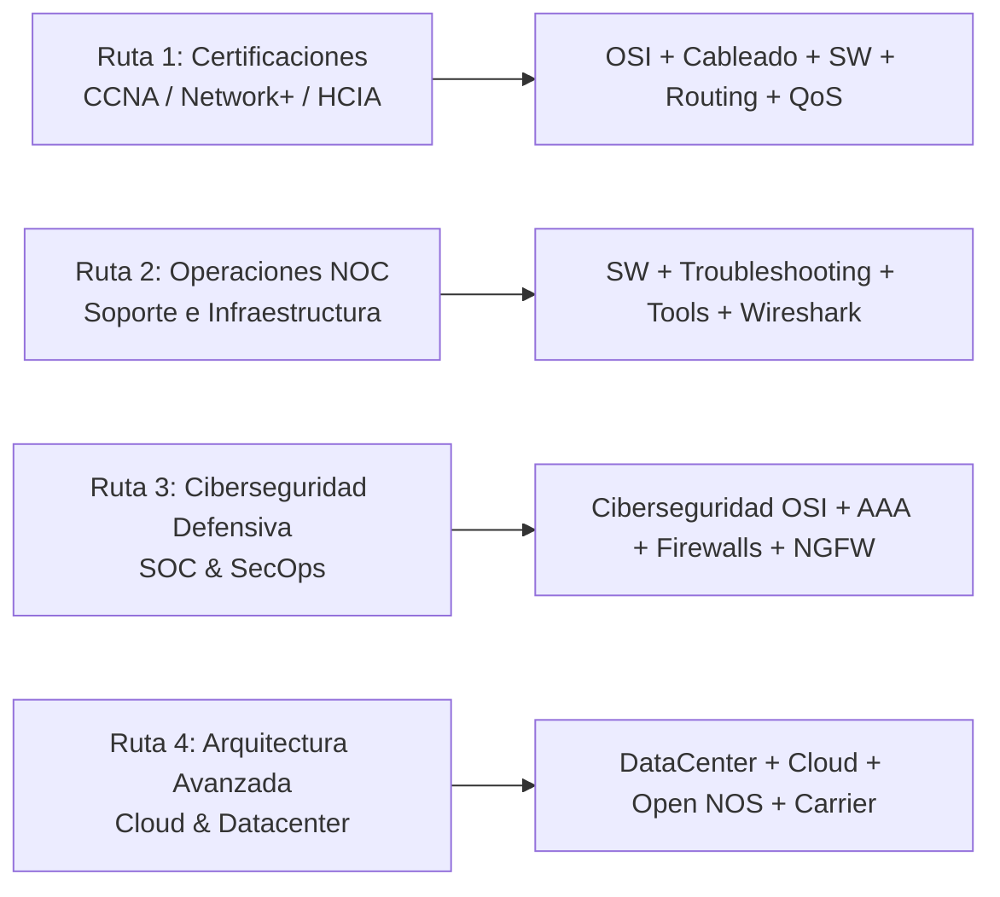

# 🌐 Network Engineering & Cybersecurity Master Compendium

<p align="center">
  
  
  
  
  
  
  
  
</p>

---

## 📌 Acerca de este Repositorio

El **Network Engineering & Cybersecurity Master Compendium** es una biblioteca técnica integral, modular y de nivel profesional diseñada para ingenieros de redes, arquitectos de infraestructura, analistas de ciberseguridad, administradores de sistemas y aspirantes a certificaciones de la industria (**Cisco CCNA/CCNP, Huawei HCIA/HCIP, CompTIA Network+/Security+**).

Este repositorio abarca desde los principios fundamentales de la capa física y el modelo OSI hasta despliegues avanzados de centros de datos basados en **Spine-and-Leaf con VXLAN/EVPN**, orquestación de **Cloud Networking Multi-Nube**, firewalls de siguiente generación (**NGFW**), segmentación **Zero Trust**, redes industriales **OT (ISA/IEC 62443)**, telecomunicaciones de operadores de servicio (**Carrier Grade / 5G / DWDM / Segment Routing**) y una **suite nativa de herramientas y scripts para Windows**.

---

## 🏛️ Mapa Arquitectónico Global de Conocimiento

```mermaid
graph TD
    classDef foundation fill:#0f172a,stroke:#38bdf8,stroke-width:2px,color:#fff;
    classDef switching fill:#1e1b4b,stroke:#818cf8,stroke-width:2px,color:#fff;
    classDef routing fill:#064e3b,stroke:#34d399,stroke-width:2px,color:#fff;
    classDef security fill:#450a0a,stroke:#f87171,stroke-width:2px,color:#fff;
    classDef datacenter fill:#3b0764,stroke:#c084fc,stroke-width:2px,color:#fff;
    classDef ops fill:#713f12,stroke:#facc15,stroke-width:2px,color:#fff;

    subgraph P1["Pilar 1: Fundamentos y Medios"]
        OSI["🌐 Modelo OSI (7 Capas)"]:::foundation
        CAB["🔌 Cableado Estructurado y Fibra"]:::foundation
    end

    subgraph P2["Pilar 2: Conmutación Multi-Vendor"]
        SW["🖧 Switching CLI (Cisco, Huawei, Aruba, HP, 3Com, TP-Link)"]:::switching
        TRB["🔍 Troubleshooting de Switches"]:::switching
    end

    subgraph P3["Pilar 3: Enrutamiento, WAN & Carrier"]
        RUT["🛣️ Routing Avanzado & WAN"]:::routing
        QOS["⚖️ QoS & Traffic Shaping"]:::routing
        CAR["📡 Telecom Carrier, 5G & Óptica"]:::routing
    end

    subgraph P4["Pilar 4: Ciberseguridad & Firewalls"]
        SEC_OSI["🛡️ Ciberseguridad en Capas OSI"]:::security
        AAA["🔑 Control de Acceso, 802.1X & ISE"]:::security
        FW["🧱 Firewalls & VPNs IPsec"]:::security
        NGFW["🔥 Firewalls NGFW (FortiGate, Palo Alto, FTD)"]:::security
        OT["🏭 Redes Industriales OT & Purdue"]:::security
    end

    subgraph P5["Pilar 5: DataCenter, Cloud & Open NOS"]
        DC["🏢 DataCenter Spine-Leaf & VXLAN"]:::datacenter
        CLOUD["☁️ Cloud Networking (AWS, Azure, GCP)"]:::datacenter
        NOS["🐧 Sistemas Operativos Abiertos (SONiC, FRR, VyOS)"]:::datacenter
    end

    subgraph P6["Pilar 6: Operaciones, Métodos & Labs"]
        DDI["🗂️ Servicios DDI (DNS, DHCP, NetBox)"]:::ops
        WSH["🦈 Análisis Forense con Wireshark"]:::ops
        TLS["🛠️ Suite de Herramientas Windows"]:::ops
        MET["📐 Metodología HLD, LLD & MOP"]:::ops
        LAB["🧪 Banco de 200 Laboratorios Prácticos"]:::ops
    end

    P1 ==> P2 ==> P3 ==> P4 ==> P5 ==> P6
```



---

## 📚 Índice Maestro de Módulos (22 Dominios de Especialidad)

| # | Módulo Técnico | Dominio de Ingeniería | Tecnologías y Estándares Clave | Acceso Directo |
| :---: | :--- | :--- | :--- | :---: |
| **01** | **Modelo OSI** | Fundamentos Arquitectónicos | ISO/IEC 7498, Encapsulamiento, PDUs, CCNA, HCIA | [Explorar](./OSI/README.md) |
| **02** | **Cableado y Fibra Óptica** | Capa 1 Física e Infraestructura | TIA-568-D, ISO 11801, SMF, MMF, MPO, SFP28, PoE 90W | [Explorar](./Cableado_y_Fibra_Optica/README.md) |
| **03** | **Switching Multi-Vendor** | Conmutación Enterprise L2/L3 | Cisco, Huawei VRP, ArubaOS-CX, HP ProCurve, 3Com, TP-Link | [Explorar](./SW/README.md) |
| **04** | **Routing y WAN** | Enrutamiento Corporativo y WAN | OSPF Multi-Área, BGP Internet, MPLS L3VPN, SD-WAN, BFD | [Explorar](./Routing_y_WAN/README.md) |
| **05** | **QoS & Traffic Shaping** | Optimización y Calidad de Servicio | DiffServ (RFC 4594), CoS, DSCP, LLQ, CBWFQ, Policing, WRED | [Explorar](./QoS_Traffic_Shaping/README.md) |
| **06** | **Wireless Enterprise** | Redes Inalámbricas y Movilidad | Wi-Fi 6/6E/7 (802.11ax/be), WLC Catalyst 9800, WPA3, Roaming | [Explorar](./Wireless_Enterprise/README.md) |
| **07** | **Control de Acceso (AAA)** | Identidad, 802.1X y Zero Trust | IEEE 802.1X, Cisco ISE 3.x, Aruba ClearPass, FreeRADIUS, TACACS+ | [Explorar](./AAA_y_Control_de_Acceso/README.md) |
| **08** | **Firewalls y VPN** | Seguridad Perimetral y Túneles | Stateful Inspection, NAT/PAT, IPsec IKEv2, DMVPN, WireGuard | [Explorar](./Firewalls_y_VPN/README.md) |
| **09** | **Firewalls NGFW Líderes** | Seguridad de Siguiente Generación | Fortinet FortiGate, Palo Alto Networks (App-ID), Cisco FTD/FMC | [Explorar](./Firewalls_NGFW_Lideres/README.md) |
| **10** | **Ciberseguridad OSI** | Defensa en Profundidad | MITRE ATT&CK, Mitigación L1 a L7, Spoofing, DAI, Zero Trust | [Explorar](./Ciberseguridad_OSI/README.md) |
| **11** | **Redes Industriales (OT)** | Automatización e Infraestructura Crítica | Purdue Model (PERA), ISA/IEC 62443, Modbus, DNP3, CIP, DIN-Rail | [Explorar](./Redes_Industriales_OT/README.md) |
| **12** | **Data Center Fabric** | Conmutación de Centros de Datos | Spine-and-Leaf Clos, VXLAN Overlays, BGP EVPN, SAN, Cisco NX-OS | [Explorar](./DataCenter/README.md) |
| **13** | **Cloud Networking** | Nube Híbrida y Multi-Cloud | AWS VPC, Azure VNet, GCP Cloud Router, Transit Gateway, ExpressRoute | [Explorar](./Cloud_Networking/README.md) |
| **14** | **Sistemas Abiertos (NOS)** | Desagregación y Whitebox | SONiC Network OS, FRRouting (FRR Linux), MikroTik RouterOS v7, VyOS | [Explorar](./Sistemas_Operativos_Abiertos_Whitebox/README.md) |
| **15** | **Telecom Carrier** | Proveedores de Servicio e ISP | 4G/5G Open RAN, DWDM/ROADM, FTTH GPON, Segment Routing (SRv6) | [Explorar](./Telecomunicaciones_Avanzadas_Carrier/README.md) |
| **16** | **Telefonía IP y VoIP** | Comunicaciones Unificadas | SIP, RTP, Codecs G.711/G.729, Avaya IP Office 500v2, FreePBX | [Explorar](./Telefonia/README.md) |
| **17** | **Servicios DDI y Gestión** | DNS, DHCP, IPAM y Monitoreo | Anycast DNS, DHCP Failover, NetBox (SSoT), NTP, SNMPv3, NetFlow | [Explorar](./Servicios_DDI_y_Gestion/README.md) |
| **18** | **Wireshark Analysis** | Análisis Profundo de Paquetes | Filtros de captura, Troubleshooting TCP (Retrans/ZeroWindow), Forense | [Explorar](./Wireshark_Analysis/README.md) |
| **19** | **Troubleshooting** | Resolución Metódica de Incidentes | Err-disabled, BPDU Guard, Loops STP, LACP Mismatch, Flapping | [Explorar](./Troubleshooting/README.md) |
| **20** | **Metodología & Plantillas** | Gobernanza de Ingeniería IT | Plantillas HLD, LLD, MOP de Ventana de Cambio, Rollback Plan | [Explorar](./Metodologia_Ingenieria_y_Plantillas/README.md) |
| **21** | **Banco de 200 Ejemplos** | Laboratorios Prácticos Reales | 200 Escenarios con Topologías ASCII, Scripts CLI y Verificación | [Explorar](./Ejemplos/README.md) |
| **22** | **Suite de Herramientas** | Scripts de Diagnóstico Windows | PowerShell nativo (.ps1), SuperPing, Descubridor PMTU, Wi-Fi Audit | [Explorar](./Tools/README.md) |

---

## 🖧 Matriz Rápida de Switching Multi-Vendor (`SW/`)

El módulo [`SW/`](./SW/README.md) proporciona comandos homologados y plantillas hardened para 6 ecosistemas:

```
SW/
├── Cisco/       -> Cisco Catalyst (IOS / IOS-XE)
├── Huawei/      -> Huawei CloudEngine / Quidway (VRP)
├── Aruba/       -> Aruba CX (ArubaOS-CX)
├── HP/          -> HP ProCurve / Provision (AOS-S)
├── 3Com/        -> 3Com Switch / H3C (Comware OS)
└── TP-Link/     -> TP-Link JetStream L2/L3 Managed
```

Cada fabricante incluye 10 niveles progresivos de configuración:
1. `01` Conceptos básicos y jerarquía de modos.
2. `02` Configuración inicial, hostname y acceso seguro SSH.
3. `03` Creación de VLANs, puertos Access/Trunk y SVI de gestión.
4. `04` Enrutamiento inter-VLAN y servidor DHCP local.
5. `05` Agregación de enlaces (EtherChannel / LACP / Eth-Trunk) y Spanning Tree.
6. `06` Seguridad de Capa 2 (Port Security, DHCP Snooping, DAI, Storm Control).
7. `07` Enrutamiento dinámico con OSPFv2.
8. `08` Listas de Control de Acceso (ACLs) y limitación QoS.
9. `09` Alta disponibilidad de primer salto (HSRP / VRRP) y apilamiento físico.
10. `10` Mantenimiento, respaldo TFTP, diagnóstico DOM y recuperación de contraseñas.

---

## 🧪 Banco de 200 Laboratorios Prácticos (`Ejemplos/`)

El módulo [`Ejemplos/`](./Ejemplos/README.md) ofrece 200 casos de estudio completos organizados en 10 partes temáticas:

- **Parte 1 (001-020):** Conectividad base, segmentación VLAN, enlaces troncales 802.1Q y ruteo estático.
- **Parte 2 (021-040):** OSPF Single-Area y Multi-Area, autenticación criptográfica y optimización de temporizadores.
- **Parte 3 (041-060):** EIGRP corporativo, redistribución de rutas mutua y control de bucles de ruteo.
- **Parte 4 (061-080):** BGP Enterprise e ISP, peering eBGP/iBGP, manipulación de AS-Path y Local Preference.
- **Parte 5 (081-100):** Redundancia HSRP/VRRP, túneles VPN IPsec IKEv2 y balanceo WAN activo-activo.
- **Parte 6 (101-120):** Datacenter Spine-and-Leaf, túneles overlay VXLAN y plano de control BGP EVPN.
- **Parte 7 (121-140):** Redes Carrier MPLS L3VPN, distribución de etiquetas LDP e ingeniería de tráfico.
- **Parte 8 (141-160):** Despliegue de IPv6 empresarial, Dual-Stack, SLAAC, DHCPv6 y OSPFv3.
- **Parte 9 (161-180):** Tráfico Multicast (PIM-SM, IGMP Snooping) y políticas avanzadas de QoS MQC.
- **Parte 10 (181-200):** Arquitecturas SD-WAN, interconexión Multi-Cloud (AWS/Azure) y microsegmentación Zero Trust.

---

## 🛠️ Suite de Herramientas de Red para Windows (`Tools/`)

Ubicada en [`Tools/`](./Tools/README.md), incluye utilidades nativas sin dependencias externas:

- **`Menu_Principal.cmd`**: Lanzador interactivo por lotes con evasión automática de restricciones de ejecución.
- **`SuperPing_Continuo.ps1`**: Monitor de latencia con marcas de tiempo en milisegundos, alertas por código de color, alertas sonoras ante caídas y exportación automática a CSV.
- **`Descubridor_MTU_Path.ps1`**: Descubrimiento dinámico del MTU de ruta (PMTU) usando banderas DF (Don't Fragment) para dimensionamiento de túneles VPN.
- **`Wifi_Analyzer_Audit.ps1`**: Analizador de espectro y auditor de redes inalámbricas en tiempo real.
- **`Reporte_Salud_Red.ps1`**: Auditoría completa de adaptadores de red, tablas de rutas, estado DNS y sockets activos con salida a reporte HTML.
- **`Port_Scanner_Rapido.ps1`**: Escáner multihilo de puertos TCP para validación rápida de servicios.

---

## 🧭 Rutas de Aprendizaje Recomendadas



---

## 🚀 Cómo Utilizar este Repositorio

### Clonar el Repositorio
```bash
git clone https://github.com/Cru9/BC.git
cd BC
```

### Visualización
Todo el repositorio está formateado en **GitHub Flavored Markdown (GFM)** compatible con renderizado nativo en GitHub, Visual Studio Code, Obsidian o cualquier visor de documentación técnica.

---

## 🤝 Cómo Contribuir

¡Las contribuciones de la comunidad son bienvenidas! Si deseas aportar nuevos casos de laboratorio, correcciones de sintaxis o guías para fabricantes adicionales:
1. Revisa nuestras directrices en [CONTRIBUTING.md](./CONTRIBUTING.md).
2. Haz un fork del repositorio.
3. Crea una rama para tu aporte (`git checkout -b feature/nuevo-laboratorio`).
4. Abre un Pull Request describiendo detalladamente tus cambios.

---

## 📄 Licencia

Este proyecto está bajo la Licencia **MIT**. Consulta el archivo [LICENSE](./LICENSE) para conocer los términos completos.

---

<p align="center">
  <b>Desarrollado y mantenido con dedicación por <a href="https://github.com/Cru9">Ezequiel (Cru9)</a></b><br>
  <i>"El conocimiento en redes pertenece a quienes conectan al mundo."</i>
</p>
